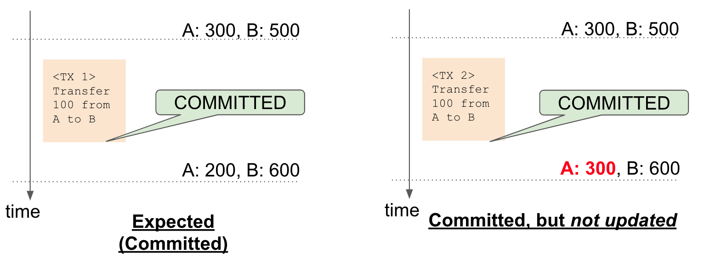
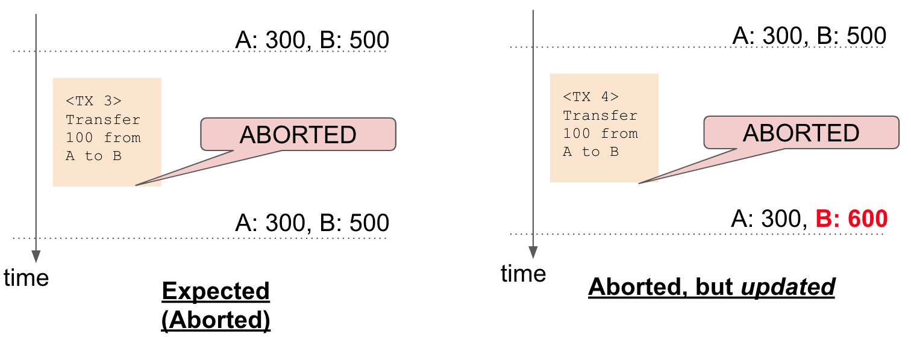




# トラブルシューティングガイド

# 導入
本書では、システムの開発・運用・保守で困ったときの対処法について説明します。 ScalarDB と DL だけでなく、他のすべてのコンポーネントのトラブルシューティング方法についても説明します。 たとえば、上位コンポーネントから「間違った値で更新に失敗したため、ScalarDB または DL に更新を要求してください」というメッセージを含むエラーを受け取った場合、ScalarDL または DB にバグがあるように感じるかもしれませんが、それは単なる問題を意味している可能性があります。 無効なリクエストが送信されました。

最初のセクションでは、ScalarDB の例外とトランザクションの不明なトランザクション状態について説明します。 2 番目のセクションは、ScalarDL 例外に関するものです。 最後のセクションでは、不整合を調査する方法について説明します。

# ScalarDB
## ストレージの例外

### 接続例外
この例外は、アプリケーションが Cassandra などのストレージ システムに接続できない場合にスローされます。 この問題は、ストレージのステータスと構成、ScalarDB 構成を確認することで解決できます。 例えば以下のような場合にスローされます。

- Cassandra ノードでポート 9042 を開けない
- プロパティで scalar.database.contact_points のノード アドレスを指定できない

### ExecutionException
この例外は非常に一般的です。 リクエストが失敗した場合にスローされます。 この例外の原因は多すぎて特定できません。 最初のケースでは、例外内のメッセージを読んでください。

この例外は必ずしも致命的なエラーを意味するわけではありません。 たとえば、ネットワークの遅延や負荷により、Cassandra でのリクエストが失敗する場合があります。 この場合、再試行するとリクエストが実行される可能性があります。 ストレージ ノードの負荷が高いためにこの障害が頻繁に発生する場合は、ノードのアップグレードを検討する必要があります。

### InvalidUsageException
この例外は、対応するリクエストにエラーがあることを示します。 APIの使用状況に応じてリクエストを修正する必要があります。 たとえば、この例外は、`get()` リクエストを使用して複数のレコードをリクエストしたときにスローされます。 この場合、`scan()` を使用する必要がありました。

### MultiPartitionException
これは、 `batch` 操作が使用される場合の `InvalidUsageException` のサブクラスです。 この例外のメッセージにあるように、複数パーティションのバッチは推奨されません。 ストレージのスキーマを変更したり、レコードごとにリクエストを発行したりする必要がある場合があります。

### NoMutationException
これは `ExecutionException` のサブクラスです。 リクエストの対応するレコードがリクエストの条件を満たしていない場合にスローされます。 たとえば、これは `PutIfNotExists()` 条件でレコードを配置しようとしたときに、同じキーを持つレコードが存在する場合にスローされます。

### ReadRepairableExecutionException
これも `ExecutionException` のサブクラスです。 この例外で失敗したリクエストは、実際には成功している可能性があります。 これは、対応するレコードが挿入、更新されたかどうかがわからないことを意味します。 別の読み取りリクエストを発行して、レコードの現在の状態を確認することもできます。

### RetriableExecutionException
これも `ExecutionException` のサブクラスです。 これは、ストレージがレコードの書き込みに失敗したときにスローされますが、原因は一時的なものであり、致命的なものではありません。 再試行すると正常に実行される場合があります。 この例外が頻繁に発生する場合は、ストレージの負荷を確認すると役立つ場合があります。

### StorageRuntimeException
この例外は、指定されたキースペースまたはテーブルが存在しない場合にスローされます。 キースペースまたはテーブルが実際に存在するかどうか、リクエストで正しい名前が指定されているかどうか、または `StorageService` のインスタンスが存在するかどうかを確認してください。

### UnsupportedTypeException
この例外は、サポートされていない型を使用した場合にスローされます。 [サポートされているタイプ](https://scalar-labs.github.io/scalardb/javadoc/com/scalar/database/io/package-summary.html) を参照してください。

## トランザクションに関する例外
### CommitConflictException
これは `CommitException` のサブクラスです。 別のトランザクションが同じレコードの更新をコミットしようとしており、トランザクションが更新のコミットに失敗した場合にスローされます。 すべての更新は中止されました。 同じ操作を持つ新しいトランザクションをリクエストすると、それらは正常に実行されます。

### CommitException
この例外は、トランザクションが更新のコミットに失敗した場合にスローされます。 この失敗には多くの原因があります。 失敗したトランザクションによってレコードはコミットされないことに注意することが重要です。 多くの場合、トランザクションは再度リクエストされた場合に正常に実行されます。 この例外が頻繁に発生する場合は、ストレージの負荷を確認することをお勧めします。

### CoordinatorException
基本的に、この例外は `CommitException` によってラップされます。 これは、コーディネーターへの操作が失敗したときに内部的にスローされます。 コーディネーターに直接アクセスする場合は、この例外を処理する必要があります。

### CrudException
この例外は基本的な例外です。 トランザクションがレコードの取得に失敗した場合にスローされます。 この失敗は、別のトランザクションがコミットしようとしたレコードの取得、またはストレージからの読み取り失敗によって発生します。 失敗したトランザクションのすべての更新は中止されているため、新しいトランザクションで読み取りを再試行できます。

### CrudRuntimeException
これは、トランザクションが同じトランザクション内で更新されたレコードを取得しようとするとスローされます。 データを更新してからそのデータを読み取ることは、同じトランザクション内では許可されません。

### InvalidUsageException
この例外は、トランザクションの使用法が間違っている場合にスローされます。 たとえば、最初にレコードを読み取らずにレコードを削除するブラインド削除では、この例外が発生します。

### RequiredValueMissingException
現時点では、この例外はトランザクションによってスローされません。 コーディネーターにアクセスして `Coordinator.State` をインスタンス化する場合、この例外が発生する可能性があります。 コーディネーター テーブルには列がない可能性があります。 コーディネーターのスキーマを確認してください。

### TransactionException
これは、トランザクションを処理する例外のスーパークラスです。  `TransactionException` を拡張する例外は、必ずしも致命的な失敗を意味するわけではありません。 多くの場合、新しいトランザクションでリクエストを再試行すると、トランザクションが正常に実行される可能性があります。

### TransactionRuntimeException
これは、 `CrudRuntimeException` などの致命的な操作によって発生する例外のスーパークラスです。 この例外は、リクエストにバグがあることを意味します。

### UncommittedRecordException
これは `CrudException` のサブクラスです。 これは、トランザクションが別のトランザクションがコミットしようとするレコードを取得しようとするとスローされます。 他の多くの例外と同様に、新しいトランザクションで読み取りを再試行できます。

### UnknownTransactionStatusException
これは、トランザクションがコミットに失敗したときにスローされる `TransactionException` のサブクラスです。 トランザクションがコミットされたのか中止されたのかを知る方法はありません。 ただし、コーディネーターをチェックすることでその状態を確認できます。 この例外はめったにスローされませんが、かなり重要なので、この未知の状態とその確認方法については次のセクションで詳しく説明します。


## 不明なトランザクション状態
上で述べたように、 `UnknownTransactionStatusException` は、トランザクションがコミットに失敗し、トランザクションの更新がコミットされたのか中止されたのかが不明な場合にスローされます。 この場合、コーディネーターを確認することで、トランザクションの更新がコミットされたかどうかを判断できます。

コーディネーターに保存されるトランザクション状態には 2 つの可能性があります。 それらは`COMMITTED` と `ABORTED` です。 `COMMITTED` 状態は、他のトランザクションがそのトランザクションによるすべての更新を取得できることを意味します。 `ABORTED` 状態は、すべての更新がなくなったことを意味します。

`UnknownTransactionStatusException` は、トランザクションが状態レコードをコーディネーターに挿入しようとしたが、処理中に例外が発生し、トランザクションが成功したかどうかを判断できなかった場合に発生します。 この場合、ストレージがレコードを挿入している場合もあれば、挿入していない場合もあります。 コーディネーターへのこの挿入は、ScalarDB の遅延回復プロセスによって最終的に完了します。 したがって、トランザクションがコミットしたかアボートしたかを示す状態は、次の方法で確認できます。

1. `UnknownTransactionStatusException#getUnknownTransactionId()` により、この例外からトランザクション ID を取得します。
2. コーディネータからIDで指定された状態レコードを取得する
     - 状態レコードがコーディネーターに存在しない場合は、トランザクションによって更新されたレコードを新しいトランザクションで読み取ってから再試行します。 この読み取りにより、内部で遅延リカバリが開始されます。
3. 状態が `TransactionState.COMMITTED` の場合、トランザクションはコミットされています。 状態が `TransactionState.ABORTED` の場合、トランザクションは中止されています。

コーディネーターをチェックするコード例は `TransactionUtility#checkCoordinatorWithRetry()` です。


# ScalarDL
## 例外

### AssetbaseException
これは `DatabaseException` のサブクラスであり、一部の例外のスーパークラスでもあります。 これは、コントラクトに `put()` と `scan()` の両方がある場合にスローされます。 ScalarDL では、`scan()` は読み取り専用コントラクトのみに使用されます。

### AssetbaseIOException
これは `AssetbaseException` のサブクラスです。 これは、Ledger  (ストレージ) からの資産の読み取りが失敗した場合にスローされます。 これは、ScalarDB の `CrudException` に似ています。 契約の実行を再試行すると、正常に実行されます。 繰り返し失敗する場合は、ストレージまたは構成を確認する必要があります。

### AssetCommitException
これは `AssetbaseException` のサブクラスです。 CommitException のようにコントラクト(トランザクション)のコミットに失敗した場合にスローされます。 これはさまざまな状況によって引き起こされます。 契約では資産がまったく更新されていません。 契約の実行を再試行できます。

### AssetOverwriteException
これは `AssetCommitException` のサブクラスであり、内部的に `AssetCommitException` としてラップされます。 これは、別のコントラクトが同じアセットに対してコミットしようとしたためにコントラクトが失敗した場合にスローされます。

### ContractContextException
これは `ContractException` のサブクラスです。 これは、コントラクトがアプリケーションのコンテキストまたは要件を満たせない場合にのみ、コントラクトがスローできる唯一の例外です。 たとえば、支払いアプリケーションで一部の資金を転送する一部の Pay 契約では、受取人の残高が不足している場合などにこの例外がスローされる必要があります。 システムがこの例外をキャッチすると、コントラクトの実行は中止され、それ自体では回復できないため再試行されません。

### ContractException
これは `LedgerException` のサブクラスであり、コントラクトのコンテキストに関するいくつかの例外のスーパークラスです。

### ContractExecutionException
これは `ContractException` のサブクラスです。 これは、アセットプルーフ機能が有効になっているときに、更新されるアセットがコントラクトの引数で指定されていない場合にスローされます。

### ContractValidationException
これは `ValidationException` のサブクラスです。 これは、契約の登録リクエストに契約の正しい署名がない場合にスローされます。 契約書は正しい署名で登録する必要があります。 リクエスト内の署名を確認する必要があります。

### DatabaseException
これは、 `AssetbaseException` などの一部の例外のスーパークラスです。

### KeyException
これは、 `UnloadableKeyException` などの例外のスーパークラスです。

### LedgerException
これは、`ContractException` などの例外のスーパークラスです。 これは主に、アセットプルーフが失敗した場合にスローされます。 これらの失敗は、 `LedgerConfig.ASSET_PROOF_ENABLED` が `true` の場合に発生します。 例外内のメッセージを読んで解決する必要があります。

### MissingCertificateException
これは `RegistryException` のサブクラスです。 これは、指定された証明書がストレージに存在しない場合にスローされます。 所有者 ID と証明書のバージョンを確認するか、対応する証明書を登録する必要があります。

### MissingContractException
これは `RegistryException` のサブクラスです。 これは、指定されたコントラクトがストレージに存在しない場合にスローされます。 所有者 ID、証明書のバージョン、契約 ID を確認するか、対応する契約を登録する必要があります。

### RegistryException
これは `DatabaseException` のサブクラスであり、`RegistryIOException` などの一部の例外のスーパークラスです。 これは、コントラクトまたは証明書がすでに登録されているために登録が失敗した場合にスローされます。

### RegistryIOException
これは `RegistryException` のサブクラスです。 これは、ストレージへの証明書またはコントラクトの出し入れが失敗したときにスローされます。 再試行すると登録または取得されます。 それができない場合は、ストレージと構成を確認する必要があります。

### セキュリティ例外
これは `LedgerException` のサブクラスであり、`KeyException` および `SignatureException` のスーパークラスです。

### SignatureException
これは `SecurityException` のサブクラスです。 これは、署名が失敗した場合、または署名オブジェクトが適切に初期化されていない場合にスローされます。 リクエストに署名する方法を確認する必要があります。

### UnknownAssetStatusException
この例外がスローされる状況は、ScalarDB の `UnknownTransactionStatusException` と同様です。 詳細については、 `UnknownTransactionStatusException` のドキュメントを確認してください。

### UnloadableContractException
これは `ContractException` のサブクラスです。 これは、コントラクトのロードに失敗した場合にスローされます。 契約が登録されているか、証明書ID、バージョン、契約IDが正しいか確認する必要があります。

### UnloadableKeyException
これは `KeyException` のサブクラスです。 これは、証明書からバリデータを取得する際に検証が失敗した場合にスローされます。

### ValidationException
これは `LedgerException` のサブクラスです。 これは、リクエストの証明書 ID とバージョンがコントラクトのものと一致しない場合にスローされます。 これは、資産防止機能が有効になっている場合に、サーバー側のハッシュがクライアント側のハッシュと比較することによって改ざんされる可能性がある場合にもスローされます。 証明書の ID とバージョンを確認するか、検証リクエストを発行して Ledger を検証する必要があります。

# 矛盾の疑い
## 何が説明されるのでしょうか?
ここでは、ScalarDB/DLでデータの整合性を確認する手順を説明します。 一般的な使用例をカバーするために、手順を可能な限り一般化します。 ユースケースに合わせて、必要に応じて手順を調整してください。

この章では、ACID の観点から見たデータベース トランザクションの一貫性に焦点を当てており、レプリカ間の一貫性 (別名、相互一貫性) については説明しません。

ScalarDB では、アプリケーションが一貫性を重視する場合は常にトランザクションを使用することをお勧めします。 ScalarDB ストレージを使用する場合、アプリケーションの一貫性を管理するのはユーザーの責任であるためです。

ScalarDL では、1 つのコントラクト実行リクエストでのコントラクトの呼び出しはトランザクションとして扱われます。 つまり、1回のコントラクト実行リクエストにおけるアセット（ `asset` は `get` や `put` などのデータ操作の単位）に対するすべての操作がトランザクションで実行されます。 コントラクトが内部で他のコントラクトを呼び出す場合、外部コントラクトと内部コントラクトのすべての操作がトランザクションで実行されます。

## アプリケーションの仕様を確認してください
まず第一に、期待することは仕様から得られるため、アプリケーションの仕様を適切に理解することは常に良いことです。 一般に、問題の多くは仕様の誤解や隠れた仕様によって引き起こされます。 したがって、仕様は開発者やテスターだけでなく、ビジネスメンバー間でも共有される必要があります。 そうしないと、期待どおりの結果が得られず、矛盾が誤って報告される可能性があります。

たとえば、支払いアプリケーションで 2 つのアカウント間で資金を送金する場合、場合によっては別のアカウントに手数料が支払われることがあります。 このことを知らなければ、一部の資金が消えてデータの一貫性が侵害されていると考えるでしょう。

## 間違ったトランザクションを見つける
予想されるデータを把握し、それを実際のデータと比較する必要があるため、間違ったトランザクションを見つけるには長い時間がかかることがあります。 期待されるデータを取得するにはログを確認できますが、ログが大きすぎて見つけるのが難しい場合があります。

簡単に入手できるケースもいくつかあります。 例えば、前回の更新は正しく行われたのに、前回の更新が間違っている場合があります。 ただし、このような場合は、アップデートの実行直後に、間違ったアップデートを見つける必要があります。 これは現実的ではありません。 一般に、何度も更新を行った後は、正しく実行された最後の更新を見つけなければならず、データが間違っている更新も見つけなければなりません。

残念ながら、多くの場合、更新を 1 つずつ追跡することしかできません。 アプリケーションのログ、ScalarDB/DL のログ、Cassandra などのストレージのログなど、たくさんのログがあります。 一般に、自分のアプリケーションのログは他のアプリケーションのログよりも読み取りやすいため、最初はアプリケーションのログの確認を開始することをお勧めします。

間違ったトランザクションを見つけるためのヒントを表示します。 それは `tx_version` または `age` です。

ScalarDB を使用すると、ストレージ内の実際のレコードを確認できます。 レコードが何回更新されたかを示す `tx_version` を取得できます。 アプリケーションのログに従ってレコードを T 回更新するあたりの一貫性に疑問がある場合、T が現在の `tx_version` に近ければ、疑わしいトランザクションが最近実行されたことがわかります。

ScalarDL を使用すると、各アセットのすべての突然変異手順を取得できます。 アセットが何回更新されたかを `tx_version` として `age` で知ることができます。 id と age で指定されたレコードは、コントラクト（トランザクション）によって更新された前状態 `input` と現在の状態 `output` を持つ手続きの一つです。 また、`contract_id` によって、アセットに対してどのコントラクトが実行されたかを知ることができます。 これらのヒントは、アプリケーション内で対応するログを見つけるのに役立ちます。

次のレコードは、サンプル転送アプリケーションのストレージ上の実際のレコードの一部の例です。 最新のレコードの `age` が `147` であるため、アセットは 147 回更新されています。 また、アカウント `id`  `5` 、 `age`  `147` で指定されたレコードが、 `argument` を指定した `PaymentWithFee` コントラクトによって挿入されています。 `input` には契約直前の残高が表示されます。 したがって、`id` `5` と `age` `146` で指定される前のレコードの `output` の残高は、最新(`age` `147`) のレコードの `input` の残高と同じになります。 最後の `PaymentWithFee` 契約により、残高は `9228` から `9132` に減少しました。 このコントラクトは、指定された金額 (金額は `argument` で確認できます) を、アカウント (最初の `asset_id`) から他の 2 つのアカウント (2 番目と最後の `asset_id`) に転送します。 最初の `asset_id` がこの資産であり、金額が `96` であるため、この資産の残高は減少しています。

```
 id | age | input                                                                                                                       | output           | argument                                                                         | contract_id
----+-----+-----------------------------------------------------------------------------------------------------------------------------+------------------+----------------------------------------------------------------------------------+-----------------------------------------------------------
  5 | 147 | {"0":{"age":130,"data":{"balance":11199}},"5":{"age":146,"data":{"balance":9228}},"9":{"age":144,"data":{"balance":10391}}} | {"balance":9132} | {"asset_ids":[5,0,9],"amount":96,"nonce":"561ad3cd-0975-4f79-8869-c1068b266abc"} | com.scalar.ledger.contract.payment_example.PaymentWithFee
  5 | 146 |                                          {"5":{"age":145,"data":{"balance":9284}},"9":{"age":141,"data":{"balance":10344}}} | {"balance":9228} |   {"asset_ids":[5,9],"amount":56,"nonce":"8ac17d71-c8fa-4968-9606-7ee55666a72d"} |        com.scalar.ledger.contract.payment_example.Payment
  5 | 145 |                                           {"2":{"age":140,"data":{"balance":8521}},"5":{"age":144,"data":{"balance":9249}}} | {"balance":9284} |   {"asset_ids":[2,5],"amount":35,"nonce":"7134ade8-df95-47f4-8070-ec322a0ff66b"} |        com.scalar.ledger.contract.payment_example.Payment
```

金額 `100` で何かを購入することで契約が締結された場合、 `argument` の金額は `96` であるため、依頼者は間違っている可能性があります。 この例では、 `argument` の金額が `100` で、最新の残高が `9132` である場合、最後の契約で間違った金額が送金されたのではないかと疑問に思うでしょう。 この場合、契約の履行を確認することになります。

これは ScalarDL の不一致ではないか、アプリケーションの仕様を誤解している場合はコントラクトにバグがあるのではないかと疑われるでしょう。 不一致の原因は多数あるため、不審な点を見つけた場合は、まずアプリケーションが期待どおりに動作していることを確認してください。

次に、ScalarDB や DL によって発生する不整合のケースについて説明します。 内部の知識がなければ理解するのは難しいかもしれませんが、一見の価値はあります。

## ScalarDB/DL にバグがある場合はどうなるか
矛盾するケースは主に 2 つあります。 1 つ目のケースは、トランザクションが成功したように見えても、トランザクションによって更新されるべき値が更新されていない場合です。 2 番目のケースは、トランザクションが失敗したように見えても、トランザクションによって更新されるべき値が実際には更新されている場合です。 どちらの場合も、別の競合するトランザクションがあり、それがそのような問題を引き起こしている可能性があります。

最初のケースでは、トランザクションがいくつかのレコードを読み取り、挿入、または更新し、それらを正常にコミットした後、次のトランザクションは挿入されたレコードを取得できないか、トランザクション前の古い値であるレコードの値を取得できます。 たとえば、下の図の右側では、トランザクション `TX 2` により A の残高から B の残高に 100 コインが転送されましたが、A の残高は更新されていません。 アプリケーションのログに `TX 2` に関する成功ログが表示される場合がありますが、レコードは更新されていません。



このコミットされたトランザクションの直後にこれが見つかった場合、トランザクションを特定するのは簡単です。 ただし、次のトランザクションでは警告が表示されないため、レコードが更新される可能性があります。 この場合、レコードに関連するログを 1 つずつ追跡する必要があります。

2 番目のケースでは、トランザクションが失敗した後、他のトランザクションは、そのトランザクションが更新しようとしたレコードに挿入または更新された値を取得します。 たとえば、下の図の右側では、トランザクション `TX 4` は中止されましたが、B の残高は予期せず更新されました。



前のケースと同様に、トランザクション直後はそれが簡単にわかります。 そうでない場合は、ログを追跡し、不審なトランザクションを見つける必要があります。

上で述べたように、不整合を発見する良い方法の 1 つは、操作ログを利用することです。 特にミッション クリティカルなアプリケーションの場合は、後の調査や Auditor に使用できるように、情報ログを書き込むようにアプリケーションを構成することが推奨される場合があります。

## 不一致を防ぐ
あなたにとって最も重要なことは、不整合の原因をトラブルシューティングすることではなく、不整合の発生を防ぐことです。 不整合を防ぐ最善の方法は、システムを正常な状態に保つことです。

私たちは、特殊なバグを見つけるために、ネットワーク分割やプロセスのランダムなクラッシュの下でも、ScalarDB と DL について多くの検証を行ってきました。 この記事を書いている時点では、そのような厳しい環境下でも不具合は発生していませんので、通常の環境下では不具合が発生する可能性はかなり低いと思われます。 したがって、不整合を避けるために最も重要なことは、適切な監視、アラート、および回復プロセス/ツールを使用して、システムをできるだけ長く正常に保つことです。
