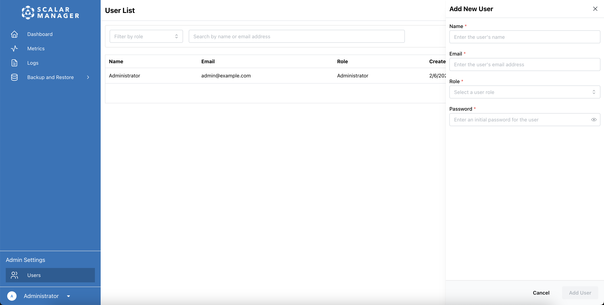
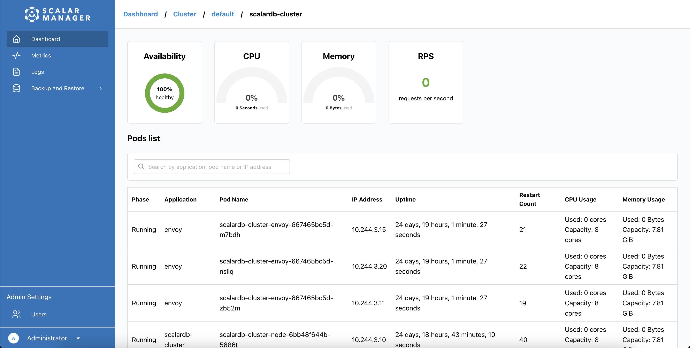
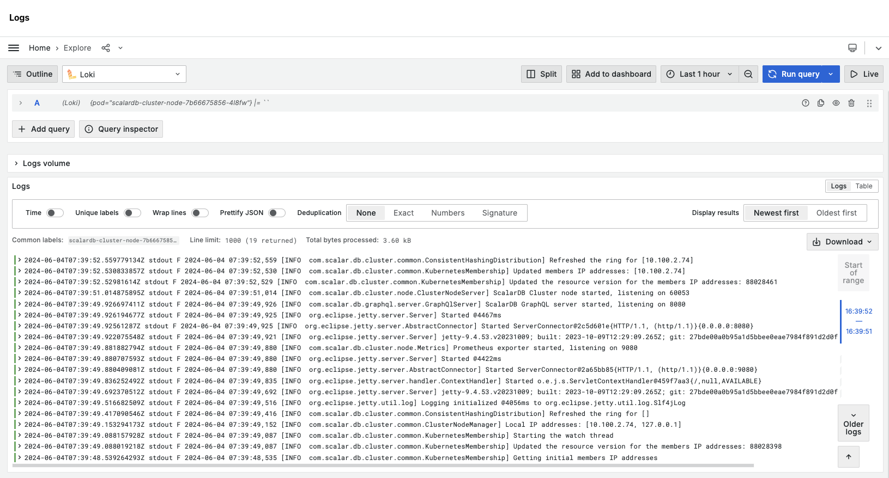
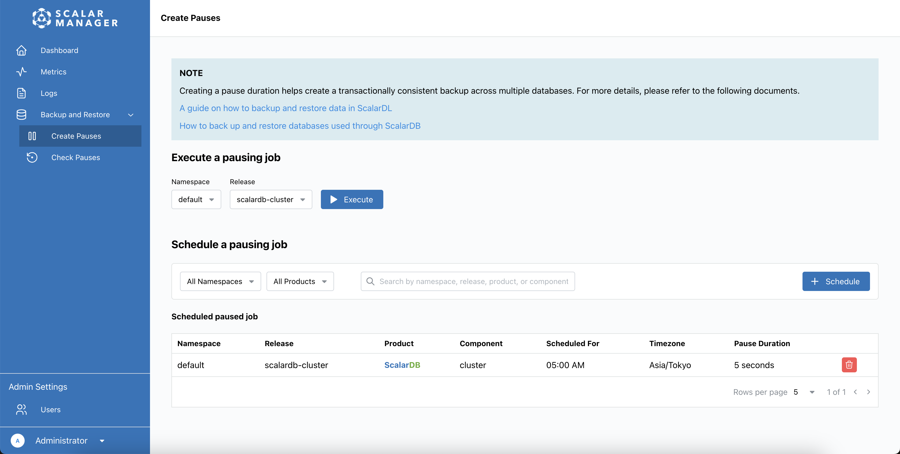

---
tags:
  - Enterprise Option
displayed_sidebar: docsEnglish
---

# How to Use Scalar Manager

Scalar Manager is a centralized management and monitoring solution for ScalarDB and ScalarDL in Kubernetes environments. It simplifies operational tasks by providing a graphical user interface (GUI) that combines functionalities previously managed through separate command-line tools and third-party solutions.

This guide explains how to use Scalar Manager to monitor, manage, and maintain your ScalarDB and ScalarDL deployments.

:::note

For instructions on how to set up and configure Scalar Manager in your environment, see [Deploy Scalar Manager](../helm-charts/getting-started-scalar-manager.mdx).

:::

## System requirements

Scalar Manager is a web-based application that can be accessed from the following supported web browsers:

- Google Chrome (latest version)
- Mozilla Firefox (latest version)
- Microsoft Edge (latest version)
- Safari (latest version)

For the best experience:

- Ensure that you have JavaScript enabled.
- Confirm that you're connected to your Scalar Manager instance.
- Disable pop-up blockers for the application domain.

:::note

This application is designed for desktop and tablet browser use. While it may load on mobile devices, functionality is not guaranteed or supported at this time.

:::

## User authentication

This section describes how to log in, manage your password, and use single sign-on (SSO) in Scalar Manager.

### How to log in to Scalar Manager

1. In a web browser, open the Scalar Manager link that your system administrator provided.
2. In the **Email** field, enter your email address.
3. In the **Password** field, enter your password and select **Log In**. After logging in, you'll be redirected to the dashboard.

:::note

If you see an error message, double-check your email address and password, and try again.

:::

### How to manage your password

The following describes how to change your password, the password requirements, and what to do if you forget your password.

#### Change your password

1. Log in to Scalar Manager.
2. Go to your profile page.
3. In the **Set New Password** section, enter the required information:
   - Your current password
   - Your new password
4. Select **Save** to apply the changes.

#### Password requirements

When creating a new password, ensure that it meets the following criteria:

- Minimum 8 characters long
- Include at least:
   - 1 uppercase letter
   - 1 lowercase letter
   - 1 number
   - 1 special character

#### What to do if you forget your password

1. Contact your system administrator.
2. Wait for your system administrator to reset your password and provide you with a temporary password.
3. Use the temporary password to log in.
4. Change your password immediately after logging in.

:::note

Scalar Manager does not support self-service password recovery.

:::

### How to use SSO with Grafana

Scalar Manager provides seamless authentication with Grafana by using your existing credentials. With SSO integration, you can access any Grafana dashboard directly through the Scalar Manager interface. Authentication happens automatically when using your Scalar Manager credentials.

:::note

- SSO integration requires proper configuration by your system administrator.
- If you encounter login prompts, please contact your system administrator.

:::

## User roles

This section describes the roles that you can assign to users in Scalar Manager.

### Available roles and permissions

The system has three fixed roles that cannot be extended or customized:

| Role          | Description               |
|---------------|---------------------------|
| Administrator | Full system access        |
| Writer        | Cluster management access |
| Reader        | View-only access          |

### Role-based feature access

Understanding which features are available to each role helps in assigning appropriate roles to users:

| Feature                  | Administrator | Writer | Reader |
|--------------------------|---------------|--------|--------|
| User Management          | ✅            | –      | –      |
| Cluster Operations       | ✅            | ✅     | –      |
| Execute Pauses           | ✅            | ✅     | –      |
| View Cluster Information | ✅            | ✅     | ✅      |
| View Metrics             | ✅            | ✅     | ✅      |
| View Logs                | ✅            | ✅     | ✅      |

:::note

Role assignments take effect immediately after saving.

:::

## User management

Users with the Administrator role can create, modify, and remove user accounts through Scalar Manager.

### How to assign roles to users

Only users with the Administrator role can assign or modify user roles. Roles can be assigned in two ways:

#### 1. Assigning a role during user creation

1. Go to the user list by selecting the **Users** menu item under **Admin Settings**.
2. Create a new user by selecting **Add User**. A sidebar will appear on the right side of the page.
3. Assign a role to the newly created user by doing the following:
   1. Fill in the user information (name, email address, and password).
   2. In the **Role** dropdown menu, select one of the three roles:
      - Administrator
      - Writer
      - Reader
   3. Select **Add User** to create the user with the assigned role.

#### 2. Modifying an existing user's role

1. Go to the user list by selecting the **Users** menu item under **Admin Settings**. You'll see a list of all users in the system.
2. Select the user whose role you want to modify. A sidebar will appear that shows the user's current information.
3. In the **Role** dropdown, select the new role that you want to assign the user.
4. Select **Save Changes** to apply your changes.

### Creating a new user

1. **Access the user management page**
   - Click on the `Users` menu item in the admin settings at the bottom of the page
   - You'll be taken to the user list page
2. **Using the user list**
   - The user list shows all users in the system
   - You can filter users by role using the role filter
   - Search for specific users by name or email address using the search bar
3. **Creating a new user**
   - Click the `Add User` button
   - A sidebar will appear on the right side of the page
   - Fill in the required user information:
      - Name
      - Email address
      - Select a role for the user
      - Enter an initial password
      - Click the `Add User` button to create the user

:::note

The system does not currently support email notifications. New users will need to be informed of their credentials through other means.

:::

### Modifying user details

1. Go to the user list by selecting the **Users** menu item under **Admin Settings**. You'll see a list of all users in the system.
2. Select the user that you want to modify from the list. A sidebar that shows the user's current information will appear on the right side of the page.
3. In the sidebar, choose what information you want to modify:
   - User's name
   - Email address
   - Role assignment
   - Password (if needed)
4. Select **Save Changes** to apply your changes.

:::note

Changes to user details take effect immediately after saving.

:::

### Deactivating/removing users

:::note

The system does not support temporarily deactivating user accounts. User accounts can only be permanently deleted.

:::

1. Go to the user list by selecting the **Users** menu item under **Admin Settings**. You'll see a list of all users in the system.
2. Find the user you want to delete in the list, then select **...** (context menu) next to the user's name.
3. Select **Delete** from the menu.
4. Confirm the deletion in the dialog window that appears.

:::note

When a user is deleted:

- Their account is permanently removed.
- Their authentication token will no longer work.
- This action cannot be undone.

:::

### Reset a user's password

1. Go to the **Users** section in the administrator settings. You'll see a list of all users in the system.
2. Find the user in the list, and select their account to open their profile.
3. In the **Password** field, enter a password that the user will temporarily use.
4. Save the changes.
5. Notify the user of their temporary password.
6. Instruct the user to change the password after logging in with that temporary password.

## Cluster management

This section describes how to view your cluster dashboard in Scalar Manager and how to access detailed release information.

### How to view your cluster dashboard

After logging in, you'll see the main dashboard that helps you monitor and manage your Kubernetes cluster and Scalar products.

#### View overall cluster health

In the upper section of the dashboard, you'll see the following:

- Kubernetes cluster availability status
- Total CPU utilization
- Total memory utilization
- Current RPS (requests per second)

#### Monitor release status

The dashboard displays a list of all your Scalar products grouped by releases. For each row, you'll see the following:

- Namespace name
- Release name
- Scalar product name and component type
- Pod availability
- Current RPS (requests per second)
- Resource usage (CPU and memory)

### How to access detailed release information

To get detailed information about a specific release, go to the list on the dashboard and select any row in the list to open the details page for that release.

- **View release metrics.** The details page will show the following:
   - Overall availability status
   - Total CPU utilization
   - Total memory usage
   - Current RPS
- **Monitor individual pods.** The pods list will show the following:
   - Pod status (Running, Pending, Failed)
   - Application name
   - Pod name and IP address
   - Uptime duration
   - Restart count
   - Individual pod resource usage
- **Analyze pod health.** Use pod information to do the following:
   - Identify problematic pods (high restart count or failed status)
   - Monitor resource distribution
   - Track individual pod performance
- **Filter and search pods.** Use the search bar at the top of the pods list to filter by the following:
   - Application name
   - Pod name
   - IP address

## Monitoring

Scalar Manager provides comprehensive metrics in the following categories:

- **Total Requests:** Overall success and failure rates
- **Distributed Transaction Admin Service:** Table management operations
- **Distributed Transaction Service:** Transaction operations for standard transactions
- **Two Phase Commit Transaction Service:** Transaction operations for two-phase commit (2PC) transactions
- **GraphQL Service:** GraphQL API performance
- **SQL Total Requests:** SQL interface usage
- **SQL Distributed Transaction Service:** SQL transaction operations
- **SQL Two Phase Commit Transaction Service:** SQL 2PC transaction operations
- **SQL Metadata Service:** SQL schema operations

For detailed descriptions and interpretations of each metric, see [Scalar Manager Metrics Reference](metrics-reference.mdx).

### How to view metrics

The metrics dashboard is pre-configured with product-specific metrics for ScalarDB and ScalarDL. You can:

- Select from pre-registered dashboards for different products and components.
- View real-time performance metrics.
- Analyze historical data trends.
- Monitor system health indicators.

To access the metrics dashboard:

1. Select **Metrics** in the side menu.
2. Select **Open metrics dashboard in Grafana**. Grafana will open with your cluster metrics displayed.

Authentication is handled seamlessly by using your Scalar Manager credentials.

## Log management

This section describes how to access logs and pause and resume clusters.

### How to access logs

To access the logs dashboard:

1. Select **Logs** in the side menu.
2. Select **Open logs in Grafana**. Grafana will open with the logs from your cluster's pods displayed.

The logs dashboard is pre-configured with your cluster's pod information. You can:

- Filter logs by pod labels.
- Search for specific log entries.
- View real-time log streams.
- Analyze historical log data.

## Pausing and resuming clusters

Pausing is a process that temporarily stops new transactions from being accepted to ensure transactional consistency during operations like backups. This helps maintain data integrity by ensuring that all transactions are completed before the operation begins.

For detailed information about pausing and when to use it, see [How to Back Up and Restore Databases Used Through ScalarDB](https://scalardb.scalar-labs.com/docs/latest/backup-restore).

### How to execute a pausing job immediately

To execute a pausing job immediately:

1. Go to **Backup & Restore**.
2. Select **Create Pauses**.
3. Select the namespace from the dropdown menu.
4. Select the release from the dropdown menu.
5. Select **Execute**. This will pause all jobs in the release.

### How to schedule pausing jobs

1. Go to **Backup & Restore**.
2. Select **Create Pauses**.
3. Select **+ Schedule**. A pop-up window will appear for you to configure the schedule.
4. Select the namespace and release from the dropdown menus.
5. Choose the scheduling type (Daily, Weekly, or Monthly).
6. Set the time parameters (hour and minutes), timezone, and pause duration.
7. Select **Schedule** to create the schedule.
   - To discard the schedule, select **Cancel**.

### How to view and manage scheduled pauses

Pausing jobs appear in the scheduled pause job list.

To see the list of scheduled pausing jobs:

1. Go to **Backup & Restore**.
2. Select **Scheduled Pauses**. The list will display all scheduled pausing jobs with details such as namespace, release name, product, component, schedule time, timezone, and pause duration.

To delete a scheduled pausing job:

1. Select **Delete** next to the scheduled pausing job.
2. Confirm the deletion when prompted.

You can see specific pausing jobs by:

- Using the search bar to find scheduled pauses by keyword.
- Filtering the list by namespace or release.

### How to check pause results

The Check Pauses page shows the results of executed pauses, providing information about when pauses were executed properly:

1. Go to **Backup & Restore**.
2. Select **Check Pauses**. The Check Pauses page is a read-only page that displays the results of executed pausing jobs, with details including namespace, release, start/end times, and timezone.

You can see specific pausing jobs by:

- Using the search bar to find scheduled pauses by keyword.
- Filtering the list by namespace or release.

:::note

This page shows only the results of pauses that have been executed. To [schedule a pausing job](#how-to-schedule-pausing-jobs) or [execute a pausing job](#how-to-execute-a-pausing-job-immediately), you need to go to the Create Pauses page as described in the previous sections.

:::

