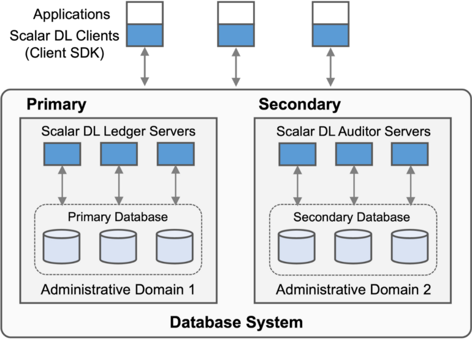

# ScalarDL の実装

import TranslationBanner from '/src/components/_translation-ja-jp.mdx';

<TranslationBanner />

ScalarDL は、正確性、スケーラビリティ、およびデータベース非依存性を実現する、トランザクショナルデータベースシステム用のスケーラブルで実用的なビザンチン故障検出ミドルウェアです。
このドキュメントでは、ScalarDL の実装について簡単に紹介します。
ScalarDL のアーキテクチャ、新規性、およびビザンチン故障検出プロトコルについては、[設計ドキュメント](design.mdx)を参照してください。

## ScalarDL コンポーネント

ScalarDL はデータベース上で動作するミドルウェアで、主に Java で書かれています。ScalarDL は、Ledger、Auditor、および Client SDK で構成されます。各コンポーネントを見てみましょう。

### Ledger

Ledger は、ビザンチン故障検出プロトコルのコミットフェーズを実装します。Ledger は、ユーザーがワンショットトランザクションを作成するためのコントラクトと呼ばれるプログラム可能な決定論的機能も管理します。コントラクトでは、ユーザーは任意のビジネスロジックを記述し、コントラクトで定義されたインターフェースを通じてデータベース操作を呼び出すことができます。ネストされた呼び出し、つまりコントラクトが別のコントラクトを呼び出すことがサポートされているため、ユーザーは複数のコントラクトを使用してアプリケーションのビジネスロジックをモジュール形式で実装できます。Ledger は、基盤となるデータベーストランザクションを利用して、ACID 方式で複数のコントラクトを実行します。各コントラクトは、後で検証できるように電子署名を付けて Java バイトコード形式でデータベースに保存されます。

Ledger は、Bigtable のデータモデルに似た Key-Value データモデルに基づいて、基盤となるデータベースを多次元マップとして抽象化します。さまざまなデータベースやデータモデルへの幅広い適用性を実現するために、抽象化を選択しました。レコードは、レコードキー (アプリケーションレベルの主キー)、バージョン、およびレコードの導出に使用される Contract 引数とすべてのレコード値の暗号化ハッシュを含む値のセットで構成されます。レコードキーとバージョンは主キーを形成し、主キーは値のセットを一意にマップします。Ledgerは、トレーサビリティを実現するために記録のバージョンを管理します。また、Ledger は、同じレコードキーを持つレコードのハッシュチェーンを構築して、レコードの部分的な悪意のある変更を困難にしますが、ScalarDL はビザンチン故障検出機能を提供するためにハッシュチェーン構造を必要としません。

Ledger は、データベースに依存しないプロパティを実現するためにデータベース抽象化を使用して検出プロトコルを実装します。データベースの抽象化を効率的に実装するために、ユニバーサルトランザクションマネージャーである ScalarDB を使用します。データベース抽象化は現在、PostgreSQL、MySQL、Oracle Database、Microsoft SQL Server、Apache Cassandra、Amazon DynamoDB、Amazon Aurora、Azure Cosmos DB、およびそれらの互換データベースをサポートしています。Cassandra、HBase、DynamoDB、Cosmos DB などの非 ACID データベースの場合、ScalarDB は、スナップショットの分離と厳密なシリアル化機能をサポートするデータベースに依存しない ACID トランザクション機能を使用してトランザクションを処理します。これらの ACID データベースに対して、ScalarDB には、トランザクション管理を基盤となるデータベースに委任するか、トランザクション管理を単独で実行するという2つのオプションが用意されています。

Ledger はそれ自体だけでユーザーにサービスを提供できます。このような場合、ScalarDL は、データベースに依存しないトランザクション機能を除いて、Oracle Blockchain Table や Amazon QLDB と同様に機能します。つまり、ScalarDL は単一の管理ドメイン (AD) でデータベースを管理するため、一部の限られたクラスのビザンチン故障のみを検出します。

### Auditor

Auditor は、ビザンチン故障検出プロトコルの順序付けフェーズと検証フェーズを実装します。また、 Auditor は Ledger と同じコントラクトを管理し、Ledger と同じデータベース抽象化を使用するため、 Auditor は基盤となるデータベースとしてさまざまなデータベースを使用できます。
正確性を保証するには、 Auditor を Ledger が配置されている管理ドメインとは別の管理ドメインに配置する必要があります。

### Client SDK

Client SDK は、プロトコルに基づいて Ledger および Auditor と対話します。Client SDK と統合されたアプリケーションプログラムは、電子署名用の鍵ペア (秘密鍵と証明書) を管理し、コントラクトの実行を認証するための電子署名付き実行リクエストを作成します。電子署名されたリクエストはデータベースにも保存されるため、誰がリクエストを実行したかを特定できるため、システムのセキュリティと追跡可能性がさらに高まります。Client SDK は、クライアントとサーバー間でシークレットを共有することで HMAC 認証を使用することもできます。ただし、HMAC 署名を追加したリクエストでは、そのような否認防止を提供できません。
Client SDK は、Java、Node.js、ブラウザ内 JavaScript、Go などの複数の言語で作成されています。

## 参考文献

* [ScalarDL設計ドキュメント](design.mdx)
