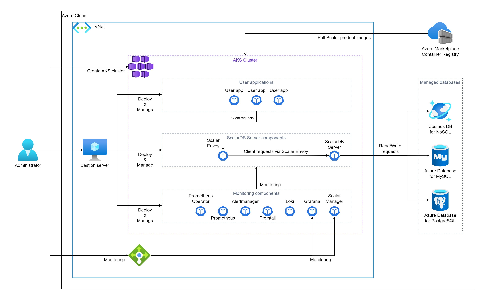
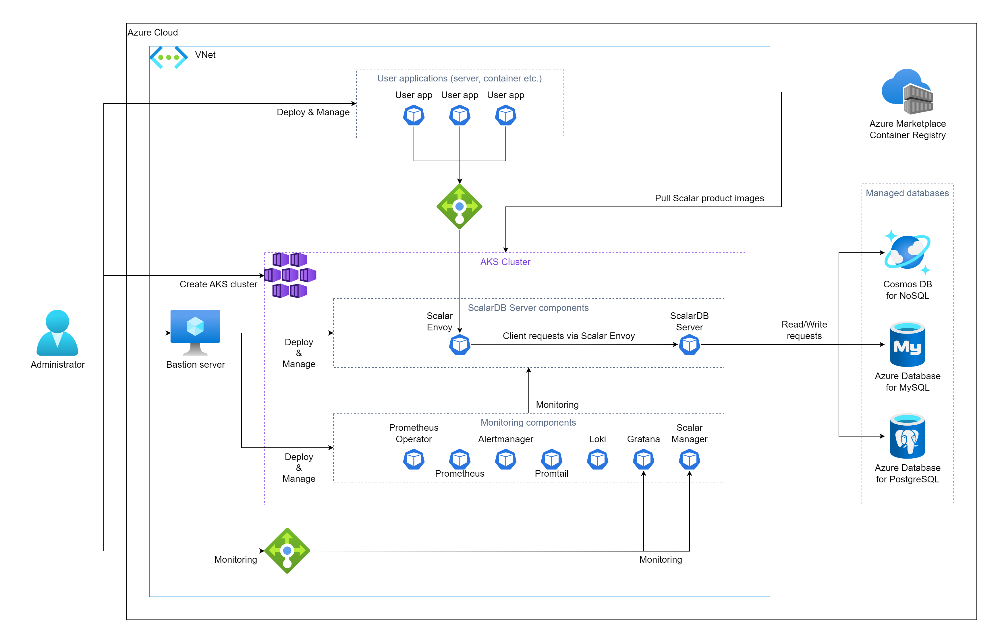

---
tags:
  - Enterprise Standard
  - Enterprise Premium
  - Deprecated
---

# [非推奨] Azure Kubernetes Service (AKS) に ScalarDB Server をデプロイする

import TranslationBanner from '/src/components/_translation-ja-jp.mdx';

<TranslationBanner />

このガイドでは、ScalarDB Server を Azure Kubernetes Service (AKS) にデプロイする方法について説明します。

このガイドでは、Azure 環境に次の 2 つの環境のいずれかを作成します。 2 つの環境の違いは、アプリケーションのデプロイをどのように計画するかです。

* アプリケーションを ScalarDB Server デプロイメントと同じ AKS クラスターにデプロイします。 この場合、アプリケーションから Scalar Envoy にアクセスするために Azure が提供するロード バランサーを使用する必要はありません。
  
    

* ScalarDB Server デプロイを含む AKS クラスターとは異なる環境にアプリケーションをデプロイします。 この場合、アプリケーションから Scalar Envoy にアクセスするには、Azure が提供するロード バランサーを使用する必要があります。

    

## ステップ 1. Azure Marketplace で ScalarDB Server にサブスクライブする

[Azure Marketplace](https://azuremarketplace.microsoft.com/en/marketplace/apps/scalarinc.scalardb) にアクセスし、ScalarDB Server をサブスクライブして、ScalarDB Server コンテナー イメージを取得する必要があります。 Azure Marketplace で ScalarDB Server をサブスクライブする方法の詳細については、[Microsoft Azure Marketplace から Scalar 製品を入手する](AzureMarketplaceGuide.mdx#microsoft-azure-marketplace-から-scalar-製品を入手する) を参照してください。

## ステップ 2. AKS クラスターを作成する

ScalarDB Server デプロイ用の AKS クラスターを作成する必要があります。 詳細については、[Scalar 製品用の AKS クラスターを作成するためのガイドライン](CreateAKSClusterForScalarProducts.mdx) を参照してください。

## ステップ 3. ScalarDB Server のデータベースをセットアップする

ScalarDB Server を展開する前にデータベースを準備する必要があります。 ScalarDB がサポートするデータベースのタイプを確認するには、[ScalarDB Supported Databases](https://scalardb.scalar-labs.com/docs/latest/requirements#databases) を参照してください。

データベースのセットアップの詳細については、[Azure での ScalarDB/ScalarDL デプロイ用のデータベースのセットアップ](SetupDatabaseForAzure.mdx) を参照してください。

## ステップ 4. 要塞サーバーを作成する

AKS 上で ScalarDB Server をデプロイおよび管理するためのいくつかのツールを実行するには、**手順 2** で作成した AKS クラスターの同じ Azure Virtual Networks (VNet) 内に要塞サーバーを準備する必要があります。 詳細については、[要塞サーバーの作成](CreateBastionServer.mdx) を参照してください。

## ステップ 5. Scalar Helm Chart のカスタム値ファイルを準備する

**ステップ 3** で作成したデータベース内の情報へのアクセスなどのタスクを実行するには、環境に基づいて ScalarDB Server の Scalar Helm Chart のカスタム値ファイルを構成する必要があります。 詳細については、[Configure a custom values file of Scalar Helm Chart](../helm-charts/configure-custom-values-file.mdx) を参照してください。

**注:** ScalarDB Server がデプロイされている AKS クラスターとは異なる環境にアプリケーションをデプロイする場合、Scalar Envoy にアクセスするには、`envoy.service.type` パラメーターを `LoadBalancer` に設定する必要があります。 応用。

## ステップ 6. Scalar Helm Chart を使用して ScalarDB Server をデプロイする

ScalarDB Server の Helm Chart を使用して、AKS クラスターに ScalarDB Server をデプロイします。 詳細については、[Deploy Scalar Products using Scalar Helm Chart](../helm-charts/how-to-deploy-scalar-products.mdx) を参照してください。

**注意:** `kubectl create ns scalardb` コマンドを使用して専用の名前空間を作成し、`helm install` コマンドで `-n scalardb` オプションを使用して名前空間に ScalarDB Server をデプロイすることをお勧めします。

## ステップ 7. ScalarDB Server デプロイメントのステータスを確認する

ScalarDB Server を AKS クラスターにデプロイした後、各コンポーネントの状態を確認する必要があります。 詳細については、[Kubernetes環境で実行する場合に定期的に確認するコンポーネント](RegularCheck.mdx) を参照してください。

## ステップ 8. ScalarDB Server の展開を監視する

ScalarDB Server を AKS クラスターにデプロイした後、特に運用環境では、デプロイされたコンポーネントを監視し、そのログを収集することをお勧めします。 詳細については、[Kubernetes クラスター上の Scalar 製品の監視](K8sMonitorGuide.mdx) および[Kubernetes クラスター上の Scalar 製品からのログの収集](K8sLogCollectionGuide.mdx) を参照してください。

## ScalarDB Server を AKS から削除します

作成した環境を削除する場合は、作成時とは逆の順序ですべてのリソースを削除してください。
