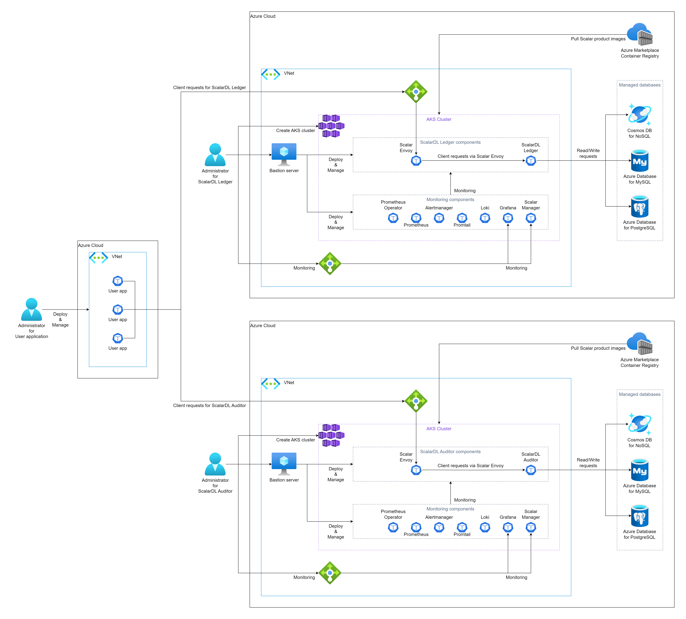

---
tags:
  - Enterprise
displayed_sidebar: docsJapanese
---

# ScalarDL Ledger と ScalarDL Auditor を Azure Kubernetes Service (AKS) にデプロイする

import TranslationBanner from '/src/components/_translation-ja-jp.mdx';

<TranslationBanner />

このガイドでは、Azure Kubernetes Service (AKS) に ScalarDL Ledger と ScalarDL Auditor をデプロイする方法について説明します。

このガイドでは、Azure 環境に次の3つの環境のいずれかを作成します。ビザンチン障害検出を適切に機能させるには、ScalarDL Ledger と ScalarDL Auditor を異なる管理ドメイン (つまり、別の環境) に展開することをお勧めします。

* 別の Azure アカウントを使用する (最も推奨される方法)

  

* 別の Azure Virtual Networks (VNet) を使用する (2番目に推奨される方法)

  

* 異なる名前空間を使用する (3番目に推奨される方法)

  

**注意:** このガイドは、2番目に推奨される方法「別の VNet を使用する」に従います。

## ステップ1. ScalarDL Ledger および ScalarDL Auditor コンテナーイメージを取得する

ScalarDL Ledger および ScalarDL Auditor コンテナーイメージを取得する必要があります。Scalar 製品のコンテナリポジトリの詳細については、[Scalar 製品のコンテナイメージを取得する方法](HowToGetContainerImages.mdx)を参照してください。

## ステップ2. ScalarDL Ledger の AKS クラスターを作成する

ScalarDL Ledger デプロイ用の AKS クラスターを作成する必要があります。詳細については、[Scalar 製品用の AKS クラスターを作成するためのガイドライン](CreateAKSClusterForScalarProducts.mdx)を参照してください。

## ステップ3. ScalarDL Auditor の AKS クラスターを作成する

ScalarDL Auditor デプロイ用の AKS クラスターも作成する必要があります。詳細については、[Scalar 製品用の AKS クラスターを作成するためのガイドライン](CreateAKSClusterForScalarProducts.mdx)を参照してください。

## ステップ4. ScalarDL Ledger のデータベースをセットアップする

ScalarDL Ledger を展開する前にデータベースを準備する必要があります。ScalarDL Ledger は内部で ScalarDB を使用してデータベースにアクセスするため、ScalarDB がサポートするデータベースの種類を確認するには、[ScalarDB Supported Databases](https://scalardb.scalar-labs.com/docs/latest/requirements#databases) を参照してください。

データベースのセットアップの詳細については、[Azure での ScalarDB/ScalarDL デプロイ用のデータベースのセットアップ](SetupDatabaseForAzure.mdx)を参照してください。

## ステップ5. ScalarDL Auditor のデータベースをセットアップする

ScalarDL Auditor を展開する前にデータベースを準備する必要もあります。ScalarDL Auditor は内部で ScalarDB を使用してデータベースにアクセスするため、ScalarDB がサポートするデータベースの種類を確認するには、[ScalarDB Supported Databases](https://scalardb.scalar-labs.com/docs/latest/requirements#databases) を参照してください。

データベースのセットアップの詳細については、[Azure での ScalarDB/ScalarDL デプロイ用のデータベースのセットアップ](SetupDatabaseForAzure.mdx)を参照してください。

## ステップ6. ScalarDL Ledger の踏み台サーバーを作成する

AKS で ScalarDL Ledger をデプロイおよび管理するためのいくつかのツールを実行するには、**手順2**で作成した AKS クラスターの同じ VNet に踏み台サーバーを準備する必要があります。詳細については、[踏み台サーバーの作成](CreateBastionServer.mdx)を参照してください。

## ステップ7. ScalarDL Auditor の踏み台サーバーを作成する

AKS で ScalarDL Auditor をデプロイおよび管理するためのいくつかのツールを実行するには、**手順3**で作成した AKS クラスターの同じ VNet に踏み台サーバーを準備する必要があります。詳細については、[踏み台サーバーの作成](CreateBastionServer.mdx)を参照してください。

## ステップ8. 2つの AKS クラスター間のネットワークピアリングを作成する

ScalarDL を適切に動作させるには、ScalarDL Ledger と ScalarDL Auditor が相互に接続する必要があります。[仮想ネットワークピアリング](https://docs.microsoft.com/en-us/azure/virtual-network/virtual-network-peering-overview)を使用して2つの VNet を接続する必要があります。詳細については、[ScalarDL Auditor モードのネットワークピアリングの構成](NetworkPeeringForScalarDLAuditor.mdx)を参照してください。

## ステップ9. ScalarDL Ledger と ScalarDL Schema Loader の両方の Scalar Helm Chart のカスタム値ファイルを準備する

**ステップ4**で作成したデータベース内の情報へのアクセスなどのタスクを実行するには、環境に基づいて ScalarDL Ledger と ScalarDL Schema Loader (Ledger 用) の両方の Scalar Helm Chart のカスタム値ファイルを構成する必要があります。詳細については、[Configure a custom values file for Scalar Helm Charts](../helm-charts/configure-custom-values-file.mdx を参照してください。

## ステップ10. Scalar Helm Chart を使用して ScalarDL Ledger をデプロイする

ScalarDL Ledger の Helm Chart を使用して、ScalarDL Ledger を AKS クラスターにデプロイします。詳細については、[Deploy Scalar products using Scalar Helm Charts](../helm-charts/how-to-deploy-scalar-products.mdx) を参照してください。

**注意:** `kubectl create ns scalardl-ledger` コマンドを使用して専用の名前空間を作成し、`helm install` コマンドで `-n scalardl-ledger` オプションを使用して名前空間に ScalarDL Ledger をデプロイすることをお勧めします。

## ステップ11. ScalarDL Auditor と ScalarDL Schema Loader の両方の Scalar Helm Chart のカスタム値ファイルを準備する

**ステップ5**で作成したデータベース内の情報へのアクセスなどのタスクを実行するには、環境に基づいて ScalarDL Auditor と ScalarDL Schema Loader (Auditor 用) の両方の Scalar Helm Chart のカスタム値ファイルを構成する必要もあります 。詳細については、[Configure a custom values file for Scalar Helm Charts](../helm-charts/configure-custom-values-file.mdx) を参照してください。

## ステップ12. Scalar Helm Chart を使用して ScalarDL Auditor をデプロイする

ScalarDL Auditor の Helm Chart を使用して、AKS クラスターに ScalarDL Auditor をデプロイします。詳細については、[Deploy Scalar products using Scalar Helm Charts](../helm-charts/how-to-deploy-scalar-products.mdx) を参照してください。

**注意:** `kubectl create ns scalardl-auditor` コマンドを使用して専用の名前空間を作成し、`helm install` コマンドで `-n scalardl-auditor` オプションを使用して名前空間に ScalarDL Auditor をデプロイすることをお勧めします。

## ステップ13. ScalarDL Ledger 導入のステータスを確認する

ScalarDL Ledger を AKS クラスターにデプロイした後、各コンポーネントの状態を確認する必要があります。詳細については、[Kubernetes環境で実行する場合に定期的に確認するコンポーネント](RegularCheck.mdx)を参照してください。

## ステップ14. ScalarDL Auditor デプロイメントのステータスを確認する

ScalarDL Auditor を AKS クラスターにデプロイした後、各コンポーネントの状態を確認する必要があります。詳細については、[Kubernetes環境で実行する場合に定期的に確認するコンポーネント](RegularCheck.mdx)を参照してください。

## ステップ15. ScalarDL Ledger の展開を監視する

AKS クラスターに ScalarDL Ledger をデプロイした後、特に運用環境では、デプロイされたコンポーネントを監視し、そのログを収集することをお勧めします。詳細については、[Kubernetes クラスター上の Scalar 製品の監視](K8sMonitorGuide.mdx)および [Kubernetes クラスター上の Scalar 製品からのログの収集](K8sLogCollectionGuide.mdx)を参照してください。

## ステップ16. ScalarDL Auditor の展開を監視する

AKS クラスターに ScalarDL Auditor をデプロイした後、特に運用環境では、デプロイされたコンポーネントを監視し、そのログを収集することをお勧めします。詳細については、[Kubernetes クラスター上の Scalar 製品の監視](./K8sMonitorGuide.mdx)および [Kubernetes クラスター上の Scalar 製品からのログの収集](K8sLogCollectionGuide.mdx)を参照してください。

## ScalarDL Ledger と ScalarDL Auditor を AKS から削除します

作成した環境を削除する場合は、作成時とは逆の順序ですべてのリソースを削除してください。
