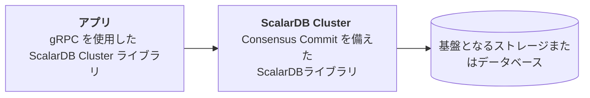
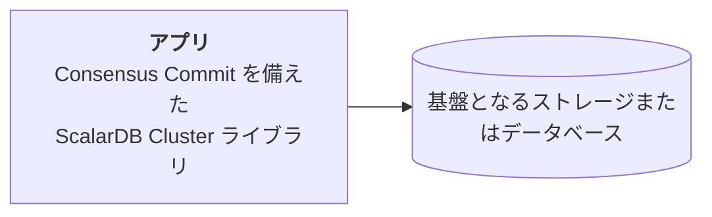
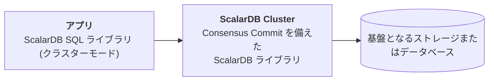
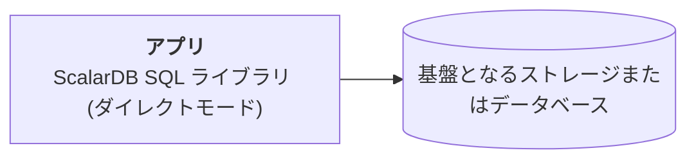

---
tags:
  - Enterprise Standard
  - Enterprise Premium
displayed_sidebar: docsJapanese
---

# ScalarDB Cluster の制作チェックリスト

import TranslationBanner from '/src/components/_translation-ja-jp.mdx';

<TranslationBanner />

このチェックリストは、実稼働環境に ScalarDB Cluster をデプロイする際の推奨事項を提供します。

## あなたが始める前に

このチェックリストでは、推奨される管理対象 Kubernetes クラスターに ScalarDB Cluster をデプロイしていることを前提としています。

## 実稼働チェックリスト: ScalarDB Cluster

以下は、運用環境で ScalarDB Cluster をセットアップする際の推奨事項のチェックリストです。

### ポッドと Kubernetes ワーカーノードの数

Kubernetes クラスターの高可用性を確保するには、少なくとも3つのワーカーノードを使用し、ワーカーノード全体に少なくとも3つのポッドをデプロイする必要があります。3つのポッドをワーカーノードに分散させるための `podAntiAffinity` の[サンプル構成](https://github.com/scalar-labs/scalar-kubernetes/blob/master/conf/scalardb-cluster-custom-values-indirect-mode.yaml)を参照できます。

:::note

ワーカーノードを異なるアベイラビリティゾーン (AZ) に配置すると、AZ の障害に耐えることができます。

:::

### ワーカーノードの仕様

商用ライセンスの観点から、ScalarDB Cluster を実行する1つのポッドのリソースは 2vCPU / 4GB メモリに制限されます。また、ScalarDB Cluster ポッド以外の一部のポッドがワーカーノード上に存在します。

つまり、次のコンポーネントは1つのワーカーノード上で実行できます。

* ScalarDB Cluster ポッド (2vCPU / 4GB)
* Envoy プロキシ (`indirect` クライアントモードを使用する場合、または Java 以外のプログラミング言語を使用する場合)
* アプリケーションポッド (同じワーカーノード上でアプリケーションのポッドを実行することを選択した場合)
* 監視コンポーネント (`kube-prometheus-stack` などの監視コンポーネントをデプロイする場合)
* Kubernetes コンポーネント

:::note

`direct-kubernetes` モードを使用する場合は、Envoy ポッドをデプロイする必要はありません。

:::

これを念頭に置いて、[ポッドと Kubernetes ワーカーノードの数](ProductionChecklistForScalarDBCluster.mdx#ポッドと-kubernetes-ワーカーノードの数)で説明されているように、少なくとも 4vCPU / 8GB のメモリリソースを持つワーカーノードを使用し、可用性のために少なくとも3つのワーカーノードを使用する必要があります。

ただし、実稼働環境では、ノードあたり少なくとも 4vCPU / 8GB のメモリリソースを備えた3つのノードが最小限です。システムのワークロードに応じて、Kubernetes クラスターのリソース (ワーカーノードの数、ノードあたりの vCPU、ノードあたりのメモリ、ScalarDB Cluster  ポッド、アプリケーションのポッドなど) も考慮する必要があります。また、[Horizontal Pod Autoscaling (HPA)](https://kubernetes.io/docs/tasks/run-application/horizontal-pod-autoscale/) などの機能を使用してポッドを自動的にスケーリングすることを計画している場合は、ワーカーノード上のポッドの最大数を考慮してワーカーノードのリソースを決定する必要があります。

#### 通信網

ScalarDB Cluster はインターネットアクセス経由でユーザーに直接サービスを提供しないため、Kubernetes クラスターはプライベートネットワーク上に作成する必要があります。アプリケーションからプライベートネットワーク経由で ScalarDB Cluster にアクセスすることをお勧めします。

### 監視とログ記録

デプロイされたコンポーネントを監視し、そのログを収集する必要があります。詳細については、[Kubernetes クラスター上の Scalar 製品の監視](K8sMonitorGuide.mdx)および `Kubernetes クラスター上の Scalar 製品からのログの収集](./K8sLogCollectionGuide.mdx)を参照してください。

### バックアップと復元

バックエンドデータベースで自動バックアップ機能とポイントインタイムリカバリ (PITR) 機能を有効にする必要があります。詳細については、[ScalarDB/ScalarDL 導入用のデータベースのセットアップ](SetupDatabase.mdx)を参照してください。

## 運用チェックリスト: ScalarDB Cluster にアクセスするクライアントアプリケーション

以下は、実稼働環境で ScalarDB Cluster にアクセスするクライアントアプリケーションをセットアップする際の推奨事項のチェックリストです。

### クライアントモード (Java クライアントライブラリのみ)

アプリケーションに Java を使用する場合、公式の Java クライアントライブラリを使用できます。この場合、[`direct-kubernetes mode`](https://scalardb.scalar-labs.com/docs/latest/scalardb-cluster/developer-guide-for-scalardb-cluster-with-java-api#direct-kubernetes-client-mode) または [`indirect mode`](https://scalardb.scalar-labs.com/docs/latest/scalardb-cluster/developer-guide-for-scalardb-cluster-with-java-api#indirect-client-mode) の2つのクライアントモードのいずれかを選択できます。

パフォーマンスの観点から、`direct-kubernetes` モードの使用をお勧めします。`direct-kubernetes` モードを使用するには、アプリケーションポッドを ScalarDB Cluster  ポッドと同じ Kubernetes クラスターにデプロイする必要があります。この場合、Envoy ポッドをデプロイする必要はありません。

何らかの理由で Java アプリケーションポッドを ScalarDB Cluster  ポッドと同じ Kubernetes クラスターにデプロイできない場合は、`indirect` モードを使用する必要があります。この場合、Envoy ポッドをデプロイする必要があります。

:::note

クライアントモード設定は Java クライアントライブラリ専用です。アプリケーションに Java 以外のプログラミング言語を使用する場合 (基本的に、[gRPC API](https://scalardb.scalar-labs.com/docs/latest/scalardb-cluster/scalardb-cluster-grpc-api-guide) または [gRPC SQL API](https://scalardb.scalar-labs.com/docs/latest/scalardb-cluster/scalardb-cluster-sql-grpc-api-guide) をプログラミング言語から直接使用する場合)、そのような構成は存在しません。この場合、Envoy ポッドをデプロイする必要があります。

:::

### トランザクションマネージャーの構成 (Java クライアントライブラリのみ)

クライアントアプリケーションは、常に ScalarDB Cluster を通じてデータベースにアクセスする必要があります。リクエストが適切に実行されていることを確認するには、クライアントアプリケーションのプロパティファイルをチェックし、CRUD API の使用時に `scalar.db.transaction_manager=cluster` が設定されていることを確認します。

#### 実稼働環境に推奨

#### 本番環境では推奨されません (テスト目的のみ)

### SQL 接続構成 (Java クライアントライブラリのみ)

クライアントアプリケーションは、常に ScalarDB Cluster を通じてデータベースにアクセスする必要があります。リクエストが適切に実行されていることを確認するには、クライアントアプリケーションのプロパティファイルをチェックし、SQL API を使用するときに `scalar.db.sql.connection_mode=cluster` が設定されていることを確認します。

#### 実稼働環境に推奨

#### 運用環境では推奨されません (テスト目的のみ)

### `direct-kubernetes` クライアントモードを使用する場合のクライアントアプリケーションのデプロイメント (Java クライアントライブラリのみ)

[`direct-kubernetes` client mode](https://scalardb.scalar-labs.com/docs/latest/scalardb-cluster/developer-guide-for-scalardb-cluster-with-java-api#direct-kubernetes-client-mode) を使用する場合は、クライアントアプリケーションを ScalarDB Cluster  デプロイメントと同じ Kubernetes クラスターにデプロイする必要があります。

また、`direct-kubernetes` クライアントモードを使用する場合は、クライアントアプリケーションが適切に動作するように追加の Kubernetes リソースをデプロイする必要があります。詳細については、[Deploy your client application on Kubernetes with `direct-kubernetes` mode](../helm-charts/how-to-deploy-scalardb-cluster.mdx#direct-kubernetes-モードを使用してクライアント-アプリケーションを-kubernetes-にデプロイします) を参照してください。

### トランザクション処理 (Java クライアントライブラリと gRPC API)

トランザクションを [`begin()`](https://scalardb.scalar-labs.com/docs/latest/api-guide#begin-or-start-a-transaction) した後、アプリケーションが常に [`commit()`](https://scalardb.scalar-labs.com/docs/latest/api-guide#commit-a-transaction) または [`rollback()`](https://scalardb.scalar-labs.com/docs/latest/api-guide#roll-back-or-abort-a-transaction) を実行するようにする必要があります。アプリケーションが `commit()` または `rollback()` を実行しない場合、アプリケーションで予期しない問題が発生したり、バックエンドデータベースから一貫性のないデータが読み取られる可能性があります。

:::note

[gRPC API](https://scalardb.scalar-labs.com/docs/latest/scalardb-cluster/scalardb-cluster-grpc-api-guide) または [SQL gRPC API](https://scalardb.scalar-labs.com/docs/latest/scalardb-cluster/scalardb-cluster-sql-grpc-api-guide) を使用する場合、アプリケーションは、`Begin` サービスを呼び出してトランザクションを開始した後、`Commit` サービスまたは `Rollback` サービスを呼び出す必要があります。

:::

### 例外処理 (Java クライアントライブラリと gRPC API)

アプリケーションがトランザクション例外を処理することを確認する必要があります。詳細については、使用している API のドキュメントを参照してください。

* [Handle exceptions (Transactional API)](https://scalardb.scalar-labs.com/docs/latest/api-guide#handle-exceptions).
* [Handle exceptions (two-phase commit transactions API)](https://scalardb.scalar-labs.com/docs/latest/two-phase-commit-transactions#handle-exceptions)
* [Execute transactions (ScalarDB SQL API)](https://scalardb.scalar-labs.com/docs/latest/scalardb-sql/sql-api-guide#execute-transactions)
* [Handle SQLException (ScalarDB JDBC)](https://scalardb.scalar-labs.com/docs/latest/scalardb-sql/jdbc-guide#handle-sqlexception)
* [Error handling (ScalarDB Cluster gRPC API)](https://scalardb.scalar-labs.com/docs/latest/scalardb-cluster/scalardb-cluster-grpc-api-guide#error-handling-1)
* [Error handling (ScalarDB Cluster SQL gRPC API)](https://scalardb.scalar-labs.com/docs/latest/scalardb-cluster/scalardb-cluster-sql-grpc-api-guide#error-handling-1)
