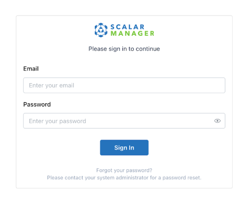
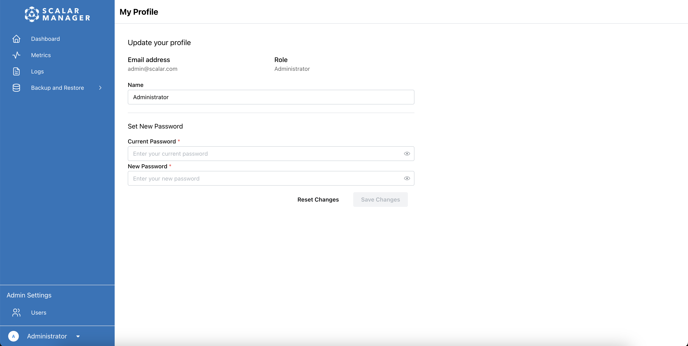
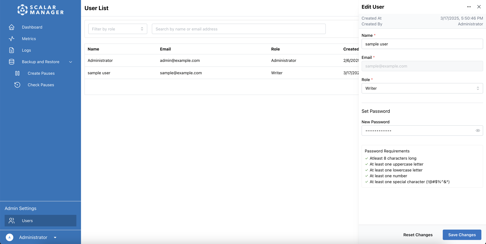
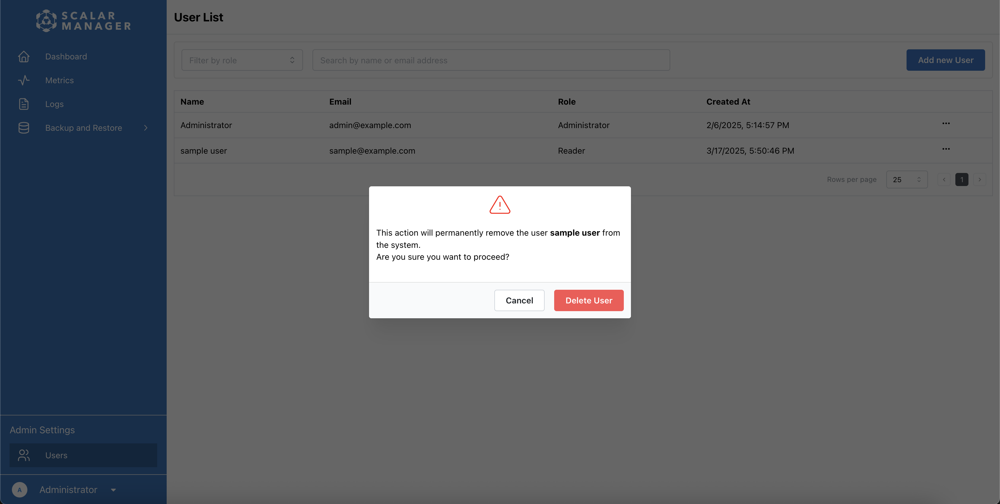
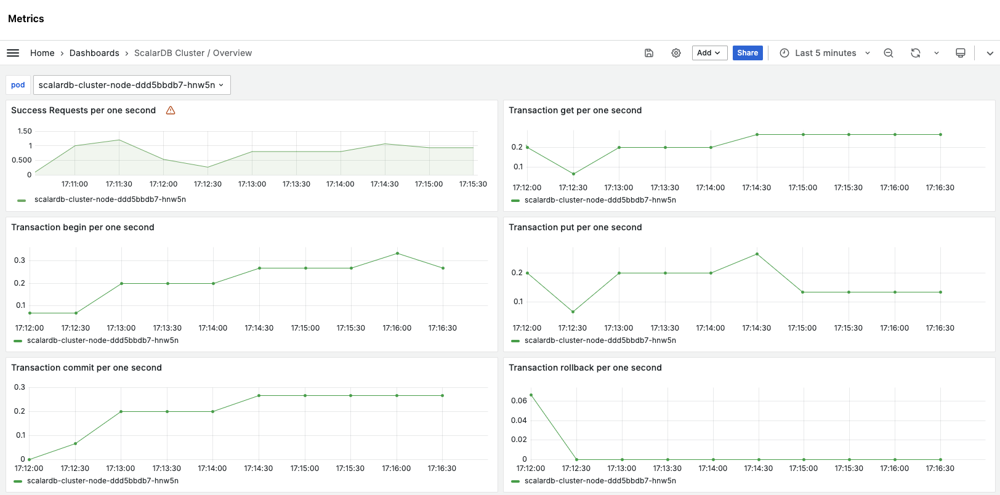
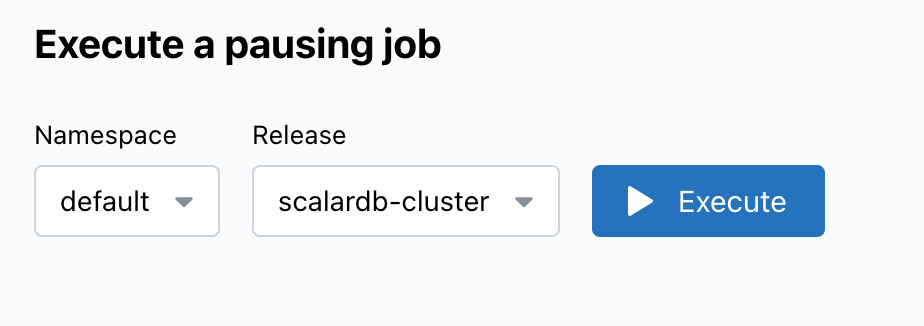
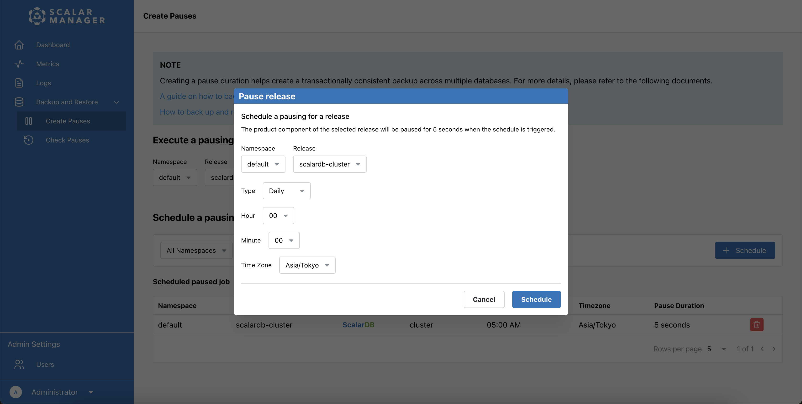
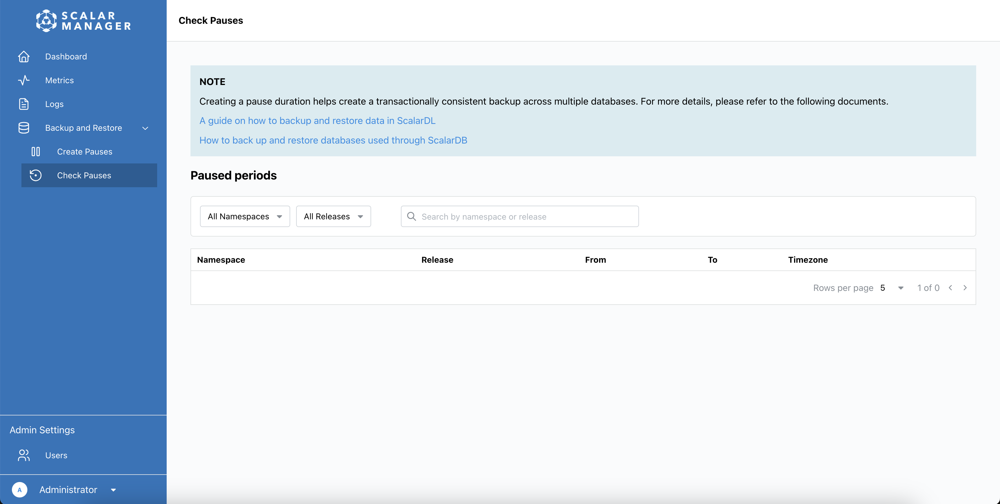

---
tags:
  - Enterprise Option
displayed_sidebar: docsJapanese
---

# Scalar Manager の使用方法

import TranslationBanner from '/src/components/_translation-ja-jp.mdx';

<TranslationBanner />

Scalar Manager は、Kubernetes 環境における ScalarDB および ScalarDL のための統合管理・監視ソリューションです。これまで個別のコマンドラインツールやサードパーティ製のソリューションで行っていた操作を、GUI (グラフィカルユーザーインターフェース) を通じて一元的に実行できます。

このガイドでは、Scalar Manager を使用して ScalarDB および ScalarDL のデプロイメントを監視・管理・保守する方法について説明します。

:::note

Scalar Manager のセットアップおよび構成手順については、[Scalar Manager のデプロイ](../helm-charts/getting-started-scalar-manager.mdx)を参照してください。

:::

## システム要件

Scalar Manager は、以下のウェブブラウザでアクセス可能なウェブアプリケーションです。

- Google Chrome (最新バージョン)
- Mozilla Firefox (最新バージョン)
- Microsoft Edge (最新バージョン)
- Safari (最新バージョン)

快適にご利用いただくために、以下の点にご注意ください。

- JavaScript が有効になっていることを確認してください。
- Scalar Manager のインスタンスに接続されていることを確認してください。
- アプリケーションドメインに対するポップアップブロッカーを無効にしてください。

:::note

本アプリケーションは、デスクトップおよびタブレット向けブラウザでの利用を想定しています。モバイルデバイスでの利用も可能な場合がありますが、動作は保証されておらず、サポート対象外となります。

:::

## ユーザー認証

このセクションでは、Scalar Manager へのログイン方法、パスワードの管理、SSO (シングルサインオン) の利用方法について説明します。

### Scalar Manager にログインする方法

1. ウェブブラウザで、システム管理者から提供された Scalar Manager のリンクを開きます。
2. **Email** フィールドにメールアドレスを入力します。
3. **Password** フィールドにパスワードを入力し、**Log In** を選択します。ログイン後、ダッシュボードにリダイレクトされます。

:::note

エラーメッセージが表示された場合は、メールアドレスとパスワードを再確認してから再度お試しください。

:::

### パスワードの管理方法

このセクションでは、パスワードの変更方法、パスワードの要件、およびパスワードを忘れた場合の対応について説明します。

#### パスワードを変更する

1. Scalar Manager にログインします。
2. プロファイルページに移動します。
3. **Set New Password** セクションに以下を入力します:
   - 現在のパスワード
   - 新しいパスワード
4. **Save** を選択して変更を適用します。

#### パスワードの要件

新しいパスワードを作成する際は、以下の条件を満たしていることを確認してください:

- 最低8文字以上
- 以下を少なくとも1つずつ含む:
   - 大文字1文字
   - 小文字1文字
   - 数字1文字
   - 特殊文字1文字

#### パスワードを忘れた場合の対処方法

1. システム管理者に連絡してください。
2. システム管理者がパスワードをリセットし、一時的なパスワードを提供するまでお待ちください。
3. 一時的なパスワードを使用してログインしてください。
4. ログイン後、すぐにパスワードを変更してください。

:::note

Scalar Manager は、セルフサービスによるパスワードの復旧をサポートしていません。

:::

### Grafana での SSO の利用方法

Scalar Manager は、既存の認証情報を使用して Grafana とのシームレスな認証を提供します。SSO 統合により、Scalar Manager インターフェースから任意の Grafana ダッシュボードに直接アクセスできます。Scalar Manager の認証情報を使用すると、認証は自動的に行われます。

:::note

- SSO 統合には、システム管理者による適切な設定が必要です。
- ログインプロンプトが表示された場合は、システム管理者にお問い合わせください。

:::

## ユーザーロール

このセクションでは、Scalar Manager でユーザーに割り当てることができるロールについて説明します。

### 利用可能なロールと権限

システムには、拡張またはカスタマイズできない3つの固定ロールがあります:

| ロール        | 説明                      |
|---------------|---------------------------|
| Administrator | フルシステムアクセス      |
| Writer        | クラスター管理アクセス    |
| Reader        | 表示のみのアクセス        |

### ロールベースの機能アクセス

各ロールで利用可能な機能を理解することで、ユーザーに適切なロールを割り当てるのに役立ちます:

| 機能                     | Administrator | Writer | Reader |
|--------------------------|---------------|--------|--------|
| ユーザー管理             | ✅            | –      | –      |
| クラスター操作           | ✅            | ✅     | –      |
| ポーズの実行             | ✅            | ✅     | –      |
| クラスター情報の表示     | ✅            | ✅     | ✅      |
| メトリクスの表示         | ✅            | ✅     | ✅      |
| ログの表示               | ✅            | ✅     | ✅      |

:::note

ロールの割り当ては、保存後すぐに有効になります。

:::

## ユーザー管理

Administrator ロールを持つユーザーは、Scalar Manager を通じてユーザーアカウントの作成、変更、削除を行うことができます。

### ユーザーにロールを割り当てる方法

Administrator ロールを持つユーザーのみが、ユーザーロールの割り当てまたは変更を行うことができます。ロールは2つの方法で割り当てることができます。

#### 1. ユーザー作成時のロール割り当て

1. **Admin Settings** の下にある **Users** メニュー項目を選択して、ユーザーリストに移動します。
2. **Add User** を選択して新しいユーザーを作成します。ページの右側にサイドバーが表示されます。
3. 新しく作成したユーザーにロールを割り当てるには、以下の手順に従います:
   1. ユーザー情報 (名前、メールアドレス、パスワード) を入力します。
   2. **Role** ドロップダウンメニューで、以下の3つのロールのいずれかを選択します:
     - Administrator
     - Writer
     - Reader
   3. **Add User** を選択して、割り当てたロールでユーザーを作成します。

#### 2. 既存ユーザーのロール変更

1. **Admin Settings** の下にある **Users** メニュー項目を選択して、ユーザーリストに移動します。システム内のすべてのユーザーのリストが表示されます。
2. ロールを変更したいユーザーを選択します。現在のユーザー情報を表示するサイドバーが表示されます。
3. **Role** ドロップダウンで、ユーザーに割り当てたい新しいロールを選択します。
4. **Save Changes** を選択して変更を適用します。

### 新しいユーザーの作成

1. **ユーザー管理ページへのアクセス**
   - ページ下部の管理設定にある `Users` メニュー項目をクリックします
   - ユーザーリストページに移動します
2. **ユーザーリストの使用**
   - ユーザーリストにはシステム内のすべてのユーザーが表示されます
   - ロールフィルターを使用してロール別にユーザーをフィルタリングできます
   - 検索バーを使用して名前またはメールアドレスで特定のユーザーを検索できます
3. **新しいユーザーの作成**
   - `Add User` ボタンをクリックします
   - ページの右側にサイドバーが表示されます
   - 必要なユーザー情報を入力します:
     - 名前
     - メールアドレス
     - ユーザーのロールを選択します
     - 初期パスワードを入力します
   - `Add User` ボタンをクリックしてユーザーを作成します

:::note

システムは現在、メール通知をサポートしていません。新しいユーザーには、他の手段で認証情報を通知する必要があります。

:::

### ユーザー詳細の変更

1. **Admin Settings** の下にある **Users** メニュー項目を選択して、ユーザーリストに移動します。システム内のすべてのユーザーのリストが表示されます。
2. リストから変更したいユーザーを選択します。ページの右側に、ユーザーの現在の情報を表示するサイドバーが表示されます。
3. サイドバーで、変更したい情報を選択します:
   - ユーザー名
   - メールアドレス
   - ロールの割り当て
   - パスワード (必要な場合)
4. **Save Changes** を選択して変更を適用します。

:::note

ユーザー詳細の変更は、保存後すぐに有効になります。

:::

### ユーザーの無効化・削除

:::note

システムはユーザーアカウントの一時的な無効化をサポートしていません。ユーザーアカウントは完全に削除されるのみです。

:::

1. **Admin Settings** の下にある **Users** メニュー項目を選択して、ユーザーリストに移動します。システム内のすべてのユーザーのリストが表示されます。
2. リストで削除したいユーザーを見つけ、ユーザー名の横にある **...** (コンテキストメニュー) を選択します。
3. メニューから **Delete** を選択します。
4. 表示されるダイアログウィンドウで削除を確認します。

:::note

ユーザーが削除されると:

- アカウントは完全に削除されます。
- 認証トークンは機能しなくなります。
- この操作は元に戻せません。

:::

### ユーザーのパスワードのリセット

1. 管理者設定の **Users** セクションに移動します。システム内のすべてのユーザーのリストが表示されます。
2. リストからユーザーを見つけ、そのアカウントを選択してプロフィールを開きます。
3. **Password** フィールドに、ユーザーが一時的に使用するパスワードを入力します。
4. 変更を保存します。
5. ユーザーに一時的なパスワードを通知します。
6. その一時的なパスワードでログインした後、パスワードを変更するようユーザーに指示します。

## クラスター管理

このセクションでは、Scalar Manager でクラスターダッシュボードを表示する方法と、詳細なリリース情報にアクセスする方法について説明します。

### クラスターダッシュボードの表示方法

ログイン後、Kubernetes クラスターと Scalar 製品の監視と管理に役立つメインダッシュボードが表示されます。

#### クラスター全体のヘルス表示

ダッシュボードの上部セクションで、以下の情報を確認できます:

- Kubernetes クラスターの可用性ステータス
- 総 CPU 使用率
- 総メモリ使用率
- 現在の RPS (リクエスト/秒)

#### リリースステータスの監視

ダッシュボードには、リリース別にグループ化されたすべての Scalar 製品のリストが表示されます。各行で以下の情報を確認できます:

- ネームスペース名
- リリース名
- Scalar 製品名とコンポーネントタイプ
- Pod の可用性
- 現在の RPS (リクエスト/秒)
- リソース使用率 (CPU とメモリ)

### 詳細なリリース情報のアクセス方法

特定のリリースの詳細情報を取得するには、ダッシュボードのリストに移動し、リスト内の任意の行を選択して、そのリリースの詳細ページを開きます。

- **リリースメトリクスの表示。** 詳細ページで以下の情報を確認できます:
   - 全体の可用性ステータス
   - 総 CPU 使用率
   - 総メモリ使用量
   - 現在の RPS
- **個別 Pod の監視。** Pod リストで以下の情報を確認できます:
   - Pod ステータス (Running、Pending、Failed)
   - アプリケーション名
   - Pod 名と IP アドレス
   - アップタイム時間
   - 再起動回数
   - 個別 Pod のリソース使用量
- **Pod のヘルス分析。** Pod 情報を使用して以下を実行します:
   - 問題のある Pod の特定 (再起動回数が多いまたは失敗ステータス)
   - リソース配分の監視
   - 個別 Pod のパフォーマンス追跡
- **Pod のフィルタリングと検索。** Pod リスト上部の検索バーを使用して以下でフィルタリングします:
   - アプリケーション名
   - Pod 名
   - IP アドレス

## 監視

Scalar Manager は、以下のカテゴリーで包括的なメトリクスを提供します:

- **Total Requests:** 全体の成功率と失敗率
- **Distributed Transaction Admin Service:** テーブル管理操作
- **Distributed Transaction Service:** 標準トランザクションのトランザクション操作
- **Two Phase Commit Transaction Service:** 2フェーズコミット (2PC) トランザクションのトランザクション操作
- **GraphQL Service:** GraphQL API のパフォーマンス
- **SQL Total Requests:** SQL インターフェースの使用状況
- **SQL Distributed Transaction Service:** SQL トランザクション操作
- **SQL Two Phase Commit Transaction Service:** SQL 2PC トランザクション操作
- **SQL Metadata Service:** SQL スキーマ操作

各メトリクスの詳細説明と解釈については、[Scalar Manager メトリクスリファレンス](metrics-reference.mdx)を参照してください。

### メトリクスの表示方法

メトリクスダッシュボードは、ScalarDB と ScalarDL の製品固有メトリクスで事前設定されています。以下を実行できます:

- 異なる製品やコンポーネント用の事前登録されたダッシュボードから選択。
- リアルタイムパフォーマンスメトリクスの表示。
- 過去のデータトレンドの分析。
- システムヘルス指標の監視。

メトリクスダッシュボードにアクセスするには:

1. サイドメニューで **Metrics** を選択します。
2. **Open metrics dashboard in Grafana** を選択します。Grafana が開き、クラスターメトリクスが表示されます。

認証は Scalar Manager の認証情報を使用してシームレスに処理されます。

## ログ管理

このセクションでは、ログのアクセス方法とクラスターの一時停止と再開について説明します。

### ログのアクセス方法

ログダッシュボードにアクセスするには:

1. サイドメニューで **Logs** を選択します。
2. **Open logs in Grafana** を選択します。Grafana が開き、クラスターの Pod からのログが表示されます。

ログダッシュボードは、クラスターの Pod 情報で事前設定されています。以下を実行できます:

- Pod ラベルでログをフィルタリング。
- 特定のログエントリを検索。
- リアルタイムログストリームの表示。
- 過去のログデータの分析。

## クラスターの一時停止と再開

一時停止 (ポーズ) は、バックアップなどの操作中にトランザクションの整合性を確保するために、新しいトランザクションの受け入れを一時的に停止するプロセスです。これにより、操作開始前にすべてのトランザクションが完了することを確実にし、データの整合性を維持することができます。

一時停止の詳細情報と使用タイミングについては、[ScalarDB を使用したデータベースのバックアップと復元方法](https://scalardb.scalar-labs.com/ja-jp/docs/latest/backup-restore)を参照してください。

### 一時停止ジョブの即座実行方法

一時停止ジョブを即座実行するには:

1. **Backup & Restore** に移動します。
2. **Create Pauses** を選択します。
3. ドロップダウンメニューからネームスペースを選択します。
4. ドロップダウンメニューからリリースを選択します。
5. **Execute** を選択します。これにより、リリース内のすべての Scalar 製品が一時停止します。

### 一時停止ジョブのスケジュール設定方法

1. **Backup & Restore** に移動します。
2. **Create Pauses** を選択します。
3. **+ Schedule** を選択します。スケジュールを設定するためのポップアップウィンドウが表示されます。
4. ドロップダウンメニューからネームスペースとリリースを選択します。
5. スケジュールタイプ (Daily、Weekly、または Monthly) を選択します。
6. 時刻パラメーター (時と分)、タイムゾーン、一時停止時間を設定します。
7. **Schedule** を選択してスケジュールを作成します。
   - スケジュールを破棄するには、**Cancel** を選択します。

### スケジュールされた一時停止の表示と管理方法

一時停止ジョブは、スケジュールされた一時停止ジョブリストに表示されます。

スケジュールされた一時停止ジョブのリストを表示するには:

1. **Backup & Restore** に移動します。
2. **Scheduled Pauses** を選択します。リストには、ネームスペース、リリース名、製品、コンポーネント、スケジュール時刻、タイムゾーン、一時停止時間などの詳細とともに、すべてのスケジュールされた一時停止ジョブが表示されます。

スケジュールされた一時停止ジョブを削除するには:

1. スケジュールされた一時停止ジョブの横にある **Delete** を選択します。
2. プロンプトが表示されたら削除を確認します。

特定の一時停止ジョブを表示するには:

- 検索バーを使用してキーワードでスケジュールされた一時停止を見つける。
- ネームスペースまたはリリースでリストをフィルタリングする。

### 一時停止結果の確認方法

一時停止確認ページでは、実行された一時停止の結果を表示し、一時停止が適切に実行された時期についての情報を提供します:

1. **Backup & Restore** に移動します。
2. **Check Pauses** を選択します。一時停止確認ページは読み取り専用ページで、ネームスペース、リリース、開始/終了時刻、タイムゾーンなどの詳細とともに、実行された一時停止ジョブの結果を表示します。

特定の一時停止ジョブを表示するには:

- 検索バーを使用してキーワードでスケジュールされた一時停止を見つける。
- ネームスペースまたはリリースでリストをフィルタリングする。

:::note

このページは、実行された一時停止の結果のみを表示します。[一時停止ジョブのスケジュール設定](#一時停止ジョブのスケジュール設定方法)または[一時停止ジョブの実行](#一時停止ジョブの即座実行方法)を行うには、前のセクションで説明したように、Create Pauses ページに移動する必要があります。

:::

