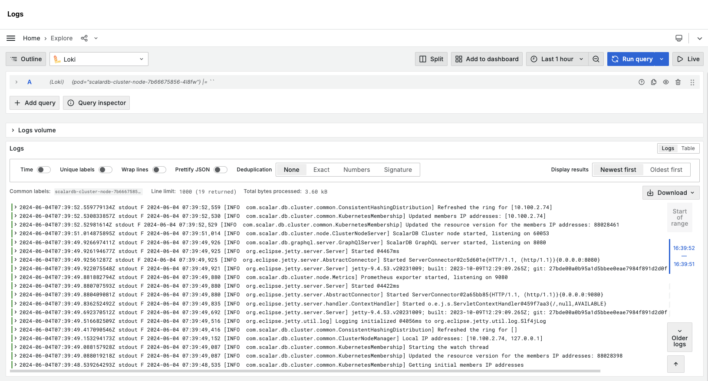
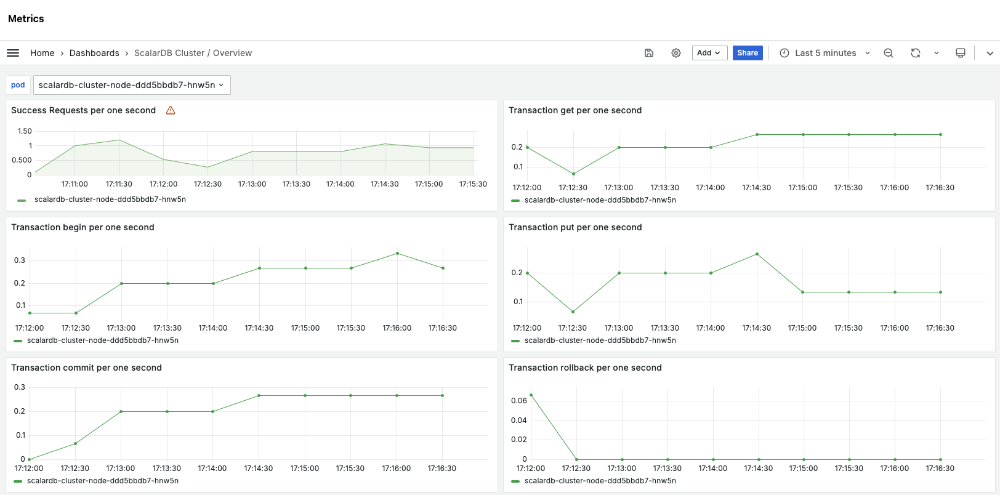

---
tags:
  - Enterprise Option
displayed_sidebar: docsJapanese
---

# Scalar Manager 概要

import TranslationBanner from '/src/components/_translation-ja-jp.mdx';

<TranslationBanner />

Scalar Manager は、Kubernetes クラスタ環境内で ScalarDB および ScalarDL の集中管理および監視ソリューションです。
これらの製品に関連する運用タスクを、グラフィカルユーザーインターフェイスに主要な機能を集約することで簡素化します。

## なぜ Scalar Manager なのか？

Scalar Manager がリリースされる前は、ユーザーは ScalarDB および ScalarDL のデプロイメントを管理および監視するために、さまざまなコマンドラインツールやサードパーティソリューションを個別に使用する必要がありました。
例えば、ユーザーはデプロイメントのステータスを確認するために kubectl を使用し、メトリクスの監視には Prometheus スタック、ログ分析には Loki スタックを使用し、複数のデータベース間でトランザクションの一貫性を確保するために Scalar の独自の CLI ツールを使用して Scalar 製品を一時停止していました。
これらのツールの組み合わせは、習得の難易度が高く、統一されたインターフェースが欠けていたため、日常の管理タスクやトラブルシューティングの際に効率的なワークフローを提供できませんでした。

Scalar Manager は、これらの問題点を解消し、主要な機能を単一のユーザーフレンドリーな GUI に集約することで、管理および監視に必要な時間と労力を削減します。
これにより、ユーザーはビジネスの開発や運用に集中できるようになります。

## 主な機能

Scalar Manager は、以下の機能をユーザーに提供します。

### 集中化されたクラスターの可視化

ユーザーは、クラスターの健康状態、pod ログ、ハードウェアの使用状況、リクエスト毎秒などのパフォーマンスメトリクス、Grafana ダッシュボードを介して可視化された詳細な時系列データについて、リアルタイムのメトリクスを迅速に取得できます。

Pod ログとメトリクスは、リアルタイムまたは時系列で表示することができます。

### 簡素化されたジョブの一時停止管理

ユーザーは、トランザクションの一貫性を確保するために、一時停止ジョブを実行またはスケジュールし、スケジュールされたジョブを確認および管理し、直感的な GUI 内で一時停止状態を監視することができます。

### ユーザー管理

Scalar Manager には現在、認証機能が含まれており、デプロイメントへの安全なアクセス制御が可能になっています。このシステムは、管理者が直感的なインターフェイスを通じてユーザーアカウントの作成、変更、削除を行うことができるユーザー管理機能を提供しています。

### 認証と承認

ロール管理機能により、管理者はユーザーに特定の役割を定義して割り当て、Scalar Manager 環境内でのアクセス権限を制御することができます。この詳細な制御により、ユーザーは自分の責任に関連する機能にのみアクセスできるようになります。

### Grafana による統合認証

Scalar Manager は現在、Grafana インスタンスとシステムのその他のコンポーネント間でシームレスな認証統合を提供しています。このシングルサインオン機能により、複数の認証プロセスが不要になり、ユーザーエクスペリエンスが向上し、認証情報管理のオーバーヘッドを軽減することでセキュリティが強化されます。

さまざまなツールやソリューションを使用して ScalarDB および ScalarDL を管理および監視し続けることはできますが、Scalar Manager は運用効率とユーザーエクスペリエンスを向上させるよりシンプルなアプローチを提供します。
