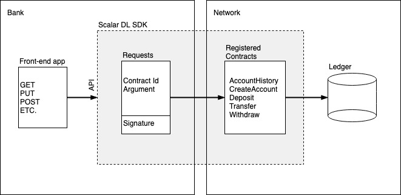

---
tags:
  - Community
  - Enterprise
displayed_sidebar: docsJapanese
---

# 簡単な銀行口座アプリケーション

import TranslationBanner from '/src/components/_translation-ja-jp.mdx';

<TranslationBanner />

## 概要

これは単純な銀行口座アプリケーションであり、[`scalardl` リポジトリ](https://github.com/scalar-labs/scalardl/tree/master/docs/applications/simple-bank-account/)にあります。ユーザーが実行できるアクションは、アカウントの作成、アカウント履歴の表示、アカウントへの資金の入金、アカウントからの資金の引き出し、アカウント間の資金の転送です。アカウントで実行されたすべてのアクションは ScalarDL に記録されます。これは、ブロックチェーンがブロックを記録する方法と似た方法で、アカウント履歴が改ざん検知可能な方法で記録されることを意味します。これは、アカウント履歴が (意図的かどうかに関わらず) 変更された場合、これを検出することが可能であることを意味します。

ここでは物事を簡単にするために、銀行がすべてのコントラクトを実行するための秘密鍵を保持していると仮定します (これがどのように機能するかについては、以下を参照してください)。おそらくこれは、この銀行アプリケーションを実際に使用する方法ではありません。この場合、悪意のあるアカウントマネージャーがユーザーのアカウント履歴を実際に変更する可能性があります。たとえば、単にアカウントを再作成し、偽のデータを入力するだけです。より意味のある設定は、銀行が口座に入金するための秘密鍵を所有し、各ユーザーが自分の秘密鍵を使用して引き出しと送金のコントラクトを登録することです。その場合、銀行のみが口座に資金を移動でき、ユーザーのみが口座から資金を移動できます。

このアプリケーションでは、次の5つのコントラクトを使用します。

- [`AccountHistory.java`](https://github.com/scalar-labs/scalardl/blob/master/docs/applications/simple-bank-account/contract/src/main/java/com/scalar/application/bankaccount/contract/AccountHistory.java)
- [`CreateAccount.java`](https://github.com/scalar-labs/scalardl/blob/master/docs/applications/simple-bank-account/contract/src/main/java/com/scalar/application/bankaccount/contract/CreateAccount.java)
- [`Deposit.java`](https://github.com/scalar-labs/scalardl/blob/master/docs/applications/simple-bank-account/contract/src/main/java/com/scalar/application/bankaccount/contract/Deposit.java)
- [`Transfer.java`](https://github.com/scalar-labs/scalardl/blob/master/docs/applications/simple-bank-account/contract/src/main/java/com/scalar/application/bankaccount/contract/Transfer.java)
- [`Withdraw.java`](https://github.com/scalar-labs/scalardl/blob/master/docs/applications/simple-bank-account/contract/src/main/java/com/scalar/application/bankaccount/contract/Withdraw.java)

これらのコントラクトは銀行によって登録され、銀行はそれぞれ、口座履歴の表示、口座の作成、口座への入金、口座間の資金移動、口座からの資金の引き出しを行うことができます。

このアプリケーションの全体的なアーキテクチャは次のようになります。(この使用例は簡素化のためのものであり、実際には少し異なる可能性があることに再度注意してください。)



## このサンプルアプリケーションの前提条件

- [Eclipse Temurin](https://adoptium.net/temurin/releases/) の OpenJDK LTS バージョン (8, 11, 17, or 21)

:::note

- 上記の LTS バージョンの使用をお勧めしますが、他の非 LTS バージョンでも動作する可能性があります。
- また、他の JDK でもこのサンプルアプリケーションは動作するはずですが、テストは行っていません。

:::

## アプリケーションを試してみる

[ScalarDL Client SDK](https://github.com/scalar-labs/scalardl-client-sdk)をダウンロードします。ScalarDL が実行されていることを確認し、必要なコントラクトをすべて実行して登録します。

```console
./gradlew build
cd contract
SCALAR_SDK_HOME=/path/to/scalardl-client-sdk ./register
```

IntelliJ (または選択した IDE) を使用するか、プロジェクトのホームディレクトリで `gradle bootRun` を実行して、アプリケーションを実行します。アプリと対話するために HTTP リクエストを送信できるサーバーを `localhost:8080` 上に作成する必要があります。詳細については、[API ドキュメント](./docs/api_endpoints.mdx)を参照してください。HTTP リクエストを作成するには、[Postman](https://www.getpostman.com/) が便利です。

## ScalarDL アプリケーションの作成に関する短いチュートリアル

Spring Boot を使用して、コントラクトと対話する Web サービスを作成することにしました。もちろん、これが唯一の選択肢ではありません。別の選択肢は、たとえば [アセット管理アプリケーション](https://github.com/indetail-blockchain/getting-started-with-scalardl)で行われたように、コマンドラインインターフェースを作成することです。そこには、ScalarDL 用のアプリケーションを作成するための非常に優れたチュートリアルもあります。

このチュートリアルでは、Web サービスまたはコマンドラインインターフェースのレベルでの詳細については説明せず、代わりにアプリケーションと ScalarDL の間の対話に焦点を当てます。コントラクトの作成方法、コントラクトの登録方法、そして ScalarDL SDK を使用してアプリケーションからこれらのコントラクトを呼び出す方法について説明します。

### コントラクト

コントラクトは、 `JacksonBasedContract` クラスを拡張し、 `invoke` メソッドをオーバーライドする Java クラスです。`Deposit.java` コントラクトを詳しく見てみましょう。

```java
package com.scalar.application.bankaccount.contract;

import com.fasterxml.jackson.databind.JsonNode;
import com.scalar.dl.ledger.statemachine.Asset;
import com.scalar.dl.ledger.contract.JacksonBasedContract;
import com.scalar.dl.ledger.exception.ContractContextException;
import com.scalar.dl.ledger.statemachine.Ledger;
import java.util.Optional;
import javax.annotation.Nullable;

public class Deposit extends JacksonBasedContract {
  @Override
  public JsonNode invoke(
      Ledger<JsonNode> ledger, JsonNode argument, @Nullable JsonNode properties) {
    if (!argument.has("id") || !argument.has("amount")) {
      throw new ContractContextException("a required key is missing: id and/or amount");
    }

    String id = argument.get("id").asText();
    long amount = argument.get("amount").asLong();

    if (amount < 0) {
      throw new ContractContextException("amount is negative");
    }

    Optional<Asset<JsonNode>> asset = ledger.get(id);

    if (!asset.isPresent()) {
      throw new ContractContextException("account does not exist");
    }

    long oldBalance = asset.get().data().get("balance").asLong();
    long newBalance = oldBalance + amount;

    ledger.put(id, getObjectMapper().createObjectNode().put("balance", newBalance));
    return getObjectMapper()
        .createObjectNode()
        .put("status", "succeeded")
        .put("old_balance", oldBalance)
        .put("new_balance", newBalance);
  }
}
```
このコントラクトが適切に機能するためには、ユーザーはアカウントの `id` と `amount` を指定する必要があります。したがって、最初に行うことは、引数にこれら2つのキーが含まれているかどうかを確認し、含まれていない場合は `ContractContextException` をスローすることです。

**注記:** `ContractContextException` はコントラクト内で唯一スロー可能な例外であり、回復不可能なエラーが発生した場合は常にスローされる必要があります。

したがって、`id` と `amount` があると仮定して、`amount` に対して簡単な非負のチェックを行い、負の場合は再度 `ContractContextException` をスローします。これで、`ledger` を操作する準備が整いました。

`ledger` で呼び出すことができるメソッドは3つあります: `get(String s)`、 `put(String s, JsonNode jsonNode)`、および `scan(AssetFilterassetFilter)` です。`get(String s)` は Ledger からアセット `s` を取得します。`put(String s, JsonNode jsonNode)` は、アセット `s` をデータ `jsonNode` に関連付け、アセットの age を増やします。`scan(AssetFilterassetFilter)` は、`AssetFilter` で指定されたアセットの履歴のバージョンを返します。

**注記:** Ledger ではブラインドライトは許可されていません。つまり、特定のアセットに対して `put` を実行する前に、まずそのアセットを `get` する必要があります。さらに、 `scan` は読み取り専用コントラクトでのみ許可されます。つまり、1つのコントラクトで `scan` と `put` の両方を行うことはできません。

コントラクトの残りの部分は単純な方法で進められます。まず Ledger からアセットを `get` し、現在の残高を取得し、それに預金額を追加し、最後に新しい残高でアセットを Ledger に `put` します。

最後に `JsonNode` を返す必要があります。`JsonNode` に何が含まれるかは、コントラクトの設計者次第です。ここでは、`status` メッセージ、`old_balance`、および `new_balance` を含めることにしました。

必要に応じて、このアプリケーションが使用する他のコントラクトを [`scalardl` リポジトリ内のこのサンプルの `contract` フォルダー](https://github.com/scalar-labs/scalardl/tree/master/docs/applications/simple-bank-account/contract/src/main/java/com/scalar/application/bankaccount/contract)で参照できます。

コントラクトを作成したら、それをコンパイルする必要があります。これは次のようにして実行できます。

```console
./gradlew build
```

### 認定資格とコントラクトの登録

これでコントラクトを作成し、コンパイルしたはずです。ただし、それらを実行する前に、ScalarDL ネットワークに登録する必要があります。[ScalarDL Client SDK](https://github.com/scalar-labs/scalardl-client-sdk) `client/bin` ディレクトリで利用可能なツールを利用して、コントラクトを登録して実行します。このディレクトリにアクセスできることを確認してください。

ここで、証明書 (例: `client.pem`) とそれに対応する秘密鍵 (例: `client-key.pem`)、および ScalarDL を起動して実行する必要があります。設定に合わせて `client.properties` (`conf` ディレクトリにあります) を編集します。次のような行が含まれている必要があります。

```console
scalar.dl.client.server.host=localhost
scalar.dl.client.server.port=50051
scalar.dl.client.cert_holder_id=alice
scalar.dl.client.cert_path=conf/client.pem
scalar.dl.client.private_key_path=conf/client-key.pem
```

すべてが正しく設定されていれば、次のように証明書を ScalarDL ネットワークに登録できるはずです。

```console
cd contract
${SCALAR_SDK_HOME}/client/bin/scalardl register-cert --properties ../conf/client.properties
```

成功すると、ステータスコード200が返されます。

コントラクトを登録するには、次の形式を使用して `conf` ディレクトリに `contracts.toml` ファイルを作成します。

```toml
[[contracts]]
contract-id = "create-account"
contract-binary-name = "com.scalar.application.bankaccount.contract.CreateAccount"
contract-class-file = "build/classes/java/main/com/scalar/application/bankaccount/contract/CreateAccount.class"

[[contracts]]
contract-id = "deposit"
contract-binary-name = "com.scalar.application.bankaccount.contract.Deposit"
contract-class-file = "build/classes/java/main/com/scalar/application/bankaccount/contract/Deposit.class"

[[contracts]]
contract-id = "transfer"
contract-binary-name = "com.scalar.application.bankaccount.contract.Transfer"
contract-class-file = "build/classes/java/main/com/scalar/application/bankaccount/contract/Transfer.class"
```

この例では、 `CreateAccount.java`、`Deposit.java`、`Transfer.java` の3つのコントラクトを登録します。`contract-binary-name` と `contract-class-file` は決まっていますが、 `contract-id` は自由に選択できます。以下で説明するように、`contract-id` は、 `ClientService` を使用して特定のコントラクトを参照する方法です。

toml ファイルを作成したら、次のように指定したすべてのコントラクトを登録できます。

```console
${SCALAR_SDK_HOME}/client/bin/scalardl register-contracts --properties ../conf/client.properties --contracts-file ../conf/contracts.toml
```

正常に登録された各コントラクトはステータスコード200を返す必要があります。

### コントラクトの実行

必要に応じて、登録されているコントラクトを実行できるようになります。たとえば、登録コントラクトを使用していくつかの口座を作成し、そのうちの1つの口座に資金を入金し、これらの資金の一部をもう一方の口座に転送して、口座履歴を確認します。

ID が `a111` と `b222` の2つのアカウントを作成します。(コントラクト ID には任意の文字列を指定できます。)

```console
${SCALAR_SDK_HOME}/client/bin/scalardl execute-contract --properties ../conf/client.properties --contract-id create-account --contract-argument '{"id": "a111"}'
${SCALAR_SDK_HOME}/client/bin/scalardl execute-contract --properties ../conf/client.properties --contract-id create-account --contract-argument '{"id": "b222"}'
```

ここで、アカウント `a111` に100を入金します。

```console
${SCALAR_SDK_HOME}/client/bin/scalardl execute-contract --properties ../conf/client.properties --contract-id deposit --contract-argument '{"id": "a111", "amount": 100}'
```

最後に、25を `a111` から `b222` に転送します。

```console
${SCALAR_SDK_HOME}/client/bin/scalardl execute-contract --properties ../conf/client.properties --contract-id transfer --contract-argument '{"from": "a111", "to": "b222", "amount": 100}'
```

`a111` の残高履歴は次のようにして確認できます。

```console
${SCALAR_SDK_HOME}/client/bin/scalardl execute-contract --properties ../conf/client.properties --contract-id account-history --contract-argument '{"id": "a111"}'
```

次のような結果が表示されます:

```console
Contract result:
{
  "status" : "succeeded",
  "history" : [ {
    "id" : "a111",
    "age" : 2,
    "data" : {
      "balance" : 0
    }
  }, {
    "id" : "a111",
    "age" : 1,
    "data" : {
      "balance" : 100
    }
  }, {
    "id" : "a111",
    "age" : 0,
    "data" : {
      "balance" : 0
    }
  } ]
}
```

アプリケーション自体を実行している場合は、[API エンドポイント](./docs/api_endpoints.mdx)を使用してこれらのコマンドを実行できます。

## 顧客サービス

これで、コントラクトが ScalarDL ネットワークに登録されたはずです。アプリケーションからこれらのコントラクトを実行するには、[ScalarDL Client SDK](https://github.com/scalar-labs/scalardl-client-sdk) の `ClientService` クラスを利用します。

Client SDK は [Maven Central](https://search.maven.org/search?q=a:scalardl-client-sdk) で入手でき、次の依存関係を追加することで Gradle を使用してアプリケーションにインストールできます。あなたの `build.gradle`:

```groovy
dependencies {
    compile group: 'com.scalar-labs', name: 'scalardl-java-client-sdk', version: '3.10.2'
}
```

次のスニペットは、`ClientService` オブジェクトをインスタンス化する方法を示しています。ここで、`properties` は `client.properties` ファイルへのパスにする必要があります。

```java
ClientServiceFactory factory = new ClientServiceFactory();
ClientService service = factory.create(new ClientConfig(new File(properties)));
```

`ClientService` には、もちろんコントラクトを実行するために使用できるメソッド `executeContract(String contractId, JsonNode contractArgument)` が含まれています。例えば：

```java
ObjectMapper mapper = new ObjectMapper();
JsonNode argument = mapper.createObjectNode().put("id", "010-123456789");
ContractExecutionResult result = clientService.executeContract("create-account", argument);
```

これにより、上で行ったように、引数 `{"id": "010-123456789"}` を指定して `CreateAccount` コントラクトが実行されます。コントラクトの登録時に選択した、指定された ID `create-account` を使用してコントラクトを呼び出していることに注意してください。

コントラクトの実行結果は `ContractExecutionResult` です。これには結果と証明が含まれており、それぞれは次のようにして取得できます。

```java
result.getProofs();
result.getResult();
```

## 次は何ですか？

独自のアプリの作成を始めるのに十分な情報が得られたことを願っています。次に試してみることができるアイデアをいくつか紹介します。

- [ScalarDL Client SDK](https://github.com/scalar-labs/scalardl-client-sdk) GitHub ページにアクセスします。
- [ScalarDL エミュレータ](https://github.com/scalar-labs/scalardl-emulator)を使用すると、メモリ内 Ledger でコントラクトをテストできます。
