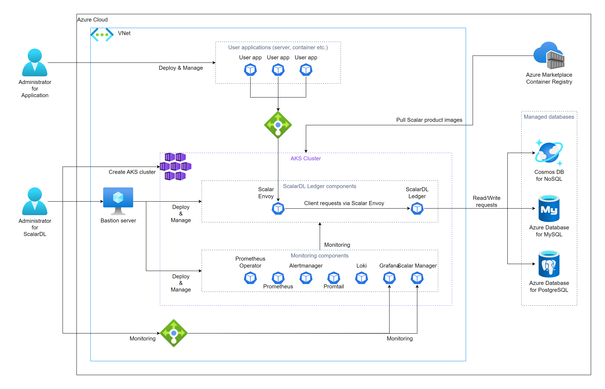

---
tags:
  - Enterprise
displayed_sidebar: docsJapanese
---

# Azure Kubernetes Service (AKS) に ScalarDL Ledger をデプロイする

import TranslationBanner from '/src/components/_translation-ja-jp.mdx';

<TranslationBanner />

このドキュメントでは、**ScalarDL Ledger** を Azure Kubernetes Service (AKS) にデプロイする方法について説明します。

このガイドでは、Azure 環境に次の環境を作成します。

## ステップ1. ScalarDL Ledger コンテナーイメージを取得する

ScalarDL Ledger コンテナーイメージを取得する必要があります。Scalar 製品のコンテナリポジトリの詳細については、[Scalar 製品のコンテナイメージを取得する方法](HowToGetContainerImages.mdx)を参照してください。

## ステップ2. AKS クラスターを作成する

ScalarDL Ledger デプロイ用の AKS クラスターを作成する必要があります。詳細については、[Scalar 製品用の AKS クラスターを作成するためのガイドライン](CreateAKSClusterForScalarProducts.mdx)を参照してください。

## ステップ3. ScalarDL Ledger のデータベースをセットアップする

ScalarDL Ledger を展開する前にデータベースを準備する必要があります。ScalarDL Ledger は内部で ScalarDB を使用してデータベースにアクセスするため、ScalarDB がサポートするデータベースの種類を確認するには、[ScalarDB Supported Databases](https://scalardb.scalar-labs.com/docs/latest/requirements#databases) を参照してください。

データベースのセットアップの詳細については、[Azure での ScalarDB/ScalarDL デプロイ用のデータベースのセットアップ](SetupDatabaseForAzure.mdx) を参照してください。

## ステップ4. 踏み台サーバーを作成する

AKS で ScalarDL Ledger をデプロイおよび管理するためのいくつかのツールを実行するには、**手順2**で作成した AKS クラスターの同じ Azure Virtual Network (VNet) 内に踏み台サーバーを準備する必要があります。詳細については、[踏み台サーバーの作成](CreateBastionServer.mdx)を参照してください。

## ステップ5. ScalarDL Ledger と ScalarDL Schema Loader の両方の Scalar Helm Chart のカスタム値ファイルを準備する

**ステップ3**で作成したデータベース内の情報へのアクセスなどのタスクを実行するには、環境に基づいて ScalarDL Ledger と ScalarDL Schema Loader (Ledger 用) の両方の Scalar Helm Chart のカスタム値ファイルを構成する必要があります。詳細については、[Configure a custom values file for Scalar Helm Charts](../helm-charts/configure-custom-values-file.mdx) を参照してください。

## ステップ6. Scalar Helm Chart を使用して ScalarDL Ledger をデプロイする

ScalarDL Ledger の Helm Chart を使用して、AKS クラスターに ScalarDL Ledger をデプロイします。詳細については、[Deploy Scalar products using Scalar Helm Charts](../helm-charts/how-to-deploy-scalar-products.mdx) を参照してください。

**注記：** `kubectl create ns scalardl-ledger` コマンドを使用して専用の名前空間を作成し、`helm install` コマンドで `-n scalardl-ledger` オプションを使用して名前空間に ScalarDL Ledger をデプロイすることをお勧めします。

## ステップ7. ScalarDL Ledger 導入のステータスを確認する

ScalarDL Ledger を AKS クラスターにデプロイした後、各コンポーネントの状態を確認する必要があります。詳細については、[Kubernetes環境で実行する場合に定期的に確認するコンポーネント](RegularCheck.mdx)を参照してください。

## ステップ8. ScalarDL Ledger の展開を監視する

AKS クラスターに ScalarDL Ledger をデプロイした後、特に運用環境では、デプロイされたコンポーネントを監視し、そのログを収集することをお勧めします。詳細については、[Kubernetes クラスター上の Scalar 製品の監視](K8sMonitorGuide.mdx)および [Kubernetes クラスター上の Scalar 製品からのログの収集](K8sLogCollectionGuide.mdx)を参照してください。

## ScalarDL Ledger を AKS から削除する

作成した環境を削除する場合は、作成時とは逆の順序ですべてのリソースを削除してください。
