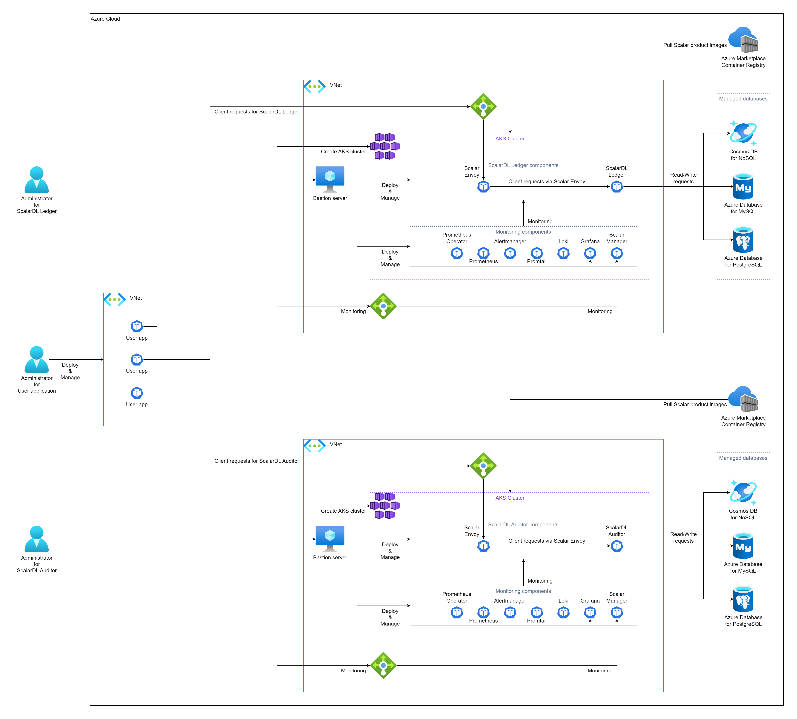
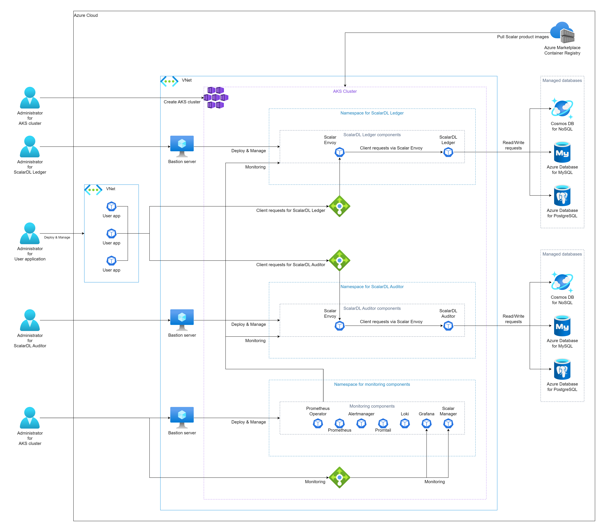

# ScalarDL Ledger と ScalarDL Auditor を Azure Kubernetes Service (AKS) にデプロイする

このガイドでは、Azure Kubernetes Service (AKS) に ScalarDL Ledger と ScalarDL Auditor をデプロイする方法について説明します。

このガイドでは、Azure 環境に次の 3 つの環境のいずれかを作成します。 ビザンチン障害検出を適切に機能させるには、ScalarDL Ledger と ScalarDL Auditor を異なる管理ドメイン (つまり、別の環境) に展開することをお勧めします。

* 別の Azure アカウントを使用する (最も推奨される方法)

  

* 別の Azure Virtual Networks (VNet) を使用する (2 番目に推奨される方法)

  

* 異なる名前空間を使用する (3 番目に推奨される方法)

  

**注意:** このガイドは、2 番目に推奨される方法「別の VNet を使用する」に従います。

## ステップ 1. Azure Marketplace で ScalarDL Ledger と ScalarDL Auditor をサブスクライブする

[Azure Marketplace](https://azuremarketplace.microsoft.com/en/marketplace/apps/scalarinc.scalardl) にアクセスし、ScalarDL Ledger および ScalarDL Auditor をサブスクライブして、ScalarDL Ledger および ScalarDL Auditor コンテナー イメージを取得する必要があります。 Azure Marketplace で ScalarDL Ledger および ScalarDL Auditor をサブスクライブする方法の詳細については、[Microsoft Azure Marketplace から Scalar 製品を入手する](AzureMarketplaceGuide.md#microsoft-azure-marketplace-から-scalar-製品を入手する) を参照してください。

## ステップ 2. ScalarDL Ledger の AKS クラスターを作成する

ScalarDL Ledger デプロイ用の AKS クラスターを作成する必要があります。 詳細については、[Scalar 製品用の AKS クラスターを作成するためのガイドライン](CreateAKSClusterForScalarProducts.md) を参照してください。

## ステップ 3. ScalarDL Auditor の AKS クラスターを作成する

ScalarDL Auditor デプロイ用の AKS クラスターも作成する必要があります。 詳細については、[Scalar 製品用の AKS クラスターを作成するためのガイドライン](CreateAKSClusterForScalarProducts.md) を参照してください。

## ステップ 4. ScalarDL Ledger のデータベースをセットアップする

ScalarDL Ledger を展開する前にデータベースを準備する必要があります。 ScalarDL Ledger は内部で ScalarDB を使用してデータベースにアクセスするため、ScalarDB がサポートするデータベースの種類を確認するには、[ScalarDB Supported Databases](https://github.com/scalar-labs/scalardb/blob/master/docs/scalardb-supported-databases.md) を参照してください。

データベースのセットアップの詳細については、[Azure での ScalarDB/ScalarDL デプロイ用のデータベースのセットアップ](SetupDatabaseForAzure.md) を参照してください。

## ステップ 5. ScalarDL Auditor のデータベースをセットアップする

ScalarDL Auditor を展開する前にデータベースを準備する必要もあります。 ScalarDL Auditor は内部で ScalarDB を使用してデータベースにアクセスするため、ScalarDB がサポートするデータベースの種類を確認するには、[ScalarDB Supported Databases](https://github.com/scalar-labs/scalardb/blob/master/docs/scalardb-supported-databases.md) を参照してください。

データベースのセットアップの詳細については、[Azure での ScalarDB/ScalarDL デプロイ用のデータベースのセットアップ](SetupDatabaseForAzure.md) を参照してください。

## ステップ 6. ScalarDL Ledger の要塞サーバーを作成する

AKS で ScalarDL Ledger をデプロイおよび管理するためのいくつかのツールを実行するには、**手順 2** で作成した AKS クラスターの同じ VNet に要塞サーバーを準備する必要があります。 詳細については、[要塞サーバーの作成](CreateBastionServer.md) を参照してください。

## ステップ 7. ScalarDL Auditor の要塞サーバーを作成する

AKS で ScalarDL Auditor をデプロイおよび管理するためのいくつかのツールを実行するには、**手順 3** で作成した AKS クラスターの同じ VNet に要塞サーバーを準備する必要があります。 詳細については、[要塞サーバーの作成](CreateBastionServer.md) を参照してください。

## ステップ 8. 2 つの AKS クラスター間のネットワーク ピアリングを作成する

ScalarDL を適切に動作させるには、ScalarDL Ledger と ScalarDL Auditor が相互に接続する必要があります。 [仮想ネットワーク ピアリング](https://docs.microsoft.com/en-us/azure/virtual-network/virtual-network-peering-overview) を使用して 2 つの VNet を接続する必要があります。 詳細については、[ScalarDL Auditor モードのネットワーク ピアリングの構成](NetworkPeeringForScalarDLAuditor.md) を参照してください。

## ステップ 9. ScalarDL Ledger と ScalarDL Schema Loader の両方の Scalar Helm Chart のカスタム値ファイルを準備する

**ステップ 4** で作成したデータベース内の情報へのアクセスなどのタスクを実行するには、環境に基づいて ScalarDL Ledger と ScalarDL Schema Loader (Ledger 用) の両方の Scalar Helm Chart のカスタム値ファイルを構成する必要があります。 詳細については、[Configure a custom values file for Scalar Helm Charts](https://github.com/scalar-labs/helm-charts/blob/main/docs/configure-custom-values-file.md) を参照してください。

## ステップ 10. Scalar Helm Chart を使用して ScalarDL Ledger をデプロイする

ScalarDL Ledger の Helm Chart を使用して、ScalarDL Ledger を AKS クラスターにデプロイします。 詳細については、[Deploy Scalar products using Scalar Helm Charts](https://github.com/scalar-labs/helm-charts/blob/main/docs/how-to-deploy-scalar-products.md) を参照してください。

**注意:** `kubectl create ns scalardl-ledger` コマンドを使用して専用の名前空間を作成し、`helm install` コマンドで `-n scalardl-ledger` オプションを使用して名前空間に ScalarDL Ledger をデプロイすることをお勧めします。

## ステップ 11. ScalarDL Auditor と ScalarDL Schema Loader の両方の Scalar Helm Chart のカスタム値ファイルを準備する

**ステップ 5** で作成したデータベース内の情報へのアクセスなどのタスクを実行するには、環境に基づいて ScalarDL Auditor と ScalarDL Schema Loader (Auditor 用) の両方の Scalar Helm Chart のカスタム値ファイルを構成する必要もあります 。 詳細については、[Configure a custom values file for Scalar Helm Charts](https://github.com/scalar-labs/helm-charts/blob/main/docs/configure-custom-values-file.md) を参照してください。

## ステップ 12. Scalar Helm Chart を使用して ScalarDL Auditor をデプロイする

ScalarDL Auditor の Helm Chart を使用して、AKS クラスターに ScalarDL Auditor をデプロイします。 詳細については、[Deploy Scalar products using Scalar Helm Charts](https://github.com/scalar-labs/helm-charts/blob/main/docs/how-to-deploy-scalar-products.md) を参照してください。

**注意:** `kubectl create ns scalardl-auditor` コマンドを使用して専用の名前空間を作成し、`helm install` コマンドで `-n scalardl-auditor` オプションを使用して名前空間に ScalarDL Auditor をデプロイすることをお勧めします。

## ステップ 13. ScalarDL Ledger 導入のステータスを確認する

ScalarDL Ledger を AKS クラスターにデプロイした後、各コンポーネントの状態を確認する必要があります。 詳細については、[Kubernetes環境で実行する場合に定期的に確認するコンポーネント](RegularCheck.md) を参照してください。

## ステップ 14. ScalarDL Auditor デプロイメントのステータスを確認する

ScalarDL Auditor を AKS クラスターにデプロイした後、各コンポーネントの状態を確認する必要があります。 詳細については、[Kubernetes環境で実行する場合に定期的に確認するコンポーネント](RegularCheck.md) を参照してください。

## ステップ 15. ScalarDL Ledger の展開を監視する

AKS クラスターに ScalarDL Ledger をデプロイした後、特に運用環境では、デプロイされたコンポーネントを監視し、そのログを収集することをお勧めします。 詳細については、[Kubernetes クラスター上の Scalar 製品の監視](K8sMonitorGuide.md) および [Kubernetes クラスター上の Scalar 製品からのログの収集](K8sLogCollectionGuide.md) を参照してください。

## ステップ 16. ScalarDL Auditor の展開を監視する

AKS クラスターに ScalarDL Auditor をデプロイした後、特に運用環境では、デプロイされたコンポーネントを監視し、そのログを収集することをお勧めします。 詳細については、[Kubernetes クラスター上の Scalar 製品の監視(./K8sMonitorGuide.md) および [Kubernetes クラスター上の Scalar 製品からのログの収集](K8sLogCollectionGuide.md) を参照してください。

## ScalarDL Ledger と ScalarDL Auditor を AKS から削除します

作成した環境を削除する場合は、作成時とは逆の順序ですべてのリソースを削除してください。
