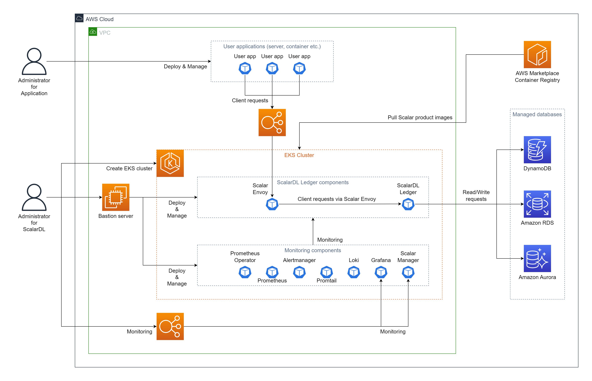

# ScalarDL Ledger を Amazon Elastic Kubernetes Service (EKS) にデプロイする

このドキュメントでは、**ScalarDL Ledger** を Amazon Elastic Kubernetes Service (EKS) にデプロイする方法について説明します。

このガイドでは、AWS 環境アカウントに次の環境を作成します。

## ステップ 1. AWS Marketplace で ScalarDL Ledger を購読する

[AWS Marketplace](https://aws.amazon.com/marketplace/pp/prodview-3jdwfmqonx7a2) から ScalarDL Ledger コンテナ イメージを取得し、ScalarDL にサブスクライブする必要があります。 AWS Marketplace で ScalarDL Ledger を購読する方法の詳細については、[AWS Marketplace から Scalar 製品を購読する](AwsMarketplaceGuide.md#aws-marketplace-から-scalar-製品を購読する) を参照してください。

## ステップ 2. EKS クラスターを作成する

ScalarDL Ledger デプロイメント用の EKS クラスターを作成する必要があります。 詳細については、[Scalar 製品用の Amazon EKS クラスターを作成するためのガイドライン](CreateEKSClusterForScalarProducts.md) を参照してください。

## ステップ 3. ScalarDL Ledger のデータベースをセットアップする

ScalarDL Ledger を展開する前にデータベースを準備する必要があります。 ScalarDL Ledger は内部で ScalarDB を使用してデータベースにアクセスするため、ScalarDB がサポートするデータベースの種類を確認するには、[ScalarDB Supported Databases](https://github.com/scalar-labs/scalardb/blob/master/docs/scalardb-supported-databases.md) を参照してください。

データベースのセットアップの詳細については、[AWS での ScalarDB/ScalarDL デプロイ用のデータベースのセットアップ](SetupDatabaseForAWS.md) を参照してください。

## ステップ 4. 要塞サーバーを作成する

EKS で ScalarDL Ledger をデプロイおよび管理するためのいくつかのツールを実行するには、**ステップ 2** で作成した EKS クラスターの同じ Amazon Virtual Private Cloud (VPC) 内に要塞サーバーを準備する必要があります。 詳細については、[要塞サーバーの作成](CreateBastionServer.md) を参照してください。

## ステップ 5. ScalarDL Ledger と ScalarDL Schema Loader の両方の Scalar Helm Chart のカスタム値ファイルを準備する

**ステップ 3** で作成したデータベース内の情報へのアクセスなどのタスクを実行するには、環境に基づいて ScalarDL Ledger と ScalarDL Schema Loader (Ledger 用) の両方の Scalar Helm Chart のカスタム値ファイルを構成する必要があります。 詳細については、[Configure a custom values file for Scalar Helm Charts](https://github.com/scalar-labs/helm-charts/blob/main/docs/configure-custom-values-file.md) を参照してください。

## ステップ 6. Scalar Helm Chart を使用して ScalarDL Ledger をデプロイする

ScalarDL Ledger の Helm Chart を使用して、ScalarDL Ledger を EKS クラスターにデプロイします。 詳細については、[Deploy Scalar products using Scalar Helm Charts](https://github.com/scalar-labs/helm-charts/blob/main/docs/how-to-deploy-scalar-products.md) を参照してください。

**注記：** `kubectl create ns scalardl-ledger` コマンドを使用して専用の名前空間を作成し、`helm install` コマンドで `-n scalardl-ledger` オプションを使用して名前空間に ScalarDL Ledger をデプロイすることをお勧めします。

## ステップ 7. ScalarDL Ledger 導入のステータスを確認する

EKS クラスターに ScalarDL Ledger をデプロイした後、各コンポーネントのステータスを確認する必要があります。 詳細については、[Kubernetes環境で実行する場合に定期的に確認するコンポーネント](RegularCheck.md) を参照してください。

## ステップ 8. ScalarDL Ledger の展開を監視する

EKS クラスターに ScalarDL Ledger をデプロイした後、特に本番環境では、デプロイされたコンポーネントを監視し、そのログを収集することをお勧めします。 詳細については、[Kubernetes クラスター上の Scalar 製品の監視](K8sMonitorGuide.md) および [Kubernetes クラスター上の Scalar 製品からのログの収集](K8sLogCollectionGuide.md) を参照してください。

## EKS から ScalarDL Ledger を削除

作成した環境を削除する場合は、作成時とは逆の順序ですべてのリソースを削除してください。
