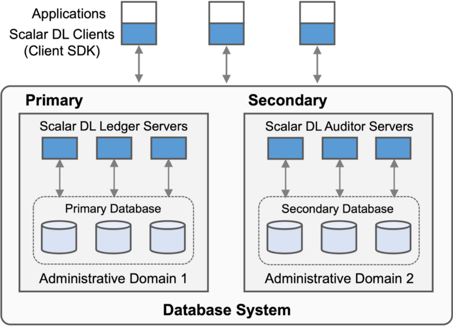

# ScalarDL の入門

import TranslationBanner from '/src/components/_translation-ja-jp.mdx';

<TranslationBanner />

このドキュメントでは、Client SDK を使用して最初の簡単なコントラクトを実行して、ScalarDL を開始する方法について説明します。
ここでは、ScalarDL がすでにインストールされており、ScalarDL Ledger が実行されており、ローカルホスト上の 50051 および 50052 ポートをリッスンしていることを前提としています。そのような環境がない場合は、[ドキュメント](./installation-with-docker.mdx)に従ってください。また、コントラクトを実行するために必要な証明書と秘密鍵をすでに持っていることも前提としています。

## ScalarDL とは何ですか?

ScalarDL は、正確性、スケーラビリティ、およびデータベース非依存性を実現する、トランザクショナルデータベースシステム用のスケーラブルで実用的なビザンチン故障検出ミドルウェアです。

ScalarDL は、次の図に示すように、Ledger、Auditor、および Client SDK で構成されます。ScalarDL Ledger は、ハッシュチェーンと電子署名を使用した独自の方法でアプリケーションデータを管理します。ScalarDL Auditor はオプションのコンポーネントであり、Ledger に依存せずに Ledger データのコピーを管理して、Ledger データと Auditor データの不一致を特定します。
Client SDK は、Ledger および Auditor と対話するためのユーザー向けプログラムのセットです。詳細については、[設計ドキュメント](design.mdx)および [実装の詳細](implementation.mdx)を参照してください。



ScalarDL (Ledger and Auditor) はデータを一連のアセットとして抽象化します。各アセットは、`asset_id` と呼ばれるキーと `age` と呼ばれる履歴バージョン番号によって識別されるレコードの履歴で構成されます。
このドキュメントでは、ScalarDL Client SDK を使用してアセットのステータスを管理する非常に単純なアプリケーションを作成します。

## JDK をインストールする

ScalarDL は Java で記述されているため、Java の使用は ScalarDL アプリケーションを構築する最も簡単な方法の1つです。
このような場合は、次の Java Development Kit (JDK) のいずれかを環境にインストールする必要があります。

- [Oracle JDK](https://www.oracle.com/java/technologies/downloads/) LTSバージョン (8、11、または17)
- [OpenJDK](https://openjdk.org/install/) LTSバージョン (8、11、または17)

:::warning

ScalarDL は JDK 8 で構築されているため、コントラクトは JDK 8 と互換性のあるバイナリである必要があります。JDK 8 以外のバージョンを使用する場合は、JDK 8 と互換性のあるバイナリをビルドするようにビルドツールを構成する必要があります。バイナリ互換性を指定するには、javac の `--release 8` オプションを使用する方法や、次のように JDK 8 ツールチェーンを使用するように Gradle (または Maven) 構成を設定する方法など、いくつかの方法があります。

```gradle
java {
    toolchain {
        languageVersion.set(JavaLanguageVersion.of(8))
    }
}
```

Gradle および Maven 構成の詳細については、[Toolchains for JVM projects for Gradle](https://docs.gradle.org/current/userguide/toolchains.html) および [Guide to Using Toolchains for Maven](https://maven.apache.org/guides/mini/guide-using-toolchains.html) を参照してください。

:::

:::note

上記の LTS バージョンを使用することをお勧めしますが、他の非 LTS バージョンも動作する可能性があります。

さらに、他の JDK も ScalarDL で動作するはずですが、それらはテストされていません。

:::

## Client SDK をダウンロードする

Client SDK ライブラリは、[Maven Central](https://search.maven.org/search?q=a:scalardl-java-client-sdk) で入手できます。Gradle などのビルドツールを使用してアプリケーションにインストールできます。
たとえば、Gradle では、次の依存関係を build.gradle に追加できます。

```
dependencies {
    compile group: 'com.scalar-labs', name: 'scalardl-java-client-sdk', version: '<version>'
}
```

ここからは、サンプル `build.gradle`、サンプルコントラクト、 迅速なテストのためのツールも含まれます。

まず、使用するバージョン (例: 3.6.0) を指定します。利用可能なバージョンについては、[タグ](https://github.com/scalar-labs/scalardl-java-client-sdk/tags)を参照してください。

```shell
VERSION=X.Y.Z
```

次に、リポジトリのクローンを作成し、ツールをダウンロードします。

```shell
git clone https://github.com/scalar-labs/scalardl-java-client-sdk.git
cd scalardl-java-client-sdk
git checkout v$VERSION
curl -OL https://github.com/scalar-labs/scalardl-java-client-sdk/releases/download/v$VERSION/scalardl-java-client-sdk-$VERSION.zip
unzip scalardl-java-client-sdk-$VERSION.zip
mv scalardl-java-client-sdk-$VERSION client
```

## プロパティを構成する

最初に行う必要があるのは、Client SDK を構成することです。
次のサンプルプロパティは、Client SDK が ScalarDL Ledger と対話するために最低限必要なプロパティです。

```
[client.properties]
# A host name of ScalarDL Ledger
scalar.dl.client.server.host=localhost

# An ID of a certificate holder. It must be configured for each private key and unique in the system.
scalar.dl.client.cert_holder_id=foo

# A certificate file path to use.
scalar.dl.client.cert_path=/path/to/foo.pem

# A private key file path to use.
scalar.dl.client.private_key_path=/path/to/foo-key.pem
```

サンプルの `client.properties` ファイルは `conf` ディレクトリにあるので、それを現在のディレクトリにコピーしましょう。

```shell
cp conf/client.properties .
```

コピーした `client.properties` ファイルの値を環境に応じて更新してください。

## 証明書を登録します

次に、ScalarDL Ledger に証明書を登録しましょう。証明書の準備方法については、[caclient-getting-started](ca/caclient-getting-started.mdx)をご確認ください。

今回は以下のように簡単なツールを使って証明書を登録してみましょう。

```shell
client/bin/register-cert --properties client.properties
```

登録された証明書を使用すると、コントラクトの登録と実行が可能になるほか、データベース内のビザンチン故障の検出にも使用されます。
セキュリティ上の理由から、追加できるのは新しい証明書のみであり、既存の証明書を更新することはできないことに注意してください。新しい証明書を追加する場合は、登録ツールを実行する前に `scalar.dl.client.cert_version` をインクリメントします。

## コントラクトを作成する

ScalarDL のコントラクトは、事前定義された基本コントラクトクラス ([`JacksonBasedContract`](https://scalar-labs.github.io/scalardl/javadoc/latest/ledger/com/scalar/dl/ledger/contract/JacksonBasedContract.html) クラスなど) を拡張し、`invoke` メソッドをオーバーライドする単純な Java クラスです。アセットを作成し、それにいくつかの状態を関連付ける [StateUpdater.java](https://github.com/scalar-labs/scalardl-java-client-sdk/blob/master/src/main/java/com/org1/contract/StateUpdater.java) コントラクトを詳しく見てみましょう。

```java
package com.org1.contract;

import com.fasterxml.jackson.databind.JsonNode;
import com.scalar.dl.ledger.contract.JacksonBasedContract;
import com.scalar.dl.ledger.exception.ContractContextException;
import com.scalar.dl.ledger.statemachine.Asset;
import com.scalar.dl.ledger.statemachine.Ledger;
import java.util.Optional;
import javax.annotation.Nullable;

public class StateUpdater extends JacksonBasedContract {

  @Nullable
  @Override
  public JsonNode invoke(Ledger<JsonNode> ledger, JsonNode argument, @Nullable JsonNode properties) {
    if (!argument.has("asset_id") || !argument.has("state")) {
      // ContractContextException is the only throwable exception in a contract and
      // it should be thrown when a contract faces some non-recoverable error
      throw new ContractContextException("please set asset_id and state in the argument");
    }

    String assetId = argument.get("asset_id").asText();
    int state = argument.get("state").asInt();

    Optional<Asset<JsonNode>> asset = ledger.get(assetId);

    if (!asset.isPresent() || asset.get().data().get("state").asInt() != state) {
      ledger.put(assetId, getObjectMapper().createObjectNode().put("state", state));
    }

    return null;
  }
}
```

このコントラクトは、引数からクライアント定義のアセット ID (`asset_id`) と状態 (`state`) を抽出し、指定された状態がアセットの現在の状態と異なる場合、そのアセット ID を Ledger 内の状態に関連付けます。

次に、以下のようにコントラクトを作成します。
次に、以下のようにコントラクトを作成します。

```shell
./gradlew assemble
```

これにより、`build/classes/java/main/com/org1/contract/StateUpdater.class` が生成されます。

## コントラクトを登録する

コントラクトを登録しましょう。ここでも簡単なツールを使用します。


```shell
client/bin/register-contract --properties client.properties --contract-id StateUpdater --contract-binary-name com.org1.contract.StateUpdater --contract-class-file build/classes/java/main/com/org1/contract/StateUpdater.class
```

コントラクト ID にはグローバルに一意な ID を設定してください (例: 上記コマンドの `StateUpdater`)。
同じコントラクトに異なるコントラクト ID を設定して、改ざん防止の方法で「誰が何をしたか」を明確にすることができます。


たとえば、投票アプリケーションについて考えてみましょう。アプリケーションでは、誰でも同じ投票ロジックで投票できるため、同じコントラクトを使用できますが、A の投票と B の投票は適切かつ安全に区別される必要があります。A は B に投票できませんし、その逆も同様です。同じコントラクトに異なるコントラクト ID があることを利用して、このようなことを実現できます。

## コントラクトを実行する

これで、次のコマンドを使用してコントラクトを実行する準備が整いました。

```shell
client/bin/execute-contract --properties client.properties --contract-id StateUpdater --contract-argument '{"asset_id":"some_asset", "state":3}'
```

コントラクト引数では、キー `asset_id` で指定された値は、各アセットに対してグローバルに一意である必要があります。

## Ledger の状態を検証する

次のコマンドを実行すると、Ledger の状態を検証できます。

```shell
client/bin/validate-ledger --properties client.properties --asset-id="some_asset"
```

検証で行われる内容は、ScalarDL のセットアップおよび構成方法によって異なります。
簡単に言うと、ScalarDL Ledger のみが使用されている場合、検証はアセットを横断して、アセットが再計算可能であり、有効なハッシュチェーン構造を持つかどうかを確認します。
ScalarDL Ledger および Auditor を使用すると、中央集権的な調整なしに、Ledger と Auditor の状態間の不一致 (つまり、ビザンチン故障) を検証でチェックします。
Auditor による検証の詳細については、[ScalarDL Auditor 入門](getting-started-auditor.mdx)を参照してください。

## 独自のコントラクトを作成する

上で説明したように、コントラクトを作成するために必要なことは、事前定義された基本コントラクトクラスを拡張し、必要に応じて `invoke` メソッドをオーバーライドすることです。詳細については、[良いコントラクトの書き方ガイド](how-to-write-contract.mdx)をご覧ください。


## ClientService と対話する

アプリケーション内で ScalarDL のコンポーネントとやりとりしたい場合は、Client SDK の API を利用することができます。API は [`ClientService`](https://scalar-labs.github.io/scalardl/javadoc/latest/client/com/scalar/dl/client/service/ClientService.html) と呼ばれるサービス層で提供されます。

以下は、`ClientService` を使用してコントラクトを実行する方法を示すコードスニペットです。

```java
  // ClientServiceFactory should always be reused.
  ClientServiceFactory factory = new ClientServiceFactory();

  // ClientServiceFactory creates a new ClientService object in every create method call
  // but reuses the internal objects and connections as much as possible for better performance and resource usage.
  ClientService service = factory.create(new ClientConfig(new File(properties));
  try {
    // create an application-specific argument that matches your contract
    JsonNode jsonArgument = ...;
    ContractExecutionResult result = service.executeContract(contractId, jsonArgument);
    result.getContractResult().ifPresent(System.out::println);
  } catch (ClientException e) {
    System.err.println(e.getStatusCode());
    System.err.println(e.getMessage());
  }

  factory.close();
```

まず、`ClientService` オブジェクトを作成するには、常に `ClientServiceFactory` を使用する必要があります。
`ClientServiceFactory` は、`ClientService` の作成に必要なオブジェクトをキャッシュし、指定された設定に基づいて可能な限り再利用するため、`ClientServiceFactory` オブジェクトは常に再利用する必要があります。

`ClientService` は、ScalarDL コンポーネント (Ledger や Auditor など) と対話して、証明書の登録、コントラクトの登録、コントラクトの実行、データの検証を行うスレッドセーフなクライアントです。
コントラクトを実行するときは、コントラクトに対応する型の引数を指定する必要があります。たとえば、コントラクトが `JacksonBasedContract` を拡張する場合、コントラクトを実行するときに JsonNode 引数を渡す必要があります。

詳細については、[Javadoc](https://scalar-labs.github.io/scalardl/javadoc/) をご覧ください。

## コントラクトを実行してテストする

ローカル環境でコントラクトをすばやく実行してテストするには、[ScalarDL サンプル](https://github.com/scalar-labs/scalardl-samples)が役立ちます。運用環境で ScalarDL を実行するには、詳細については [scalar-kubernetes](https://github.com/scalar-labs/scalar-kubernetes) を参照してください。

## 参考文献

* [良いコントラクトの書き方ガイド](how-to-write-contract.mdx)
* [優れたファンクションの書き方に関するガイド](how-to-write-function.mdx)
* [ScalarDL Auditor 入門](getting-started-auditor.mdx)
* [Javadoc](https://scalar-labs.github.io/scalardl/javadoc/)
* [ScalarDL設計ドキュメント](design.mdx)
* [ScalarDL 実装](implementation.mdx)
