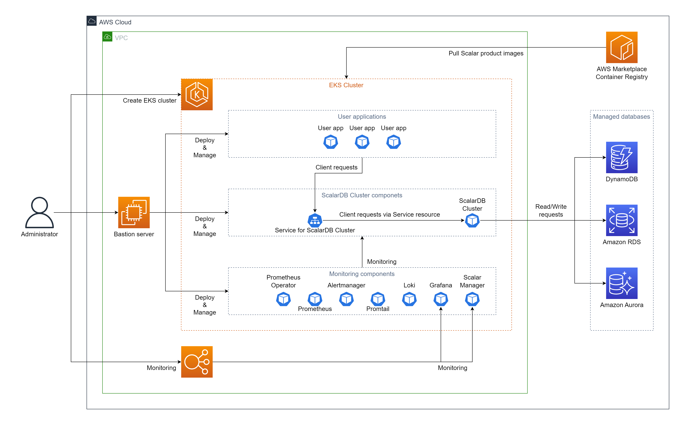

---
tags:
  - Enterprise Standard
  - Enterprise Premium
---

# Amazon Elastic Kubernetes Service (EKS) に ScalarDB Cluster をデプロイする

import TranslationBanner from '/src/components/_translation-ja-jp.mdx';

<TranslationBanner />

このガイドでは、ScalarDB Cluster を Amazon Elastic Kubernetes Service (EKS) にデプロイする方法について説明します。

このガイドでは、AWS 環境に次の 2 つの環境のいずれかを作成します。 環境は、使用する [client mode](https://scalardb.scalar-labs.com/docs/latest/scalardb-cluster/developer-guide-for-scalardb-cluster-with-java-api#client-modes) によって異なります。

* **[`direct-kubernetes` client mode](https://scalardb.scalar-labs.com/docs/latest/scalardb-cluster/developer-guide-for-scalardb-cluster-with-java-api#direct-kubernetes-client-mode).** このモードでは、ScalarDB Cluster のデプロイメントと同じ EKS クラスターにアプリケーションをデプロイします。

    

* **[`indirect` client mode](https://scalardb.scalar-labs.com/docs/latest/scalardb-cluster/developer-guide-for-scalardb-cluster-with-java-api#indirect-client-mode).** このモードでは、ScalarDB Cluster のデプロイメントを含む EKS クラスターとは異なる環境にアプリケーションをデプロイします。

  

## ステップ 1. AWS Marketplace で ScalarDB Cluster にサブスクライブする

ScalarDB Cluster コンテナ イメージを取得するには、AWS Marketplace にアクセスし、[ScalarDB Cluster Standard Edition (Pay-As-You-Go)](https://aws.amazon.com/marketplace/pp/prodview-jx6qxatkxuwm4) または [ScalarDB Cluster Premium Edition (Pay-As-You-Go)](https://aws.amazon.com/marketplace/pp/prodview-djqw3zk6dwyk6) をサブスクライブする必要があります。 AWS Marketplace で ScalarDB Cluster をサブスクライブする方法の詳細については、[AWS Marketplace から Scalar 製品を購読する](AwsMarketplaceGuide.mdx#aws-marketplace-から-scalar-製品を購読する) を参照してください。

## ステップ 2. EKS クラスターを作成する

ScalarDB Cluster のデプロイメント用の EKS クラスターを作成する必要があります。 詳細については、[Scalar 製品用の Amazon EKS クラスターを作成するためのガイドライン](CreateEKSClusterForScalarProducts.mdx) を参照してください。

## ステップ 3. ScalarDB Cluster のデータベースをセットアップする

ScalarDB Cluster をデプロイする前にデータベースを準備する必要があります。 ScalarDB がサポートするデータベースのタイプを確認するには、[ScalarDB Supported Databases](https://scalardb.scalar-labs.com/docs/latest/requirements#databases) を参照してください。

データベースのセットアップの詳細については、[AWS での ScalarDB/ScalarDL デプロイ用のデータベースのセットアップ](SetupDatabaseForAWS.mdx) を参照してください。

## ステップ 4. 要塞サーバーを作成する

EKS 上で ScalarDB Cluster をデプロイおよび管理するためのいくつかのツールを実行するには、**ステップ 2** で作成した EKS クラスターの同じ Amazon Virtual Private Cloud (VPC) 内に要塞サーバーを準備する必要があります。 詳細については、[要塞サーバーの作成](CreateBastionServer.mdx) を参照してください。

## ステップ 5. Scalar Helm Chart のカスタム値ファイルを準備する

**ステップ 3** で作成したデータベース内の情報へのアクセスなどのタスクを実行するには、環境に基づいて ScalarDB Cluster の Scalar Helm Chart のカスタム値ファイルを構成する必要があります。 詳細については、[Configure a custom values file for Scalar Helm Charts](../helm-charts/configure-custom-values-file.mdx) を参照してください。

**注意:** ScalarDB Cluster がデプロイされている EKS クラスターとは異なる環境にアプリケーションをデプロイする場合 (つまり、`indirect` クライアント モードを使用する場合)、`envoy.enabled` パラメーターを次のように設定する必要があります。 アプリケーションから Scalar Envoy にアクセスするには、`true` と `envoy.service.type` パラメータを `LoadBalancer` に設定します。

## ステップ 6. Scalar Helm Chart を使用して ScalarDB Cluster をデプロイする

ScalarDB Cluster の Helm Chart を使用して、EKS クラスターに ScalarDB Cluster をデプロイします。 詳細については、[Deploy Scalar products using Scalar Helm Charts](../helm-charts/how-to-deploy-scalar-products.mdx) を参照してください。

**注意:** `kubectl create ns scalardb-cluster` コマンドを使用して専用の名前空間を作成し、`helm install` コマンドで `-n scalardb-cluster` オプションを使用して名前空間に ScalarDB Cluster をデプロイすることをお勧めします。

## ステップ 7. ScalarDB Cluster のデプロイメントのステータスを確認する

EKS クラスターに ScalarDB Cluster をデプロイした後、各コンポーネントのステータスを確認する必要があります。 詳細については、[Kubernetes 環境で実行するときに定期的に確認するコンポーネント](./ RegularCheck.mdx) を参照してください。

## ステップ 8. ScalarDB Cluster のデプロイメントを監視する

EKS クラスターに ScalarDB Cluster をデプロイした後、特に本番環境では、デプロイされたコンポーネントを監視し、そのログを収集することをお勧めします。 詳細については、[Kubernetes クラスター上の Scalar 製品の監視](K8sMonitorGuide.mdx) および [Kubernetes クラスター上の Scalar 製品からのログの収集](K8sLogCollectionGuide.mdx) を参照してください。

## ステップ 9. アプリケーションをデプロイする

[`direct-kubernetes` client mode](https://scalardb.scalar-labs.com/docs/latest/scalardb-cluster/developer-guide-for-scalardb-cluster-with-java-api#direct-kubernetes-client-mode) を使用する場合は、追加の Kubernetes リソースをデプロイする必要があります。 詳細については、[Deploy your client application on Kubernetes with `direct-kubernetes` mode](../helm-charts/how-to-deploy-scalardb-cluster.mdx#direct-kubernetes-モードを使用してクライアント-アプリケーションを-kubernetes-にデプロイします) を参照してください。

## EKS から ScalarDB Cluster を削除

作成した環境を削除する場合は、作成時とは逆の順序ですべてのリソースを削除してください。
