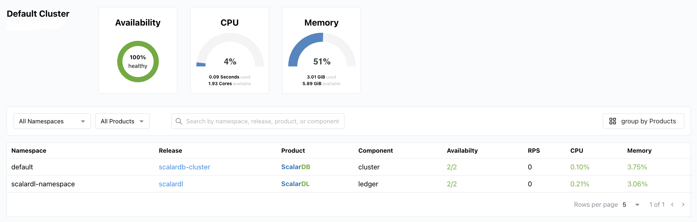
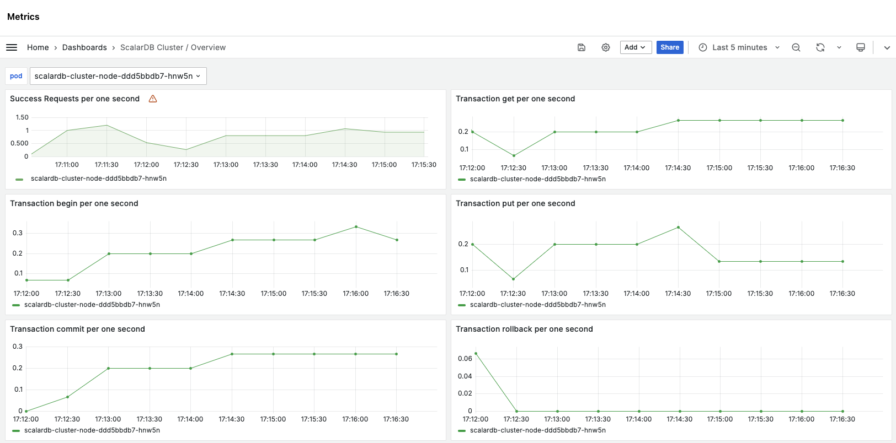
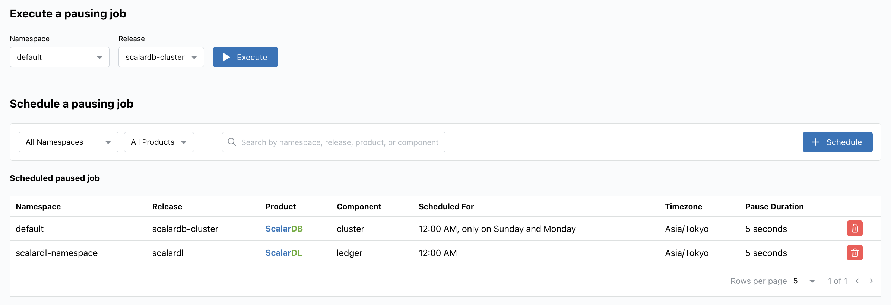
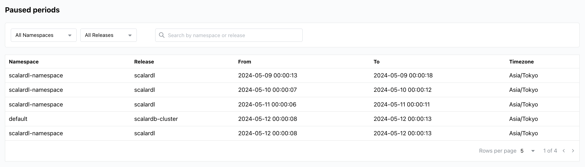

# Scalar Manager 概要

import TranslationBanner from '/src/components/_translation-ja-jp.mdx';

<TranslationBanner />

Scalar Manager は、Kubernetes クラスタ環境内で ScalarDB および ScalarDL の集中管理および監視ソリューションです。
これらの製品に関連する運用タスクを、グラフィカルユーザーインターフェイスに主要な機能を集約することで簡素化します。

## なぜ Scalar Manager なのか？

Scalar Manager がリリースされる前は、ユーザーは ScalarDB および ScalarDL のデプロイメントを管理および監視するために、さまざまなコマンドラインツールやサードパーティソリューションを個別に使用する必要がありました。
例えば、ユーザーはデプロイメントのステータスを確認するために kubectl を使用し、メトリクスの監視には Prometheus スタック、ログ分析には Loki スタックを使用し、複数のデータベース間でトランザクションの一貫性を確保するために Scalar の独自の CLI ツールを使用して Scalar 製品を一時停止していました。
これらのツールの組み合わせは、習得の難易度が高く、統一されたインターフェースが欠けていたため、日常の管理タスクやトラブルシューティングの際に効率的なワークフローを提供できませんでした。

Scalar Manager は、これらの問題点を解消し、主要な機能を単一のユーザーフレンドリーな GUI に集約することで、管理および監視に必要な時間と労力を削減します。
これにより、ユーザーはビジネスの開発や運用に集中できるようになります。

## 主な機能

Scalar Manager は、以下の機能をユーザーに提供します。

### 集中化されたクラスターの可視化

ユーザーは、クラスターの健康状態、pod ログ、ハードウェアの使用状況、リクエスト毎秒などのパフォーマンスメトリクス、および統合された Grafana ダッシュボードを介して時系列データの詳細な可視化について、リアルタイムのメトリクスを迅速に取得できます。

Pod ログとメトリクスは、リアルタイムまたは時系列で表示することができます。

### 簡素化されたジョブの一時停止管理

ユーザーは、トランザクションの一貫性を確保するために、一時停止ジョブを実行またはスケジュールし、スケジュールされたジョブを確認および管理し、直感的な GUI 内で一時停止状態を監視することができます。

さまざまなツールやソリューションを使用して ScalarDB および ScalarDL を管理および監視し続けることはできますが、Scalar Manager は運用効率とユーザーエクスペリエンスを向上させるよりシンプルなアプローチを提供します。
