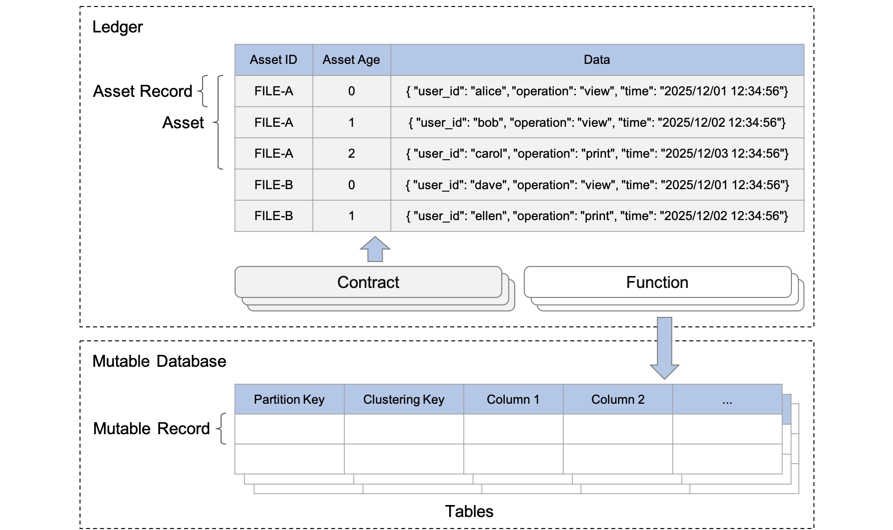

---
tags:
  - Community
  - Enterprise
displayed_sidebar: docsJapanese
---

# データをモデル化する

import JavadocLink from '/src/theme/JavadocLink.js';
import TranslationBanner from '/src/components/_translation-ja-jp.mdx';

<TranslationBanner />

データモデリング (つまり、データの整理) とは、データへのアクセスに使用されるパターンと、ビジネスオペレーション内で実行されるクエリの種類を特定することで、データの保存方法と使用方法を概念化して視覚化するプロセスです。

このページでは、まず ScalarDL データモデルについて説明し、次にデータモデルに基づいてデータを整理する方法について説明します。

## ScalarDL データモデル

ScalarDL のデータモデルは、アセットの集合として台帳を抽象化した、キー値モデルの一種です。各キーはアセットの一意の識別子として機能し、値はアセットのデータを表します。次の図は、ScalarDL のオブジェクトといくつかのアセットの例を示しています。このセクションでは、まず ScalarDL が定義するオブジェクトについて説明し、次にオブジェクトの検索方法について説明します。

### ScalarDL のオブジェクト

ScalarDL データモデルには、いくつかのオブジェクトがあります。

#### 台帳

ScalarDL の台帳は、アセットの集合として抽象化されます。

#### アセット

アセットは任意のデータにすることができますが、連続する履歴データとして捉える方が適しています。たとえば、アセットは有形 (不動産やハードウェア) から無形 (契約、知的財産、さらには上の図に示す監査証跡ログ) まで多岐にわたります。

#### アセットレコード

アセットは1つ以上のアセットレコードで構成され、各アセットレコードはアセット ID と世代によって識別されます。アセットレコードには、任意の文字列形式 (通常は JSON 形式) のデータと、暗号化ハッシュなどのレコードの真正性を検証するための複数の内部メタデータが含まれます。アセットレコードは、コントラクトによって読み書きされます。

:::note

コントラクトは、単一のビジネスロジックを実装するために記述された Java プログラムであり、呼び出されるには事前に台帳に登録されている必要があります。コントラクトを使用して、アセットを作成、更新、または取得できます。アセットを作成または更新すると、改ざん検知可能な方法でアセットレコードの新しい世代 (つまり、新しいバージョン) が追加されます。

:::

#### 可変データベース

コントラクトによって管理されるアセットは改ざん検知機能があり、追加のみ可能なため、さまざまなアプリケーションのモデリングにおいてデータ構造が制限されます。さらに、改ざん検知を保証するためにアセットを削除することはできません。これらの制限を補うために、可変データベースの抽象化を使用して、より強力で使いやすいモデリング機能を実現できます。

可変データベースは、テーブルのコレクションである ScalarDB 名前空間に対応します。テーブルはパーティションのコレクションであり、パーティションは可変レコードのコレクションです。ScalarDB データモデルの詳細については、[ScalarDB データモデル](https://scalardb.scalar-labs.com/ja-jp/docs/latest/data-modeling/#scalardb-%E3%83%87%E3%83%BC%E3%82%BF%E3%83%A2%E3%83%87%E3%83%AB)を参照してください。

#### 可変レコード

可変レコードは、基本的なデータ要素である列のセットです。可変レコードは、ファンクションを使用して読み取り、書き込み、または削除されます。

:::note

ファンクションも単一のビジネスロジックを実装するために記述された Java プログラムであり、呼び出されるには事前に台帳に登録されている必要があります。コントラクトとともにアトミックに実行されるファンクションにおいて、ScalarDB API のサブセットを使用することで、変更可能なレコードを作成、更新、取得、または削除できます。

:::

### アセットレコードの検索方法

このセクションでは、台帳内のアセットレコードを検索する方法について説明します。

#### 最新のアセットレコードを取得する

アセット ID を指定すると、最新のアセットレコードを取得できます。

#### アセットのアセットレコードをスキャンする

アセット ID と世代を指定すると、アセットの複数のレコード (つまり、アセットの履歴) をスキャンできます。具体的には、アセット ID と世代は `AssetFilter` クラスで指定できます。仕様の詳細については、Javadoc の <JavadocLink packageName="scalardl-common" path="com/scalar/dl/ledger/database" className="AssetFilter" /> ページを参照してください。

### 可変レコードの検索方法

パーティションキーやクラスタリングキーなどのキーを使用して、ScalarDB テーブル内の可変レコードを検索することができます。詳細については、ScalarDB データモデルの [レコードの検索方法](https://scalardb.scalar-labs.com/ja-jp/docs/latest/data-modeling/#%E3%83%AC%E3%82%B3%E3%83%BC%E3%83%89%E3%81%AE%E6%A4%9C%E7%B4%A2%E6%96%B9%E6%B3%95)を参照してください。

## データの整理方法

ScalarDL のデータモデルはリレーショナルデータモデルとは異なるため、データモデリングには基本原則といくつかのベストプラクティスがあります。

### クエリ駆動型データモデリング

リレーショナルデータベースでは、データは正規化されたテーブルに整理され、外部キーを使用して他のテーブル内の関連データを参照します。アプリケーションが実行するクエリはテーブルによって構造化され、関連データはテーブル結合としてクエリされます。

ScalarDL には結合機能が用意されていないため、データモデリングは NoSQL データベースのようにクエリ駆動型にする必要があります。データアクセスパターンとアプリケーションクエリによって、アセットの構造と編成が決まります。

### ベストプラクティス

このセクションでは、データをモデル化するためのベストプラクティスをいくつか説明します。

#### 複数のエンティティを処理するためにアセット ID にプレフィックスを追加する

ScalarDL は単一のアセット ID スペースのみを提供するため、複数のエンティティを処理する場合は、アセット ID にプレフィックスを追加して、複数のアセットタイプを自分で管理する必要がある場合があります。

たとえば、監査証跡ログファイルと、ファイルの真正性を検証できるユーザーを管理する場合は、アセット ID に `log_` や `user_` などのプレフィックスを追加することで、これら2つのエンティティを個別に処理できます。

#### アセットを柔軟にクエリするためのインデックスを作成する

さまざまな属性に基づいてアセットを検索したいことがよくあります。そのような場合、検索時にこのような柔軟性を実現するには、次の2つのオプションがあります。

- **オプション 1:** アセットとして一種のインデックステーブルを準備し、各インデックスアセットに対応するアセット ID をポインターとして持つようにします。このアプローチでは、台帳上のインデックスを管理するためにパフォーマンスのオーバーヘッドが発生しますが、インデックス情報も改ざん検知可能な方法で保存されるため、厳重に安全なデータ管理を実現できます。
- **オプション 2:** ScalarDB テーブルをアセットのインデックスとして使用します。アセットレコードを台帳に配置するときに、ファンクションを使用して、ScalarDB テーブルをセカンダリインデックスでアトミックに更新し、ScalarDB テーブル内のレコードがアセットまたはアセットレコードを指すようにすることができます。このアプローチは最初のアプローチよりも柔軟で効率的ですが、インデックス情報が改ざんされる可能性があることに注意し、ユースケースでこれが許容されるかどうかを検討する必要があります。

このような場合、アセットを更新するときに差分データのみを配置し、最新データの全体像を取得したいときにすべてのアセットレコードをマージすることを選択できます。この方法はストレージコストの観点からは効率的ですが、すべてのアセットレコードをスキャンする必要があるため、クエリのパフォーマンスに影響します。このトレードオフの影響を制限するには、ある時点でスナップショットを作成することもできます。これにより、毎回すべてのアセットレコードをスキャンする必要がなくなります。
