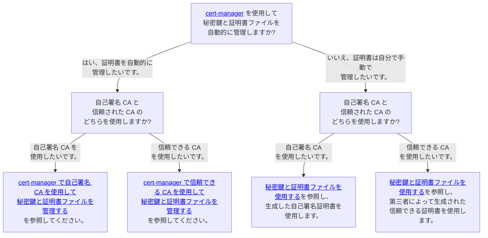
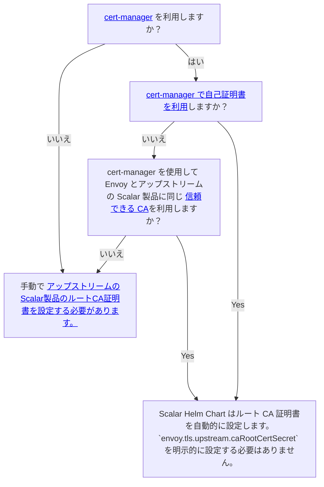

---
tags:
  - Enterprise Standard
  - Enterprise Premium
displayed_sidebar: docsJapanese
---

# Scalar Envoy のカスタム値ファイルを構成する

import Tabs from '@theme/Tabs';
import TabItem from '@theme/TabItem';

このドキュメントでは、Scalar Envoy チャートのカスタム値ファイルを作成する方法について説明します。 パラメータの詳細を知りたい場合は、Scalar Envoy チャートの [README](https://github.com/scalar-labs/helm-charts/blob/main/charts/envoy/README.md) を参照してください。

## Scalar Envoy チャートのカスタム値を構成する

Scalar Envoy チャートは他のチャート (scalardb、scalardb-cluster、scalardl、scalardl-audit) 経由で使用されるため、Scalar Envoy チャートのカスタム値ファイルを作成する必要はありません。 Scalar Envoy を設定したい場合は、`envoy.*` 設定を他のチャートに追加する必要があります。

たとえば、ScalarDB Server 用に Scalar Envoy を構成する場合は、次のように ScalarDB のカスタム値ファイルでいくつかの Scalar Envoy 構成を構成できます。

* 例 (scalardb-custom-values.yaml)
  ```yaml
  envoy:
    configurationsForScalarEnvoy: 
      ...
  
  scalardb:
    configurationsForScalarDB: 
       ...
  ```

## 必要な構成

### サービス構成

Kubernetes のサービス リソース タイプを指定するには、`envoy.service.type` を設定する必要があります。

Kubernetes クラスターの内部からのみクライアント リクエストを受け入れる場合 (たとえば、クライアント アプリケーションを Scalar 製品と同じ Kubernetes クラスターにデプロイする場合)、`envoy.service.type` を `ClusterIP` に設定できます。 この構成では、クラウド サービス プロバイダーが提供するロード バランサーは作成されません。

```yaml
envoy:
  service:
    type: ClusterIP
```

クラウド サービス プロバイダーが提供するロード バランサーを使用して、Kubernetes クラスターの外部からのクライアント リクエストを受け入れる場合は、`envoy.service.type` を `LoadBalancer` に設定する必要があります。

```yaml
envoy:
  service:
    type: LoadBalancer
```

アノテーションを介してロードバランサを設定したい場合は、アノテーションを `envoy.service.annotations` に設定することもできます。

```yaml
envoy:
  service:
    type: LoadBalancer
    annotations:
      service.beta.kubernetes.io/aws-load-balancer-internal: "true"
      service.beta.kubernetes.io/aws-load-balancer-type: "nlb"
```

## オプションの構成

### リソース構成 (本番環境で推奨)

Kubernetes のリクエストと制限を使用してポッド リソースを制御したい場合は、`envoy.resources` を使用できます。

これらは、Kubernetes のリクエストと制限と同じ構文を使用して構成できます。 そのため、Kubernetes の要求と制限の詳細については、公式ドキュメント [Resource Management for Pods and Containers](https://kubernetes.io/docs/concepts/configuration/manage-resources-containers/) を参照してください。

```yaml
envoy:
  resources:
    requests:
      cpu: 1000m
      memory: 2Gi
    limits:
      cpu: 2000m
      memory: 4Gi
```

### アフィニティ構成 (運用環境で推奨)

Kubernetes のアフィニティと反アフィニティを使用してポッドのデプロイメントを制御したい場合は、`envoy.affinity` を使用できます。

Kubernetes のアフィニティと同じ構文を使用して構成できます。 そのため、Kubernetes のアフィニティ設定の詳細については、公式ドキュメント [Assigning Pods to Nodes](https://kubernetes.io/docs/concepts/scheduling-eviction/assign-pod-node/) を参照してください。

```yaml
envoy:
  affinity:
    podAntiAffinity:
      preferredDuringSchedulingIgnoredDuringExecution:
        - podAffinityTerm:
            labelSelector:
              matchExpressions:
                - key: app.kubernetes.io/name
                  operator: In
                  values:
                    - scalardb-cluster
                - key: app.kubernetes.io/app
                  operator: In
                  values:
                    - envoy
            topologyKey: kubernetes.io/hostname
          weight: 50
```

### Prometheus および Grafana 構成 (実稼働環境で推奨)

[kube-prometheus-stack](https://github.com/prometheus-community/helm-charts/tree/main/charts/kube-prometheus-stack) を使用して Scalar Envoy ポッドを監視する場合は、`envoy.grafanaDashboard.enabled`、`envoy.serviceMonitor` を使用して、kube-prometheus-stack の ConfigMap、ServiceMonitor、および PrometheusRule リソースをデプロイできます。 `envoy.prometheusRule.enabled` と `envoy.prometheusRule.enabled`。

```yaml
envoy:
  grafanaDashboard:
    enabled: true
    namespace: monitoring
  serviceMonitor:
    enabled: true
    namespace: monitoring
    interval: 15s
  prometheusRule:
    enabled: true
    namespace: monitoring
```

### SecurityContext 設定 (デフォルト値を推奨)

Scalar Envoy ポッドに SecurityContext と PodSecurityContext を設定する場合は、`envoy.securityContext` と `envoy.podSecurityContext` を使用できます。

KubernetesのSecurityContextやPodSecurityContextと同じ構文を使用して設定できます。 したがって、Kubernetes の SecurityContext および PodSecurityContext 構成の詳細については、公式ドキュメント [Configure a Security Context for a Pod or Container](https://kubernetes.io/docs/tasks/configure-pod-container/security-context/) を参照してください。

```yaml
envoy:
  podSecurityContext:
    seccompProfile:
      type: RuntimeDefault
  securityContext:
    capabilities:
      drop:
        - ALL
    runAsNonRoot: true
    allowPrivilegeEscalation: false
```

### 画像構成 (デフォルト値を推奨)

イメージ リポジトリとバージョンを変更したい場合は、`envoy.image.repository` を使用して、プルする Scalar Envoy コンテナ イメージのコンテナ リポジトリ情報を指定できます。

```yaml
envoy:
  image:
    repository: <SCALAR_ENVOY_CONTAINER_IMAGE>
```

AWS または Azure を使用している場合、詳細については次のドキュメントを参照してください。

* [How to install Scalar products through AWS Marketplace](../scalar-kubernetes/AwsMarketplaceGuide.mdx)
* [How to install Scalar products through Azure Marketplace](../scalar-kubernetes/AzureMarketplaceGuide.mdx)

### TLS 構成 (環境に応じてオプション)

以下の通信で TLS を有効にできます。

- クライアントと Scalar Envoy 間のダウンストリーム接続。
- Scalar Envoy と Scalar 製品間のアップストリーム接続。

さらに、次の 2 つの観点からいくつかのオプションがあります。

1. 秘密鍵と証明書ファイルの管理
   1. [cert-manager](https://cert-manager.io/docs/) を使用して秘密鍵と証明書ファイルを自動的に管理します。
      - メンテナンスや運用のコストを削減できます。たとえば、cert-manager は証明書の有効期限が切れる前に自動的に更新し、Scalar Helm Chart は秘密鍵と証明書ファイルを Scalar 製品ポッドに自動的にマウントします。
      - cert-manager がサポートしていない CA は使用できません。サポートされている発行元は [cert-manager ドキュメント](https://cert-manager.io/docs/configuration/issuers/)で確認できます。
   1. 秘密鍵と証明書ファイルを手動で管理します。
      - ご自身のお好みの方法で、秘密鍵と証明書ファイルを発行・管理することができます。
      - cert-manager がサポートしていない場合でも、任意の証明書を使用できます。
      - 証明書の有効期限が切れた場合は、シークレット リソースを更新する必要があります。
1. 証明書の種類
   1. 信頼できる CA (サードパーティによる署名付き証明書) を使用します。
      - サードパーティの証明書発行者からの信頼できる証明書を使用できます。
      - パケットを暗号化できます。
      - 信頼できる証明書を発行するには費用を支払う必要があります。
   1. 自己署名証明書を使用します。
      - 証明書発行にかかるコストを削減できます。
      - 証明書の信頼性は信頼できる CA よりも低くなりますが、パケットを暗号化できます。

つまり、次の 4 つのオプションがあります。

1. 自動管理で自己署名 CA を使用します。
1. 自動管理で信頼できる CA を使用します。
1. 手動管理で自己署名 CA を使用します。
1. 手動管理で信頼できる CA を使用します。

セキュリティ要件に基づいて、どの方法を使用するかを検討する必要があります。各方法のガイダンスと関連ドキュメントについては、次の意思決定ツリーを参照してください。



#### ダウンストリーム接続で TLS を有効にする

次の設定により、ダウンストリーム接続で TLS を有効にできます。

```yaml
envoy:
  tls:
    downstream:
      enabled: true
```

##### 秘密鍵と証明書ファイルを使用する

次の構成を使用して、秘密鍵と証明書ファイルを設定できます。

```yaml
envoy:
  tls:
    downstream:
      enabled: true
      certChainSecret: "envoy-tls-cert"
      privateKeySecret: "envoy-tls-key"
```

この場合、次のように山括弧内の内容を置き換えて、Scalar Envoy の秘密鍵と証明書ファイルを含むシークレットリソースを作成する必要があります。

```console
kubectl create secret generic envoy-tls-cert --from-file=tls.crt=/<PATH_TO_YOUR_CERTIFICATE_FILE_FOR_SCALAR_ENVOY> -n <NAMESPACE>
kubectl create secret generic envoy-tls-key --from-file=tls.key=/<PATH_TO_YOUR_PRIVATE_KEY_FILE_FOR_SCALAR_ENVOY> -n <NAMESPACE>
```

秘密鍵と証明書ファイルの準備方法の詳細については、[Scalar 製品の秘密鍵と証明書ファイルの作成方法](../scalar-kubernetes/HowToCreateKeyAndCertificateFiles.mdx) を参照してください。


##### cert-manager で信頼できる CA を使用して秘密鍵と証明書ファイルを管理する

次の構成を使用して、山括弧内の内容を説明に従って置き換えることで、cert-manager で秘密鍵と証明書ファイルを管理できます。

:::note

* cert-manager を使用する場合は、cert-manager をデプロイし、`Issuers` リソースを準備する必要があります。詳細については、cert-manager のドキュメント、[インストール](https://cert-manager.io/docs/installation/) および [発行者構成](https://cert-manager.io/docs/configuration/) を参照してください。
* デフォルトでは、Scalar Helm Chart は Scalar 製品の証明書要件を満たす `Certificate` リソースを作成します。デフォルトの証明書構成が推奨されますが、カスタム証明書構成を使用する場合は、Scalar 製品の証明書要件を満たす必要があります。詳細については、[Scalar 製品の秘密キーと証明書ファイルを作成する方法](../scalar-kubernetes/HowToCreateKeyAndCertificateFiles.mdx#certificate-requirements) を参照してください。

:::

```yaml
envoy:
  tls:
    downstream:
      enabled: true
      certManager:
        enabled: true
        issuerRef:
          name: <YOUR_TRUSTED_CA>
        dnsNames:
          - envoy.scalar.example.com
```

この場合、cert-manager は信頼できる発行者を使用して秘密鍵と証明書ファイルを発行します。cert-manager を使用すると、秘密鍵と証明書ファイルを手動でマウントする必要がなくなります。

##### cert-manager で自己署名 CA を使用して秘密鍵と証明書ファイルを管理する

次の構成を使用して、cert-manager で秘密キーと自己署名証明書ファイルを管理できます。

:::note

* cert-manager を使用する場合は、cert-manager をデプロイする必要があります。詳細については、cert-manager のドキュメント [インストール](https://cert-manager.io/docs/installation/) を参照してください。
* デフォルトでは、Scalar Helm Chart は Scalar 製品の証明書要件を満たす `Certificate` リソースを作成します。デフォルトの証明書構成が推奨されますが、カスタム証明書構成を使用する場合は、Scalar 製品の証明書要件を満たす必要があります。詳細については、[Scalar 製品の秘密キーと証明書ファイルを作成する方法](../scalar-kubernetes/HowToCreateKeyAndCertificateFiles.mdx#certificate-requirements) を参照してください。

:::

```yaml
envoy:
  tls:
    downstream:
      enabled: true
      certManager:
        enabled: true
        selfSigned:
          enabled: true
        dnsNames:
          - envoy.scalar.example.com
```

この場合、Scalar Helm Charts と cert-manager が秘密鍵と自己署名証明書ファイルを発行します。秘密鍵と証明書ファイルを手動でマウントする必要はありません。

#### アップストリーム接続で TLS を有効にする

次の設定により、アップストリーム接続で TLS を有効にできます。

```yaml
envoy:
  tls:
    upstream:
      enabled: true
```

また、アップストリーム Scalar 製品のルート CA 証明書ファイルを設定する必要があります。どのアプローチを取るべきかを判断するには、次の意思決定ツリーを参照してください。



##### アップストリーム Scalar 製品のルート CA 証明書ファイルを設定する

次の構成を使用して、ルート CA 証明書ファイルを設定できます。

```yaml
envoy:
  tls:
    upstream:
      enabled: true
      caRootCertSecret: "envoy-upstream-scalardb-cluster-root-ca"
```

この場合、次のように CA 証明書ファイルを含むシークレット リソースを作成する必要があります。使用するアップストリーム (ScalarDB Cluster、ScalarDL Ledger、または ScalarDL Auditor) に基づいてルート CA 証明書ファイルを設定する必要があります。説明されているように、山括弧内の内容を必ず置き換えてください。

<Tabs>
  <TabItem value="ScalarDB_Cluster" label="ScalarDB Cluster" default>
    ```console
    kubectl create secret generic envoy-upstream-scalardb-cluster-root-ca --from-file=ca.crt=/<PATH_TO_ROOT_CA_CERTIFICATE_FILE_FOR_SCALARDB_CLUSTER> -n <NAMESPACE>
    ```
  </TabItem>
  <TabItem value="ScalarDL_Ledger" label="ScalarDL Ledger">
    ```console
    kubectl create secret generic envoy-upstream-scalardl-ledger-root-ca --from-file=ca.crt=/<PATH_TO_ROOT_CA_CERTIFICATE_FILE_FOR_SCALARDL_LEDGER> -n <NAMESPACE>
    ```
  </TabItem>
  <TabItem value="ScalarDB_Auditor" label="ScalarDL Auditor">
    ```console
    kubectl create secret generic envoy-upstream-scalardl-auditor-root-ca --from-file=ca.crt=/<PATH_TO_ROOT_CA_CERTIFICATE_FILE_FOR_SCALARDL_AUDITOR> -n <NAMESPACE>
    ```
  </TabItem>
</Tabs>

秘密鍵と証明書ファイルを準備する方法の詳細については、[Scalar 製品のキーと証明書ファイルを作成する方法](../scalar-kubernetes/HowToCreateKeyAndCertificateFiles.mdx) を参照してください。

##### TLS通信のカスタム権限を設定する

`envoy.tls.upstream.overrideAuthority` を使用して、TLS 通信のカスタム権限を設定できます。この値によって、実際に接続されているホストが変わることはありません。この値はテスト用ですが、DNS オーバーライドの代替としてテスト以外でも安全に使用できます。たとえば、使用している製品に応じて、`scalardbCluster.tls.certChainSecret`、`ledger.tls.certChainSecret`、または `auditor.tls.certChainSecret` を使用して設定した証明書チェーン ファイルに示されているホスト名を指定できます。Envoy はこの値を使用して、ScalarDB Cluster または ScalarDL との TLS 接続の証明書を検証します。

```yaml
envoy:
  tls:
    upstream:
      enabled: true
      overrideAuthority: "cluster.scalardb.example.com"
```

### レプリカ構成 (環境に応じてオプション)

Scalar Envoy のレプリカ (ポッド) の数は、`envoy.replicaCount` を使用して指定できます。

```yaml
envoy:
  replicaCount: 3
```

### 汚染と許容の構成 (環境に応じてオプション)

Kubernetes のテイントと許容を使用してポッドのデプロイメントを制御したい場合は、`envoy.tolerations` を使用できます。

Kubernetes の許容と同じ構文を使用して、テイントと許容を構成できます。 Kubernetes での許容設定の詳細については、Kubernetes の公式ドキュメント [Taints and Tolerations](https://kubernetes.io/docs/concepts/scheduling-eviction/taint-and-toleration/) を参照してください。

```yaml
envoy:
  tolerations:
    - effect: NoSchedule
      key: scalar-labs.com/dedicated-node
      operator: Equal
      value: scalardb
```
