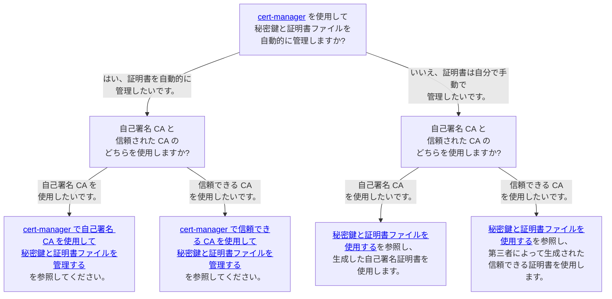

---
tags:
  - Enterprise Standard
  - Enterprise Premium
---

# ScalarDB Cluster のカスタム値ファイルを構成する

このドキュメントでは、ScalarDB Cluster チャートのカスタム値ファイルを作成する方法について説明します。 パラメータの詳細については、ScalarDB Cluster チャートの [README](https://github.com/scalar-labs/helm-charts/blob/main/charts/scalardb-cluster/README.md) を参照してください。

## 必要な構成

### 画像構成

`scalardbCluster.image.repository`を設定する必要があります。 コンテナー リポジトリからイメージをプルできるように、必ず ScalarDB Cluster コンテナー イメージを指定してください。

```yaml
scalardbCluster:
  image:
    repository: <SCALARDB_CLUSTER_CONTAINER_IMAGE>
```

### データベース構成

`scalardbCluster.scalardbClusterNodeProperties` を設定する必要があります。 このパラメータには `scalardb-cluster-node.properties` を設定してください。 ScalarDB Cluster の構成の詳細については、[ScalarDB Cluster Configurations](https://scalardb.scalar-labs.com/docs/latest/scalardb-cluster/scalardb-cluster-configurations/) を参照してください。

```yaml
scalardbCluster:
  scalardbClusterNodeProperties: |
    scalar.db.cluster.membership.type=KUBERNETES
    scalar.db.cluster.membership.kubernetes.endpoint.namespace_name=${env:SCALAR_DB_CLUSTER_MEMBERSHIP_KUBERNETES_ENDPOINT_NAMESPACE_NAME}
    scalar.db.cluster.membership.kubernetes.endpoint.name=${env:SCALAR_DB_CLUSTER_MEMBERSHIP_KUBERNETES_ENDPOINT_NAME}
    scalar.db.contact_points=localhost
    scalar.db.username=${env:SCALAR_DB_USERNAME}
    scalar.db.password=${env:SCALAR_DB_PASSWORD}
    scalar.db.storage=cassandra
```

Scalar Helm Chart を使用して Kubernetes 環境に ScalarDB Cluster をデプロイする場合は、次の 3 つのプロパティを常に設定する必要があることに注意してください。 これらのプロパティは固定値です。 プロパティは個別の環境に依存しないため、以下の値をコピーして `scalardbCluster.scalardbClusterNodeProperties` に貼り付けることで同じ値を設定できます。

```yaml
scalardbCluster:
  scalardbClusterNodeProperties: |
    scalar.db.cluster.membership.type=KUBERNETES
    scalar.db.cluster.membership.kubernetes.endpoint.namespace_name=${env:SCALAR_DB_CLUSTER_MEMBERSHIP_KUBERNETES_ENDPOINT_NAMESPACE_NAME}
    scalar.db.cluster.membership.kubernetes.endpoint.name=${env:SCALAR_DB_CLUSTER_MEMBERSHIP_KUBERNETES_ENDPOINT_NAME}
```

## オプションの構成

### リソース構成 (実稼働環境で推奨)

Kubernetes でリクエストと制限を使用してポッド リソースを制御するには、`scalardbCluster.resources` を使用できます。

商用ライセンスの場合、Scalar 製品の各ポッドのリソースは 2vCPU / 4GB メモリに制限されることに注意してください。 また、AWS Marketplace が提供する従量課金制のコンテナを使用する場合、`resources.limits` の 2vCPU / 4GB メモリ構成を超えるコンテナを実行することはできません。 このリソース制限を超えると、ポッドは自動的に停止します。

Kubernetes のリクエストと制限と同じ構文を使用して、リクエストと制限を構成できます。 Kubernetes のリクエストと制限の詳細については、[Resource Management for Pods and Containers](https://kubernetes.io/docs/concepts/configuration/manage-resources-containers/) を参照してください。

```yaml
scalardbCluster:
  resources:
    requests:
      cpu: 2000m
      memory: 4Gi
    limits:
      cpu: 2000m
      memory: 4Gi
```

### シークレット構成 (運用環境で推奨)

環境変数を使用して `scalardbCluster.scalardbClusterNodeProperties` 内の一部のプロパティ (資格情報など) を設定するには、`scalardbCluster.secretName` を使用して、いくつかの資格情報を含む Secret リソースを指定します。

たとえば、環境変数を使用してバックエンド データベースの資格情報 (`scalar.db.username` および `scalar.db.password`) を設定できるため、ポッドの安全性が高まります。

Secret リソースの使用方法の詳細については、[Secret リソースを使用して資格情報を環境変数としてプロパティ ファイルに渡す方法](use-secret-for-credentials.mdx) を参照してください。

```yaml
scalardbCluster:
  secretName: "scalardb-cluster-credentials-secret"
```

### アフィニティ構成 (運用環境で推奨)

Kubernetes でアフィニティとアンチアフィニティを使用してポッドのデプロイメントを制御するには、`scalardbCluster.affinity` を使用できます。

Kubernetes のアフィニティとアンチアフィニティと同じ構文を使用して、アフィニティとアンチアフィニティを構成できます。 Kubernetes でのアフィニティの構成の詳細については、[Assigning Pods to Nodes](https://kubernetes.io/docs/concepts/scheduling-eviction/assign-pod-node/) を参照してください。

```yaml
scalardbCluster:
  affinity:
    podAntiAffinity:
      preferredDuringSchedulingIgnoredDuringExecution:
        - podAffinityTerm:
            labelSelector:
              matchExpressions:
                - key: app.kubernetes.io/name
                  operator: In
                  values:
                    - scalardb-cluster
                - key: app.kubernetes.io/app
                  operator: In
                  values:
                    - scalardb-cluster
            topologyKey: kubernetes.io/hostname
          weight: 50
```

### Prometheus および Grafana 構成 (実稼働環境で推奨)

[kube-prometheus-stack](https://github.com/prometheus-community/helm-charts/tree/main/charts/kube-prometheus-stack) を使用して ScalarDB Cluster ポッドを監視するには、`scalardbCluster.grafanaDashboard.enabled`、`scalardbCluster.serviceMonitor.enabled`、`scalardbCluster.prometheusRule.enabled` を `true` に設定します。 これらの構成を `true` に設定すると、チャートは必要なリソースをデプロイし、kube-prometheus-stack が自動的に監視を開始します。

```yaml
scalardbCluster:
  grafanaDashboard:
    enabled: true
    namespace: monitoring
  serviceMonitor:
    enabled: true
    namespace: monitoring
    interval: 15s
  prometheusRule:
    enabled: true
    namespace: monitoring
```

### SecurityContext 設定 (デフォルト値を推奨)

ScalarDB Cluster ポッドの SecurityContext と PodSecurityContext を設定するには、`scalardbCluster.securityContext` と `scalardbCluster.podSecurityContext` を使用できます。

Kubernetes の SecurityContext および PodSecurityContext と同じ構文を使用して、SecurityContext および PodSecurityContext を構成できます。 Kubernetes の SecurityContext および PodSecurityContext 構成の詳細については、[Configure a Security Context for a Pod or Container](https://kubernetes.io/docs/tasks/configure-pod-container/security-context/) を参照してください。

```yaml
scalardbCluster:
  podSecurityContext:
    seccompProfile:
      type: RuntimeDefault
  securityContext:
    capabilities:
      drop:
        - ALL
    runAsNonRoot: true
    allowPrivilegeEscalation: false
```

### TLS 構成 (環境に応じてオプション)

TLS は、次の通信で有効にできます:

- ScalarDB Cluster ノードとクライアント間の通信。
- すべての ScalarDB Cluster ノード間の通信 (クラスターの内部通信)。

さらに、証明書管理にはいくつかのオプションがあります。詳細については、[Envoy の TLS 構成](./configure-custom-values-envoy.mdx#tls-構成-環境に応じてオプション) を参照してください。

セキュリティ要件に基づいて、どの方法を使用するかを検討する必要があります。各方法のガイダンスと関連ドキュメントについては、次の意思決定ツリーを参照してください。



#### TLS を有効にする

次の構成を使用して、すべての ScalarDB Cluster 接続で TLS を有効にできます。

```yaml
scalardbCluster:
  scalardbClusterNodeProperties: |
    ...(omit)...
    scalar.db.cluster.tls.enabled=true
    scalar.db.cluster.tls.ca_root_cert_path=/tls/scalardb-cluster/certs/ca.crt
    scalar.db.cluster.node.tls.cert_chain_path=/tls/scalardb-cluster/certs/tls.crt
    scalar.db.cluster.node.tls.private_key_path=/tls/scalardb-cluster/certs/tls.key
    scalar.db.cluster.tls.override_authority=<HOSTNAME_OF_YOUR_CERTIFICATE>
  tls:
    enabled: true
```
##### 秘密鍵と証明書ファイルを使用する

次の構成を使用して、秘密鍵と証明書ファイルを設定できます。

```yaml
scalardbCluster:
  tls:
    enabled: true
    caRootCertSecret: "scalardb-cluster-tls-ca"
    certChainSecret: "scalardb-cluster-tls-cert"
    privateKeySecret: "scalardb-cluster-tls-key"
```

この場合、次のように山括弧内の内容を置き換えて、ScalarDB Cluster の秘密鍵と証明書ファイルを含むシークレットリソースを作成する必要があります。

```console
kubectl create secret generic scalardb-cluster-tls-ca --from-file=ca.crt=/<PATH_TO_YOUR_CA_CERTIFICATE_FILE_FOR_SCALARDB_CLUSTER> -n <NAMESPACE>
kubectl create secret generic scalardb-cluster-tls-cert --from-file=tls.crt=/<PATH_TO_YOUR_CERTIFICATE_FILE_FOR_SCALARDB_CLUSTER> -n <NAMESPACE>
kubectl create secret generic scalardb-cluster-tls-key --from-file=tls.key=/<PATH_TO_YOUR_PRIVATE_KEY_FILE_FOR_SCALARDB_CLUSTER> -n <NAMESPACE>
```

秘密鍵と証明書ファイルを準備する方法の詳細については、[Scalar 製品の秘密鍵と証明書ファイルを作成する方法](../scalar-kubernetes/HowToCreateKeyAndCertificateFiles.mdx) を参照してください。

##### cert-manager で信頼できる CA を使用して秘密鍵と証明書ファイルを管理する

次の構成を使用して、山括弧内の内容を説明に従って置き換えることで、cert-manager で秘密鍵と証明書ファイルを管理できます。

:::note

* cert-manager を使用する場合は、cert-manager をデプロイし、`Issuers` リソースを準備する必要があります。詳細については、cert-manager のドキュメント、[インストール](https://cert-manager.io/docs/installation/) および [発行者構成](https://cert-manager.io/docs/configuration/) を参照してください。
* デフォルトでは、Scalar Helm Chart は Scalar 製品の証明書要件を満たす `Certificate` リソースを作成します。デフォルトの証明書構成が推奨されますが、カスタム証明書構成を使用する場合は、Scalar 製品の証明書要件を満たす必要があります。詳細については、[Scalar 製品の秘密キーと証明書ファイルを作成する方法](../scalar-kubernetes/HowToCreateKeyAndCertificateFiles.mdx#certificate-requirements) を参照してください。

:::

```yaml
scalardbCluster:
  tls:
    enabled: true
    certManager:
      enabled: true
      issuerRef:
        name: <YOUR_TRUSTED_CA>
      dnsNames:
        - cluster.scalardb.example.com
```

この場合、cert-manager は信頼できる発行者を使用して秘密鍵と証明書ファイルを発行します。秘密鍵と証明書ファイルを手動でマウントする必要はありません。

##### cert-manager で自己署名 CA を使用して秘密鍵と証明書ファイルを管理する

次の構成を使用して、cert-manager で秘密キーと自己署名証明書ファイルを管理できます。

:::note

* cert-manager を使用する場合は、cert-manager をデプロイする必要があります。詳細については、cert-manager のドキュメント [インストール](https://cert-manager.io/docs/installation/) を参照してください。
* デフォルトでは、Scalar Helm Chart は Scalar 製品の証明書要件を満たす `Certificate` リソースを作成します。デフォルトの証明書構成が推奨されますが、カスタム証明書構成を使用する場合は、Scalar 製品の証明書要件を満たす必要があります。詳細については、[Scalar 製品の秘密キーと証明書ファイルを作成する方法](../scalar-kubernetes/HowToCreateKeyAndCertificateFiles.mdx#certificate-requirements) を参照してください。

:::

```yaml
scalardbCluster:
  tls:
    enabled: true
    certManager:
      enabled: true
      selfSigned:
        enabled: true
      dnsNames:
        - cluster.scalardb.example.com
```

この場合、Scalar Helm Charts と cert-manager が秘密鍵と自己署名証明書ファイルを発行します。秘密鍵と証明書ファイルを手動でマウントする必要はありません。

##### TLS通信のカスタム権限を設定する

`scalardbCluster.tls.overrideAuthority` を使用して、TLS 通信のカスタム権限を設定できます。この値によって、実際に接続されているホストが変わることはありません。この値はテスト用ですが、DNS オーバーライドの代替としてテスト以外でも安全に使用できます。たとえば、`scalardbCluster.tls.certChainSecret` を使用して設定した証明書チェーン ファイルで提示されるホスト名を指定できます。このチャートでは、`startupProbe` と `livenessProbe` にこの値を使用しています。

```yaml
scalardbCluster:
  tls:
    enabled: true
    overrideAuthority: "cluster.scalardb.example.com"
```

### レプリカ構成 (環境に応じてオプション)

`scalardbCluster.replicaCount` を使用して、ScalarDB Cluster のレプリカ (ポッド) の数を指定できます。

```yaml
scalardbCluster:
  replicaCount: 3
```

### ロギング構成 (環境に応じてオプション)

ScalarDB Cluster のログ レベルを変更するには、`scalardbCluster.logLevel` を使用できます。

```yaml
scalardbCluster:
  logLevel: INFO
```

### GraphQL 構成 (環境に応じてオプション)

ScalarDB Cluster で GraphQL 機能を使用するには、`scalardbCluster.graphql.enabled` を `true` に設定して、GraphQL 機能用のリソースをデプロイします。 GraphQL 機能を使用する場合は、`scalardbCluster.scalardbClusterNodeProperties` で `scalar.db.graphql.enabled=true` を設定する必要があることに注意してください。

```yaml
scalardbCluster:
  graphql:
    enabled: true
```

また、クライアントからの GraphQL リクエストを受け入れる `Service` リソースを設定することもできます。

```yaml
scalardbCluster:
  graphql:
    service:
      type: ClusterIP
      annotations: {}
      ports:
        graphql:
          port: 8080
          targetPort: 8080
          protocol: TCP
```

### SQL 構成 (環境に応じてオプション)

ScalarDB Cluster で SQL 機能を使用するために、カスタム値ファイルに必要な構成はありません。 この機能は、`scalardbCluster.scalardbClusterNodeProperties` で `scalar.db.sql.enabled=true` を設定することで使用できます。

### Scalar Envoy 構成 (環境に応じてオプション)

ScalarDB Cluster を `indirect` モードで使用するには、次のように Envoy を有効にする必要があります。

```yaml
envoy:
  enabled: true
```

また、ScalarDB Cluster のカスタム値ファイルに Scalar Envoy 構成を設定する必要があります。 これは、`indirect` モードで Kubernetes 環境に ScalarDB Cluster をデプロイする場合、クライアントは gRPC リクエストのロード バランサーとして Scalar Envoy を介して ScalarDB Cluster にリクエストを送信する必要があるためです。

Scalar Envoy 構成の詳細については、[Scalar Envoy のカスタム値ファイルの構成](configure-custom-values-envoy.mdx) を参照してください。

```yaml
envoy:
  configurationsForScalarEnvoy: 
    ...

scalardbCluster:
  configurationsForScalarDbCluster: 
    ...
```

### 汚染と許容の構成 (環境に応じてオプション)

Kubernetes のテイントと許容を使用してポッドのデプロイメントを制御したい場合は、`scalardbCluster.tolerations` を使用できます。

Kubernetes の許容と同じ構文を使用して、テイントと許容を構成できます。 Kubernetes での許容設定の詳細については、Kubernetes の公式ドキュメント [Taints and Tolerations](https://kubernetes.io/docs/concepts/scheduling-eviction/taint-and-toleration/) を参照してください。

```yaml
scalardbCluster:
  tolerations:
    - effect: NoSchedule
      key: scalar-labs.com/dedicated-node
      operator: Equal
      value: scalardb-cluster
```

### 暗号化設定 (環境に応じてオプション)

[保存時の暗号化](https://scalardb.scalar-labs.com/docs/latest/scalardb-cluster/encrypt-data-at-rest/)を有効にして、バックエンドデータベース内のデータを保護できます。暗号化機能を使用する場合、次の 2つのデプロイメントオプションがあります。

1. HashiCorp Vault (HashiCorp Cloud Platform (HCP) Vault Dedicated) を使用して、DEK を管理および保存します。
1. ScalarDB Cluster を使用して DEK を管理し、Kubernetes Secrets に保存します。

#### HashiCorp Vaultを使用する

HashiCorp Vault (HCP Vault Dedicated) を使用してデータを暗号化できます。山括弧内の内容は説明に応じて置き換えます。

```yaml
scalardbCluster:
  scalardbClusterNodeProperties: |
    ...(omit)...
    scalar.db.cluster.encryption.enabled=true
    scalar.db.cluster.encryption.type=vault
    scalar.db.cluster.encryption.vault.address=https://<FQDN_OR_IP_OF_VAULT_SERVER>:<PORT_OF_VAULT_SERVER>
    scalar.db.cluster.encryption.vault.token=<TOKEN_OF_VAULT>
    scalar.db.cluster.encryption.vault.transit_secrets_engine_path=<PATH_TO_TRANSIT_OF_VAULT>
  encryption:
    enabled: true
    type: "vault"
```

#### ScalarDB Cluster と Kubernetes Secrets を使用する

ScalarDB Cluster と Kubernetes Secrets を使用して、次のようにデータを暗号化できます。山括弧内の内容は説明に応じて置き換えます。

```yaml
scalardbCluster:
  scalardbClusterNodeProperties: |
    ...(omit)...
    scalar.db.cluster.encryption.enabled=true
    scalar.db.cluster.encryption.type=self
    scalar.db.cluster.encryption.self.kubernetes.secret.namespace_name=${env:SCALAR_DB_CLUSTER_ENCRYPTION_SELF_KUBERNETES_SECRET_NAMESPACE_NAME}
  encryption:
    enabled: true
    type: "self"
```

この場合、ScalarDB Cluster の Helm Chart は名前空間情報を環境変数として自動的に設定するため、`${env:SCALAR_DB_CLUSTER_ENCRYPTION_SELF_KUBERNETES_SECRET_NAMESPACE_NAME}` を置き換える必要はありません。このため、`${env:SCALAR_DB_CLUSTER_ENCRYPTION_SELF_KUBERNETES_SECRET_NAMESPACE_NAME}` の値はそのままにしておいてかまいません。
