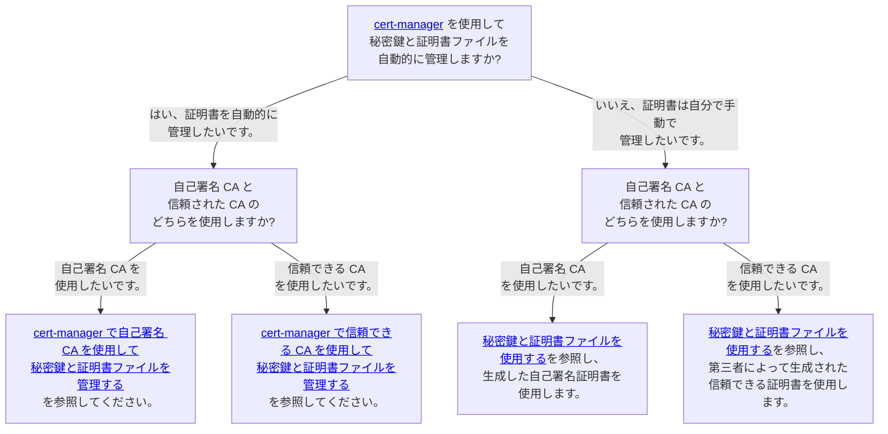
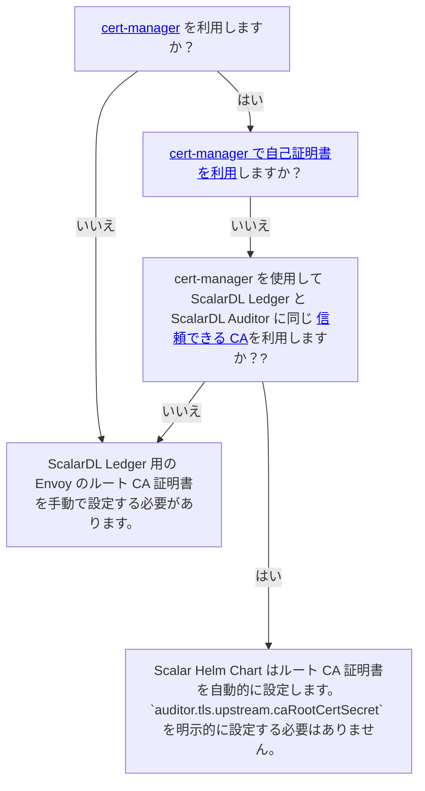

# ScalarDL Auditor のカスタム値ファイルを構成する

このドキュメントでは、ScalarDL Auditor チャートのカスタム値ファイルを作成する方法について説明します。 パラメータの詳細を知りたい場合は、ScalarDL Auditor チャートの [README](https://github.com/scalar-labs/helm-charts/blob/main/charts/scalardl-audit/README.md) を参照してください。

## 必要な構成

### Scalar Envoy 構成

ScalarDL Auditor のカスタム値ファイルで Scalar Envoy 構成を設定する必要があります。 これは、ScalarDL Auditor を Kubernetes 環境にデプロイする場合、クライアント リクエストが gRPC リクエストのロード バランサーとして Scalar Envoy 経由で ScalarDL Auditor に送信されるためです。

Scalar Envoy 構成の詳細については、ドキュメント [Scalar Envoy のカスタム値ファイルの構成](configure-custom-values-envoy.mdx) を参照してください。

```yaml
envoy:
  configurationsForScalarEnvoy: 
    ...

auditor:
  configurationsForScalarDLAuditor: 
    ...
```

### 画像構成

`auditor.image.repository` を設定する必要があります。 コンテナー リポジトリからイメージをプルできるように、必ず ScalarDL Auditor コンテナー イメージを指定してください。

```yaml
auditor:
  image:
    repository: <SCALARDL_AUDITOR_CONTAINER_IMAGE>
```

Scalar 製品のコンテナリポジトリの詳細については、[Scalar 製品のコンテナ イメージを取得する方法](../scalar-kubernetes/HowToGetContainerImages.mdx) を参照してください。

### Auditor / データベースの構成

`auditor.auditorProperties` を設定する必要があります。 `auditor.properties` をこのパラメータに設定してください。 ScalarDL Auditor の設定の詳細については、[auditor.properties](https://github.com/scalar-labs/scalar/blob/master/auditor/conf/auditor.properties) を参照してください。

```yaml
auditor:
  auditorProperties: |
    scalar.db.contact_points=localhost
    scalar.db.username=cassandra
    scalar.db.password=cassandra
    scalar.db.storage=cassandra
    scalar.dl.auditor.ledger.host=<Host name to access ScalarDL Ledger pods>
    scalar.dl.auditor.private_key_path=/keys/auditor-key-file
    scalar.dl.auditor.cert_path=/keys/auditor-cert-file
```

### キー/証明書の構成

秘密鍵ファイルを `scalar.dl.auditor.private_key_path` に設定し、証明書ファイルを `scalar.dl.auditor.cert_path` に設定する必要があります。

秘密キー ファイルと証明書ファイルも ScalarDL Auditor ポッドにマウントする必要があります。

秘密キー ファイルと証明書ファイルをマウントする方法の詳細については、[ScalarDL Helm Charts のポッドにキーファイルと証明書ファイルをマウントする](mount-files-or-volumes-on-scalar-pods.mdx#scalardl-helm-charts-のポッドにキーファイルと証明書ファイルをマウントする) を参照してください。

## オプションの構成

### リソース構成 (本番環境で推奨)

Kubernetes のリクエストと制限を使用してポッド リソースを制御したい場合は、`auditor.resources` を使用できます。

商用ライセンスの観点から、Scalar 製品の 1 つのポッドのリソースは 2vCPU / 4GB メモリに制限されていることに注意してください。 また、AWS Marketplace から提供される従量課金制のコンテナを取得する場合、`resources.limits` で 2vCPU / 4GB を超えるメモリ構成でそれらのコンテナを実行することはできません。 この制限を超えると、ポッドは自動的に停止されます。

これらは、Kubernetes のリクエストと制限と同じ構文を使用して構成できます。 そのため、Kubernetes の要求と制限の詳細については、公式ドキュメント [Resource Management for Pods and Containers](https://kubernetes.io/docs/concepts/configuration/manage-resources-containers/) を参照してください。

```yaml
auditor:
  resources:
    requests:
      cpu: 2000m
      memory: 4Gi
    limits:
      cpu: 2000m
      memory: 4Gi
```

### シークレット構成

環境変数を使用して `auditor.auditorProperties` 内の一部のプロパティ (資格情報など) を設定したい場合は、`auditor.secretName` を使用して、いくつかの資格情報を含む Secret リソースを指定できます。

たとえば、環境変数を使用してバックエンド データベースの資格情報 (`scalar.db.username` および `scalar.db.password`) を設定でき、これによりポッドの安全性が高まります。

Secret リソースの使用方法の詳細については、ドキュメント [Secret リソースを使用して資格情報を環境変数としてプロパティ ファイルに渡す方法](use-secret-for-credentials.mdx) を参照してください。

```yaml
auditor:
  secretName: "auditor-credentials-secret"
```

### Affinity configurations (Recommended in the production environment)

Kubernetes のアフィニティと反アフィニティを使用してポッドのデプロイメントを制御したい場合は、`auditor.affinity` を使用できます。

Kubernetes のアフィニティと同じ構文を使用して構成できます。 そのため、Kubernetes のアフィニティ設定の詳細については、公式ドキュメント [Assigning Pods to Nodes](https://kubernetes.io/docs/concepts/scheduling-eviction/assign-pod-node/) を参照してください。

```yaml
auditor:
  affinity:
    podAntiAffinity:
      preferredDuringSchedulingIgnoredDuringExecution:
        - podAffinityTerm:
            labelSelector:
              matchExpressions:
                - key: app.kubernetes.io/name
                  operator: In
                  values:
                    - scalardl-audit
                - key: app.kubernetes.io/app
                  operator: In
                  values:
                    - auditor
            topologyKey: kubernetes.io/hostname
          weight: 50
```

### Prometheus/Grafana 構成 (運用環境で推奨)

[kube-prometheus-stack](https://github.com/prometheus-community/helm-charts/tree/main/charts/kube-prometheus-stack) を使用して ScalarDL Auditor ポッドを監視する場合は、`auditor.grafanaDashboard.enabled`、`auditor.serviceMonitor` を使用して、kube-prometheus-stack の ConfigMap、ServiceMonitor、および PrometheusRule リソースをデプロイできます。 `enabled` および `auditor.prometheusRule.enabled`。

```yaml
auditor:
  grafanaDashboard:
    enabled: true
    namespace: monitoring
  serviceMonitor:
    enabled: true
    namespace: monitoring
    interval: 15s
  prometheusRule:
    enabled: true
    namespace: monitoring
```

### SecurityContext 設定 (デフォルト値を推奨)

ScalarDL Auditor ポッドに SecurityContext と PodSecurityContext を設定したい場合は、`auditor.securityContext` と `auditor.podSecurityContext` を使用できます。

KubernetesのSecurityContextやPodSecurityContextと同じ構文を使用して設定できます。 したがって、Kubernetes の SecurityContext および PodSecurityContext 構成の詳細については、公式ドキュメント [Configure a Security Context for a Pod or Container](https://kubernetes.io/docs/tasks/configure-pod-container/security-context/) を参照してください。

```yaml
auditor:
  podSecurityContext:
    seccompProfile:
      type: RuntimeDefault
  securityContext:
    capabilities:
      drop:
        - ALL
    runAsNonRoot: true
    allowPrivilegeEscalation: false
```

### TLS 構成 (環境に応じてオプション)

TLS は、次の通信で有効にできます:

- ScalarDL Auditor とクライアント間の通信。
- ScalarDL Ledger と ScalarDL Auditor 間の通信。

さらに、証明書管理にはいくつかのオプションがあります。詳細については、[Envoy の TLS 構成](./configure-custom-values-envoy.mdx#tls-構成-環境に応じてオプション) を参照してください。

セキュリティ要件に基づいて、どの方法を使用するかを検討する必要があります。各方法のガイダンスと関連ドキュメントについては、次の意思決定ツリーを参照してください。



#### TLS を有効にする

次の構成を使用して、すべての ScalarDL Auditor 接続で TLS を有効にすることができます。

```yaml
auditor:
  auditorProperties: |
    ...(omit)...
    scalar.dl.auditor.server.tls.enabled=true
    scalar.dl.auditor.server.tls.cert_chain_path=/tls/scalardl-auditor/certs/tls.crt
    scalar.dl.auditor.server.tls.private_key_path=/tls/scalardl-auditor/certs/tls.key
    scalar.dl.auditor.tls.enabled=true
    scalar.dl.auditor.tls.ca_root_cert_path=/tls/scalardl-ledger/certs/ca.crt
    scalar.dl.auditor.tls.override_authority=envoy.scalar.example.com
  tls:
    enabled: true
```

##### 秘密鍵と証明書ファイルを使用する

次の構成を使用して、秘密鍵と証明書ファイルを設定できます。

```yaml
auditor:
  tls:
    enabled: true
    caRootCertSecret: "scalardl-auditor-tls-ca"
    certChainSecret: "scalardl-auditor-tls-cert"
    privateKeySecret: "scalardl-auditor-tls-key"
```

この場合、次のように、山括弧内の内容を置き換えて、ScalarDL Ledger および ScalarDL Auditor の秘密キーと証明書ファイルを含むシークレットリソースを作成する必要があります。

```console
kubectl create secret generic scalardl-auditor-tls-ca --from-file=ca.crt=/<PATH_TO_YOUR_CA_CERTIFICATE_FILE_FOR_SCALARDL_AUDITOR> -n <NAMESPACE>
kubectl create secret generic scalardl-auditor-tls-cert --from-file=tls.crt=/<PATH_TO_YOUR_CERTIFICATE_FILE_FOR_SCALARDL_AUDITOR> -n <NAMESPACE>
kubectl create secret generic scalardl-auditor-tls-key --from-file=tls.key=/<PATH_TO_YOUR_PRIVATE_KEY_FILE_FOR_SCALARDL_AUDITOR> -n <NAMESPACE>
kubectl create secret generic scalardl-auditor-tls-ca-for-ledger --from-file=ca.crt=/<PATH_TO_YOUR_CA_CERTIFICATE_FILE_FOR_SCALARDL_LEDGER> -n <NAMESPACE>
```

秘密鍵と証明書ファイルを準備する方法の詳細については、[Scalar 製品の秘密鍵と証明書ファイルを作成する方法](../scalar-kubernetes/HowToCreateKeyAndCertificateFiles.mdx) を参照してください。

##### cert-manager で信頼できる CA を使用して秘密鍵と証明書ファイルを管理する

次の構成を使用して、山括弧内の内容を説明に従って置き換えることで、cert-manager で秘密鍵と証明書ファイルを管理できます。

:::note

* cert-manager を使用する場合は、cert-manager をデプロイし、`Issuers` リソースを準備する必要があります。詳細については、cert-manager のドキュメント、[インストール](https://cert-manager.io/docs/installation/) および [発行者構成](https://cert-manager.io/docs/configuration/) を参照してください。
* デフォルトでは、Scalar Helm Chart は Scalar 製品の証明書要件を満たす `Certificate` リソースを作成します。デフォルトの証明書構成が推奨されますが、カスタム証明書構成を使用する場合は、Scalar 製品の証明書要件を満たす必要があります。詳細については、[Scalar 製品の秘密キーと証明書ファイルを作成する方法](../scalar-kubernetes/HowToCreateKeyAndCertificateFiles.mdx#certificate-requirements) を参照してください。

:::

```yaml
auditor:
  tls:
    enabled: true
    certManager:
      enabled: true
      issuerRef:
        name: <YOUR_TRUSTED_CA>
      dnsNames:
        - auditor.scalardl.example.com
```

この場合、cert-manager は信頼できる発行者を使用して秘密鍵と証明書ファイルを発行します。秘密鍵と証明書ファイルを手動でマウントする必要はありません。

##### cert-manager で自己署名 CA を使用して秘密鍵と証明書ファイルを管理する

次の構成を使用して、cert-manager で秘密キーと自己署名証明書ファイルを管理できます。

:::note

* cert-manager を使用する場合は、cert-manager をデプロイする必要があります。詳細については、cert-manager のドキュメント [インストール](https://cert-manager.io/docs/installation/) を参照してください。
* デフォルトでは、Scalar Helm Chart は Scalar 製品の証明書要件を満たす `Certificate` リソースを作成します。デフォルトの証明書構成が推奨されますが、カスタム証明書構成を使用する場合は、Scalar 製品の証明書要件を満たす必要があります。詳細については、[Scalar 製品の秘密キーと証明書ファイルを作成する方法](../scalar-kubernetes/HowToCreateKeyAndCertificateFiles.mdx#certificate-requirements) を参照してください。

:::

```yaml
auditor:
  tls:
    enabled: true
    certManager:
      enabled: true
      selfSigned:
        enabled: true
      dnsNames:
        - auditor.scalardl.example.com
```

この場合、Scalar Helm Charts と cert-manager が秘密鍵と自己署名証明書ファイルを発行します。秘密鍵と証明書ファイルを手動でマウントする必要はありません。

#### ScalarDL Ledger のルート CA 証明書を設定する

ScalarDL Ledger 側で TLS を有効にする場合は、ScalarDL Auditor からアクセスできるように、ScalarDL Ledger の前にある Envoy のルート CA 証明書ファイルを設定する必要があります。どのアプローチを取るべきかを判断するには、次の意思決定ツリーを参照してください。



Envoy のルート CA 証明書ファイルを手動で設定する必要がある場合は、次の構成を使用して設定できます。

```yaml
auditor:
  tls:
    enabled: true
    caRootCertForLedgerSecret: "scalardl-auditor-tls-ca-for-ledger"
```

この場合、次のように山括弧内の内容を置き換えて、ルート CA 証明書ファイルを含むシークレットリソースを作成する必要があります。

```console
kubectl create secret generic scalardl-auditor-tls-ca-for-ledger --from-file=ca.crt=/<PATH_TO_ROOT_CA_CERT_FILE_FOR_ENVOY_IN_FRONT_OF_SCALARDL_LEDGER>/scalardl-ledger -n <NAMESPACE>
```

##### TLS通信のカスタム権限を設定する

`auditor.tls.overrideAuthority` を使用して、TLS 通信のカスタム権限を設定できます。この値によって、実際に接続されているホストが変わることはありません。この値はテスト用ですが、DNS オーバーライドの代替としてテスト以外でも安全に使用できます。たとえば、`auditor.tls.certChainSecret` を使用して設定した証明書チェーン ファイルで提示されるホスト名を指定できます。このチャートでは、`startupProbe` と `livenessProbe` にこの値を使用しています。

### レプリカ構成 (環境に応じてオプション)

ScalarDL Auditor のレプリカ (ポッド) の数は、`auditor.replicaCount` を使用して指定できます。

```yaml
auditor:
  replicaCount: 3
```

### ロギング構成 (環境に応じてオプション)

ScalarDL Auditor のログレベルを変更したい場合は、`auditor.scalarAuditorConfiguration.auditorLogLevel` を使用できます。

```yaml
auditor:
  scalarAuditorConfiguration:
    auditorLogLevel: INFO
```

### 汚染と許容の構成 (環境に応じてオプション)

Kubernetes のテイントと許容を使用してポッドのデプロイメントを制御したい場合は、`auditor.tolerations` を使用できます。

Kubernetes の許容と同じ構文を使用して、テイントと許容を構成できます。 Kubernetes での許容設定の詳細については、Kubernetes の公式ドキュメント [Taints and Tolerations](https://kubernetes.io/docs/concepts/scheduling-eviction/taint-and-toleration/) を参照してください。

```yaml
auditor:
  tolerations:
    - effect: NoSchedule
      key: scalar-labs.com/dedicated-node
      operator: Equal
      value: scalardl-auditor
```
