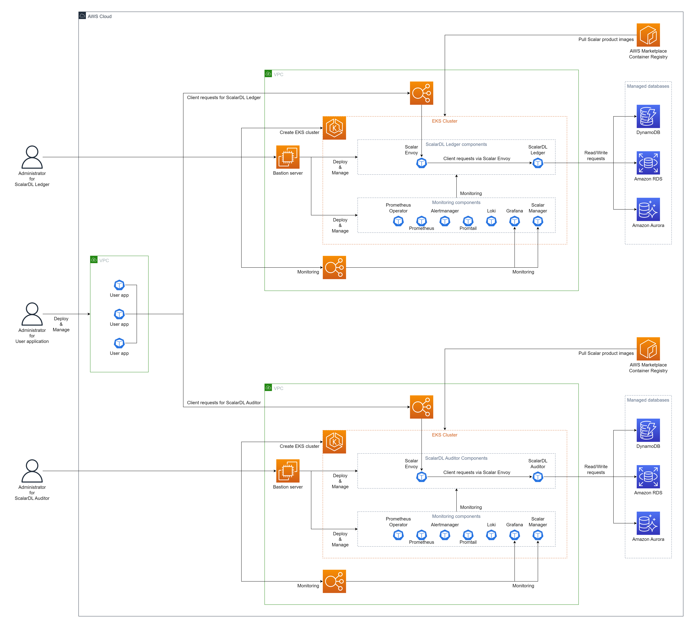
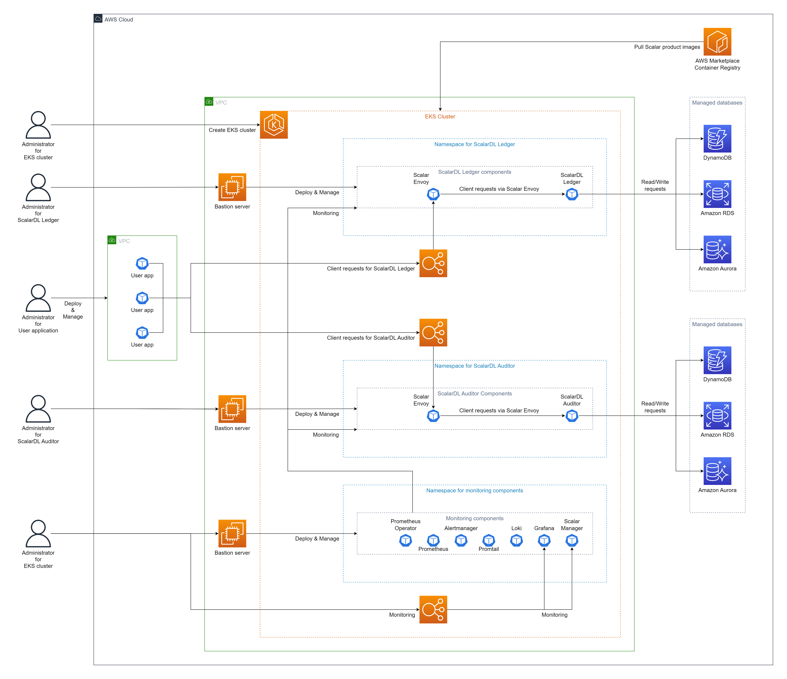

# ScalarDL Ledger と ScalarDL Auditor を Amazon Elastic Kubernetes Service (EKS) にデプロイする

import TranslationBanner from '/src/components/_translation-ja-jp.mdx';

<TranslationBanner />

このガイドでは、ScalarDL Ledger と ScalarDL Auditor を Amazon Elastic Kubernetes Service (EKS) にデプロイする方法について説明します。

このガイドでは、AWS 環境に次の3つの環境のいずれかを作成します。ビザンチン障害検出を適切に機能させるには、ScalarDL Ledger と ScalarDL Auditor を異なる管理ドメイン (つまり、別の環境) に展開することをお勧めします。

* 別の AWS アカウントを使用する (最も推奨される方法)

  

* 異なる Amazon Virtual Private Cloud (VPC) を使用する (2番目に推奨される方法)

  

* 異なる名前空間を使用する (3番目に推奨される方法)

  

**注記：** このガイドは、2番目に推奨される方法「別の VPC を使用する」に従います。

## ステップ1. AWS Marketplace で ScalarDL Ledger と ScalarDL Auditor を購読する

[AWS Marketplace](https://aws.amazon.com/marketplace/seller-profile?id=bd4cd7de-49cd-433f-97ba-5cf71d76ec7b) から ScalarDL Ledger および ScalarDL Auditor コンテナイメージを取得し、ScalarDL Ledger および ScalarDL Auditor をサブスクライブする必要があります。AWS Marketplace で ScalarDL Ledger および ScalarDL Auditor を購読する方法の詳細については、[AWS Marketplace から Scalar 製品を購読する](AwsMarketplaceGuide.mdx#aws-marketplace-から-scalar-製品を購読する)を参照してください。

## ステップ2. ScalarDL Ledger の EKS クラスターを作成する

ScalarDL Ledger デプロイメント用の EKS クラスターを作成する必要があります。詳細については、[Scalar 製品用の Amazon EKS クラスターを作成するためのガイドライン](CreateEKSClusterForScalarProducts.mdx)を参照してください。

## ステップ3. ScalarDL Auditor 用の EKS クラスターを作成する

ScalarDL Auditor デプロイメント用の EKS クラスターも作成する必要があります。詳細については、[Scalar 製品用の Amazon EKS クラスターを作成するためのガイドライン](CreateEKSClusterForScalarProducts.mdx)を参照してください。

## ステップ4. ScalarDL Ledger のデータベースをセットアップする

ScalarDL Ledger を展開する前にデータベースを準備する必要があります。ScalarDL Ledger は内部で ScalarDB を使用してデータベースにアクセスするため、ScalarDB がサポートするデータベースの種類を確認するには、[ScalarDB Supported Databases](https://scalardb.scalar-labs.com/docs/latest/requirements#databases) を参照してください。

データベースのセットアップの詳細については、[AWS での ScalarDB/ScalarDL デプロイ用のデータベースのセットアップ](SetupDatabaseForAWS.mdx)を参照してください。

## ステップ5. ScalarDL Auditor のデータベースをセットアップする

ScalarDL Auditor を展開する前にデータベースを準備する必要もあります。ScalarDL Auditor は内部で ScalarDB を使用してデータベースにアクセスするため、ScalarDB がサポートするデータベースの種類を確認するには、[ScalarDB Supported Databases](https://scalardb.scalar-labs.com/docs/latest/requirements#databases) を参照してください。

データベースのセットアップの詳細については、[AWS での ScalarDB/ScalarDL デプロイ用のデータベースのセットアップ](SetupDatabaseForAWS.mdx)を参照してください。

## ステップ6. ScalarDL Ledger の踏み台サーバーを作成する

EKS 上で ScalarDL Ledger をデプロイおよび管理するためのいくつかのツールを実行するには、**ステップ2**で作成した EKS クラスターの同じ VPC 内に踏み台サーバーを準備する必要があります。詳細については、[踏み台サーバーの作成](CreateBastionServer.mdx)を参照してください。

## ステップ7. ScalarDL Auditor の踏み台サーバーを作成する

EKS 上で ScalarDL Auditor をデプロイおよび管理するためのいくつかのツールを実行するには、**ステップ3**で作成した EKS クラスターの同じ VPC 内に踏み台サーバーを準備する必要があります。詳細については、[踏み台サーバーの作成](CreateBastionServer.mdx)を参照してください。

## ステップ8. 2つの EKS クラスター間のネットワークピアリングを作成する

ScalarDL を適切に動作させるには、ScalarDL Ledger と ScalarDL Auditor が相互に接続する必要があります。[VPC peering](https://docs.aws.amazon.com/vpc/latest/peering/create-vpc-peering-connection.html) を使用して2つの VPC を接続する必要があります。詳細については、[ScalarDL Auditor モードのネットワークピアリングの構成](NetworkPeeringForScalarDLAuditor.mdx)を参照してください。

## ステップ9. ScalarDL Ledger および ScalarDL Schema Loader の Scalar Helm Chart のカスタム値ファイルを準備する

**ステップ4**で作成したデータベース内の情報へのアクセスなどのタスクを実行するには、環境に基づいて ScalarDL Ledger および ScalarDL Schema Loader (Ledger 用) の Scalar Helm Chart のカスタム値ファイルを構成する必要があります。詳細については、[Configure a custom values file for Scalar Helm Charts](../helm-charts/configure-custom-values-file.mdx) を参照してください。

## ステップ10. Scalar Helm Chart を使用して ScalarDL Ledger をデプロイする

ScalarDL Ledger の Helm Chart を使用して、ScalarDL Ledger を EKS クラスターにデプロイします。詳細については、[Deploy Scalar products using Scalar Helm Charts](../helm-charts/how-to-deploy-scalar-products.mdx) を参照してください。

**注記：** `kubectl create ns scalardl-ledger` コマンドを使用して専用の名前空間を作成し、`helm install` コマンドで `-n scalardl-ledger` オプションを使用して名前空間に ScalarDL Ledger をデプロイすることをお勧めします。

## ステップ11. ScalarDL Auditor と ScalarDL Schema Loader の両方の Scalar Helm Chart のカスタム値ファイルを準備する

**ステップ5**で作成したデータベース内の情報へのアクセスなどのタスクを実行するには、環境に基づいて ScalarDL Auditor と ScalarDL Schema Loader (Auditor 用) の両方の Scalar Helm Chart のカスタム値ファイルを構成する必要があります。詳細については、[Configure a custom values file for Scalar Helm Charts](../helm-charts/configure-custom-values-file.mdx) を参照してください。

## ステップ12. Scalar Helm Chart を使用して ScalarDL Auditor をデプロイする

ScalarDL Auditor の Helm Chart を使用して、ScalarDL Auditor を EKS クラスターにデプロイします。詳細については、[Deploy Scalar products using Scalar Helm Charts](../helm-charts/how-to-deploy-scalar-products.mdx) を参照してください。

**注記：** `kubectl create ns scalardl-auditor` コマンドを使用して専用の名前空間を作成し、`helm install` コマンドで `-n scalardl-auditor` オプションを使用して名前空間に ScalarDL Auditor をデプロイすることをお勧めします。

## ステップ13. ScalarDL Ledger 導入のステータスを確認する

EKS クラスターに ScalarDL Ledger をデプロイした後、各コンポーネントのステータスを確認する必要があります。詳細については、[Kubernetes環境で実行する場合に定期的に確認するコンポーネント](RegularCheck.mdx)を参照してください。

## ステップ14. ScalarDL Auditor デプロイメントのステータスを確認する

EKS クラスターに ScalarDL Auditor をデプロイした後、各コンポーネントのステータスを確認する必要があります。詳細については、[Kubernetes 環境で実行するときに定期的に確認するコンポーネント](RegularCheck.mdx)を参照してください。

## ステップ15. ScalarDL Ledger の展開を監視する

EKS クラスターに ScalarDL Ledger をデプロイした後、特に本番環境では、デプロイされたコンポーネントを監視し、そのログを収集することをお勧めします。詳細については、[Kubernetes クラスター上の Scalar 製品の監視](K8sMonitorGuide.mdx)および [Kubernetes クラスター上の Scalar 製品からのログの収集](K8sLogCollectionGuide.mdx)を参照してください。

## ステップ16. ScalarDL Auditor の展開を監視する

EKS クラスターに ScalarDL Auditor をデプロイした後、特に運用環境で、デプロイされたコンポーネントを監視し、そのログを収集することをお勧めします。詳細については、[Kubernetes クラスター上の Scalar 製品の監視](K8sMonitorGuide.mdx)および [Kubernetes クラスター上の Scalar 製品からのログの収集](K8sLogCollectionGuide.mdx)を参照してください。

## EKS から ScalarDL Ledger と ScalarDL Auditor を削除

作成した環境を削除する場合は、作成時とは逆の順序ですべてのリソースを削除してください。
