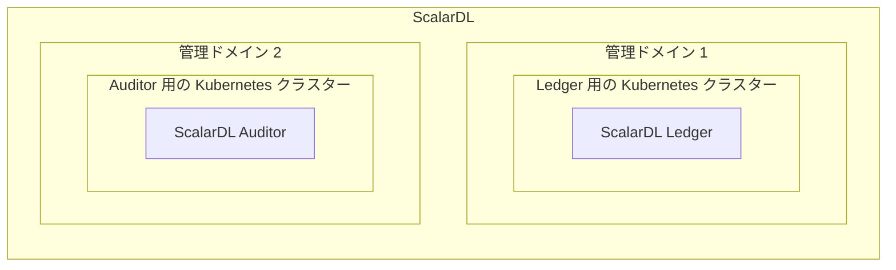
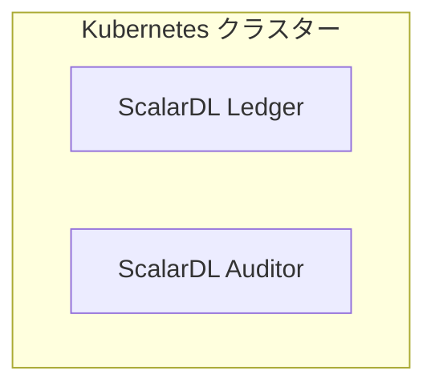
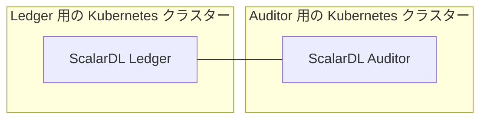
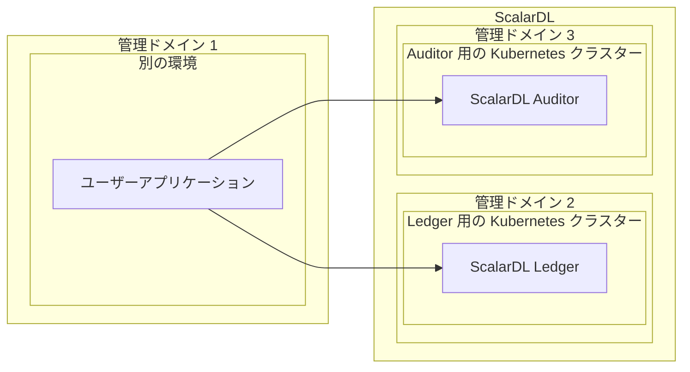
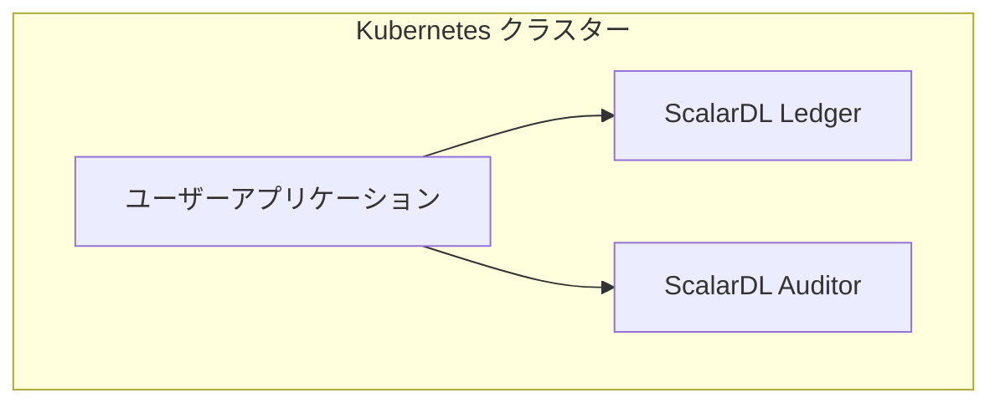

---
---

# ScalarDL Auditor の制作チェックリスト

import TranslationBanner from '/src/components/_translation-ja-jp.mdx';

<TranslationBanner />

このチェックリストは、ScalarDL Auditor を運用環境に展開する際の推奨事項を提供します。

## あなたが始める前に

このチェックリストでは、推奨される管理対象 Kubernetes クラスターに ScalarDL Auditor をデプロイしていることを前提としています。

## プロダクションチェックリスト: ScalarDL Auditor

以下は、運用環境で ScalarDL Auditor をセットアップする際の推奨事項のチェックリストです。

### ScalarDL の可用性

Kubernetes クラスターの高可用性を確保するには、少なくとも 3 つのワーカーノードを使用し、ワーカーノード全体に少なくとも 3 つのポッドをデプロイする必要があります。 3 つのポッドをワーカーノードに分散させるための `podAntiAffinity` の [サンプル構成](https://github.com/scalar-labs/scalar-kubernetes/blob/master/conf/scalardl-audit-custom-values.yaml) を参照できます。

:::note

ワーカーノードを異なるアベイラビリティ ゾーン (AZ) に配置すると、AZ の障害に耐えることができます。

:::

### リソース

商用ライセンスの観点から、ScalarDL Auditor を実行する 1 つのポッドのリソースは 2vCPU / 4GB メモリに制限されます。 ScalarDL Auditor ポッドに加えて、Kubernetes は次のコンポーネントの一部を各ワーカーノードにデプロイできます。

* ScalarDL Auditor ポッド (2vCPU / 4GB)
* Envoy プロキシ
* 監視コンポーネント (`kube-prometheus-stack` などの監視コンポーネントをデプロイする場合)
* Kubernetes コンポーネント

これを念頭に置いて、[ScalarDL の可用性](#scalardl-availability) で説明されているように、少なくとも 4vCPU / 8GB のメモリ リソースを持つワーカーノードを使用し、可用性のために少なくとも 3 つのワーカーノードを使用する必要があります。

ただし、ノードあたり少なくとも 4vCPU / 8GB のメモリ リソースを備えた 3 つのノードが運用環境の最小環境となります。 システムのワークロードに応じて、Kubernetes クラスターのリソース (ワーカーノードの数、ノードあたりの vCPU、ノードあたりのメモリ、ScalarDL Auditor ポッドなど) も考慮する必要があります。 また、[Horizontal Pod Autoscaling (HPA)](https://kubernetes.io/docs/tasks/run-application/horizontal-pod-autoscale/) などの機能を使用してポッドを自動的にスケーリングする予定の場合は、ワーカーノードのリソースを決定するときにワーカーノード上の最大ポッド数を考慮する必要があります。

### 通信網

ScalarDL Auditor はインターネット アクセス経由でユーザーにサービスを直接提供しないため、Kubernetes クラスターはプライベート ネットワーク上に作成する必要があります。 アプリケーションからプライベート ネットワーク経由で ScalarDL Auditor にアクセスすることをお勧めします。

### 監視とログ記録

デプロイされたコンポーネントを監視し、そのログを収集する必要があります。 詳細については、[Kubernetes クラスター上の Scalar 製品の監視](K8sMonitorGuide.mdx) および  [Kubernetes クラスター上の Scalar 製品からのログの収集](K8sLogCollectionGuide.mdx) を参照してください。

### バックアップと復元

バックエンド データベースで自動バックアップ機能とポイントインタイム リカバリ (PITR) 機能を有効にする必要があります。 詳細については、[ScalarDB/ScalarDL 導入用のデータベースのセットアップ](SetupDatabase.mdx) を参照してください。

### ScalarDL Auditor の展開

ScalarDL でのビザンチン障害検出が適切に機能するには、ScalarDL Ledger デプロイメントと同じ Kubernetes クラスターに ScalarDL Auditor ポッドをデプロイしないでください。 代わりに、ScalarDL Ledger デプロイメントの管理ドメイン以外の環境 (Kubernetes クラスター以外) に ScalarDL Auditor ポッドをデプロイする必要があります。

#### 実稼働環境に必要



#### 運用環境では推奨されません (テスト目的のみ)



### ScalarDL Ledger と ScalarDL Auditor 間の接続

ScalarDL Auditor モードが正しく動作するには、ScalarDL Ledger と ScalarDL Auditor 間の接続を許可する必要があります。



ScalarDL は、ScalarDL Ledger と ScalarDL Auditor 間の接続に次のポートを使用します。 ScalarDL Ledger と ScalarDL Auditor の間で次の接続を許可する必要があります。

* ScalarDL Ledger
  * 50051/TCP
  * 50052/TCP
* ScalarDL Auditor
  * 40051/TCP
  * 40052/TCP

### 秘密鍵と証明書

認証に PKI を使用する場合は、ScalarDL Ledger および ScalaDL Auditor に登録する秘密鍵と証明書が次の要件を満たしていることを確認する必要があります。

```console
Algorithm       : ECDSA
Hash function   : SHA256
Curve parameter : P-256
```

詳しくは [How to get a certificate](https://scalardl.scalar-labs.com/ja-jp/docs/latest/ca/caclient-getting-started) をご覧ください。

## 実稼働チェックリスト: ScalarDL Auditor にアクセスするクライアント アプリケーション

以下は、運用環境で ScalarDL Auditor にアクセスするクライアント アプリケーションをセットアップする際の推奨事項のチェックリストです。

### クライアント アプリケーションのデプロイメント

ScalarDL でのビザンチン障害検出が適切に機能するには、ScalarDL デプロイメントと同じ Kubernetes クラスターにアプリケーション ポッドをデプロイしないでください。 代わりに、ScalarDL デプロイメントの管理ドメイン以外の環境 (Kubernetes クラスター以外) にアプリケーションをデプロイする必要があります。

#### 実稼働環境に必要



#### 運用環境では推奨されません (テスト目的のみ)



### クライアント アプリケーションのチェックリスト

また、[運用チェックリスト: ScalarDL Ledger にアクセスするクライアントアプリケーション](ProductionChecklistForScalarDLLedger.mdx#運用チェックリスト-scalardl-ledger-にアクセスするクライアントアプリケーション) を満たしていることも確認する必要があります。
