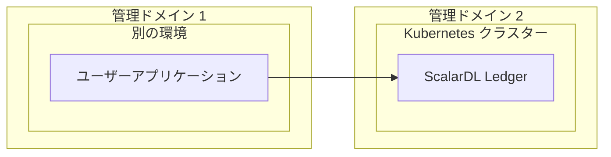
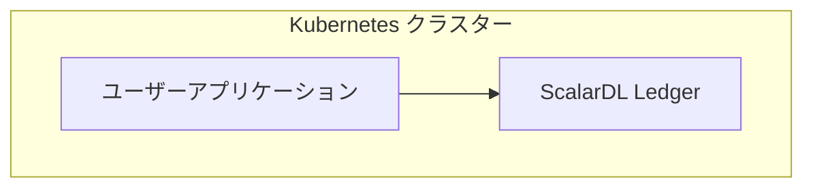

---
---

# ScalarDL Ledgerの制作チェックリスト

import TranslationBanner from '/src/components/_translation-ja-jp.mdx';

<TranslationBanner />

このチェックリストは、実稼働環境に ScalarDL Ledger を展開する際の推奨事項を提供します。

## あなたが始める前に

このチェックリストでは、推奨される管理対象 Kubernetes クラスターに ScalarDL Ledger をデプロイしていることを前提としています。

## プロダクションチェックリスト: ScalarDL Ledger

以下は、運用環境で ScalarDL Ledger をセットアップする際の推奨事項のチェックリストです。

### ScalarDL の可用性

Kubernetes クラスターの高可用性を確保するには、少なくとも 3 つのワーカーノードを使用し、ワーカーノード全体に少なくとも 3 つのポッドをデプロイする必要があります。 3 つのポッドをワーカーノードに分散させるための `podAntiAffinity` の [サンプル構成](https://github.com/scalar-labs/scalar-kubernetes/blob/master/conf/scalardl-custom-values.yaml) を参照できます。

:::note

ワーカーノードを異なるアベイラビリティ ゾーン (AZ) に配置すると、AZ の障害に耐えることができます。

:::

### リソース

商用ライセンスの観点から、ScalarDL Ledger を実行する 1 つのポッドのリソースは 2vCPU / 4GB メモリに制限されます。 ScalarDL Ledger ポッドに加えて、Kubernetes は次のコンポーネントの一部を各ワーカーノードにデプロイできます。

* ScalarDL Ledger ポッド (2vCPU / 4GB)
* Envoy プロキシ
* 監視コンポーネント (`kube-prometheus-stack` などの監視コンポーネントをデプロイする場合)
* Kubernetes コンポーネント

これを念頭に置いて、[ScalarDL の可用性](#scalardl-availability) で説明されているように、少なくとも 4vCPU / 8GB のメモリ リソースを持つワーカーノードを使用し、可用性のために少なくとも 3 つのワーカーノードを使用する必要があります。

ただし、ノードあたり少なくとも 4vCPU / 8GB のメモリ リソースを備えた 3 つのノードが運用環境の最小環境となります。 システムのワークロードに応じて、Kubernetes クラスターのリソース (ワーカーノードの数、ノードあたりの vCPU、ノードあたりのメモリ、ScalarDL Ledger ポッドなど) も考慮する必要があります。 また、[Horizontal Pod Autoscaling (HPA)](https://kubernetes.io/docs/tasks/run-application/horizontal-pod-autoscale/) などの機能を使用してポッドを自動的にスケーリングする予定の場合は、ワーカーノードのリソースを決定するときにワーカーノード上の最大ポッド数を考慮する必要があります。

### 通信網

ScalarDL Ledger はインターネット アクセス経由でユーザーにサービスを直接提供しないため、Kubernetes クラスターはプライベート ネットワーク上に作成する必要があります。 アプリケーションからプライベート ネットワーク経由で ScalarDL Ledger にアクセスすることをお勧めします。

### 監視とログ記録

デプロイされたコンポーネントを監視し、そのログを収集する必要があります。 詳細については、[Kubernetes クラスター上の Scalar 製品の監視](K8sMonitorGuide.mdx) および [Kubernetes クラスター上の Scalar 製品からのログの収集](K8sLogCollectionGuide.mdx) を参照してください。

### バックアップと復元

バックエンド データベースで自動バックアップ機能とポイントインタイム リカバリ (PITR) 機能を有効にする必要があります。 詳細については、[ScalarDB/ScalarDL 導入用のデータベースのセットアップ](SetupDatabase.mdx) を参照してください。

## 運用チェックリスト: ScalarDL Ledger にアクセスするクライアントアプリケーション

以下は、運用環境で ScalarDL Ledger にアクセスするクライアント アプリケーションをセットアップする際の推奨事項のチェックリストです。

### クライアント アプリケーションのデプロイメント

ScalarDL でのビザンチン障害検出が適切に機能するには、アプリケーション ポッドを ScalarDL Ledger デプロイメントと同じ Kubernetes クラスターにデプロイしないでください。 代わりに、ScalarDL Ledger デプロイメントの管理ドメイン以外の環境 (Kubernetes クラスター以外) にアプリケーションをデプロイする必要があります。

#### 実稼働環境に必要



#### 運用環境では推奨されません (テスト目的のみ)



### 契約と機能

契約と機能がガイドラインに従っているかどうかを確認するには、次を参照してください。

* [A Guide on How to Write a Good Contract for ScalarDL](https://scalardl.scalar-labs.com/ja-jp/docs/latest/how-to-write-contract)
* [A Guide on How to Write Function for ScalarDL](https://scalardl.scalar-labs.com/ja-jp/docs/latest/how-to-write-function)

### 契約のバージョン管理

契約を登録した後は、既存の契約を上書きすることはできません。 したがって、契約のバージョン管理を検討する必要があります。 次の 2 つの方法のいずれかを推奨します。

#### `クラス名` を使用したバージョニング

```console
Contract ID              : FooV1
Binary Name              : com.example.contract.FooV1
Class file (Class Name)  : src/main/java/com/example/contract/FooV1.class
---
Contract ID              : FooV2
Binary Name              : com.example.contract.FooV2
Class file (Class Name)  : src/main/java/com/example/contract/FooV2.class
```

####  `Package Name` を使用したバージョニング

```console
Contract ID             : FooV3
Binary Name             : com.example.contract.v3.Foo
Class file (Class Name) : src/main/java/com/example/contract/v3/Foo.class
---
Contract ID             : FooV4
Binary Name             : com.example.contract.v4.Foo
Class file (Class Name) : src/main/java/com/example/contract/v4/Foo.class
```

### 契約上の制限

コントラクト登録時にバイナリ名、パッケージ名、クラス名が異なる場合、登録後にそのコントラクトを実行することはできません。

#### バイナリ名とクラス名が異なります（このコントラクトは実行できません）

```console
Contract ID              : FooV5
Binary Name              : com.example.contract.FooV5
Class file (Class Name)  : src/main/java/com/example/contract/FooV6.class
```

#### バイナリ名とパッケージ名が異なります（本契約は実行できません）

```console
Contract ID              : FooV7
Binary Name              : com.example.contract.v7.Foo
Class file (Class Name)  : src/main/java/com/example/contract/v8/Foo.class
```

### 秘密鍵と証明書

認証に PKI を使用する場合、ScalarDL Ledger に登録する秘密キーと証明書が次の要件を満たしていることを確認する必要があります。

```console
Algorithm       : ECDSA
Hash function   : SHA256
Curve parameter : P-256
```

詳しくは [How to get a certificate](https://scalardl.scalar-labs.com/ja-jp/docs/latest/ca/caclient-getting-started) をご覧ください。

### 例外処理

アプリケーションが例外を処理することを確認する必要があります。 詳細については、[A Guide on How to Handle Errors in ScalarDL](https://scalardl.scalar-labs.com/ja-jp/docs/latest/how-to-handle-errors) を参照してください。
