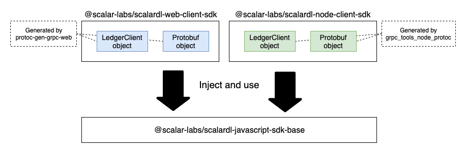

include scalardl/end-of-support-ja-jp.html

[](https://circleci.com/gh/scalar-labs/scalardl-javascript-sdk-base/tree/master)

NPM パッケージ `@scalar-labs/scalardl-javascript-sdk-base` は、パッケージ [@scalar-labs/scalardl-web-client-sdk](https://github.com/scalar-labs/scalardl-web-client-sdk) と [@scalar-labs/scalardl-node-client-sdk](https://github.com/scalar-labs/scalardl-node-client-sdk) の共通部分です。
これら 2 つのパッケージは、サービスと Protobuf オブジェクトの生成に異なる gRPC ツールを使用しますが、オブジェクトを挿入した後に @scalar-labs/scalardl-javascript-sdk-base を使用できます。 関連する静的ファイルを生成する方法については、この README の後半で紹介します。



開発者は実際にはこのパッケージを使用する必要がないかもしれません。 ScalarDLT アプリケーションを作成するには、[@scalar-labs/scalardl-web-client-sdk](https://github.com/scalar-labs/scalardl-web-client-sdk) または [@scalar-labs/scalardl-node-client-sdk](https://github.com/scalar-labs/scalardl-node-client-sdk) を参照してください。

## 開発とテストに使用されるノードのバージョン

このパッケージは、Node LTS v14.16.0 を使用して開発およびテストされています。 名前は「fermium」。
これは、他のノード バージョンを使用する場合、パッケージの通常の動作を保証できないことを意味します。

## JavaScript ベースの SDK を更新する方法

ファイル *scalardl-web-client-sdk* および *scalardl-node-client-sdk* は *scalardl-javascript-sdk-base* に基づいています。 したがって、*scalardl-javascript-sdk-base* を更新する場合は、それらの SDK も更新する必要があります。 以下では、それを適切に行う方法について説明します。

### 開発には推奨される Node/Npm バージョンを使用してください

nvm を使用して、[.nvmrc](.nvmrc) に記載されている推奨ノード バージョンを設定できます。

```bash
nvm use
```

### scalardl-javascript-sdk-base バージョンをアップグレードする

scalardl-javascript-sdk-base の実装を変更した後、package.json の version フィールドをアップグレードする必要があります。 次のようになります。

```
"version": "3.0.0",
```

バージョンは[セマンティック バージョニング](https://semver.org/)の規則に準拠します。 package.json が新しいバージョンにアップグレードされたら、 `npm publish` を使用してパッケージを NPM レジストリにプッシュします。

### Web および Node.js SDK の scalardl-javascript-sdk-base をアップグレードする

scalardl-javascript-sdk-base をアップグレードして package.json を更新する必要があります。 *scalardl-javascript-sdk-base* をアップグレードするには、package.json ファイルが含まれる *scalardl-web-client-sdk* および *scalardl-node-client-sdk* のルート フォルダーに移動し、次のコマンドを使用します。

```
npm upgrade @scalar-labs/scalardl-javascript-sdk-base
```

このコマンドは、 `package.json` ファイルと `package-lock.json` ファイルを更新します。

## scalardl-web-client-sdk の静的ファイルを再生成する方法

[proto Buffer Compiler](http://google.github.io/proto-lens/installing-protoc.html) および [protoc-gen-grpc-web](https://github.com/grpc/grpc-web/releases) プラグインがインストールされていることを確認してください。 次に、scalar.proto が含まれるフォルダーに移動し、次のコマンドを実行します。

```
protoc --js_out=import_style=commonjs:. --grpc-web_out=import_style=commonjs,mode=grpcwebtext:. scalar.proto
```

次に、新しく生成された 2 つのファイル **scalar_grpc_web_pb.js** と **scalar_pb.js** が表示されます。 これら 2 つのファイルを https://github.com/scalar-labs/scalardl-web-client-sdk に更新します。

コード内で ClientServiceBase が正しく初期化されていることを確認してください。

## scalardl-node-client-sdk の静的ファイルを再生成する方法

[grpc-tools](https://www.npmjs.com/package/grpc-tools) がインストールされていることを確認してください (グローバル インストールを推奨)。 次に、scalar.proto が含まれるフォルダーに移動し、次のコマンドを実行します。

```
grpc_tools_node_protoc --js_out=import_style=commonjs,binary:. --grpc_out=grpc_js:. --plugin=protoc-gen-grpc=`which grpc_tools_node_protoc_plugin` scalar.proto
```

*注記: grpc-tools をローカルにインストールする場合は、上記のコマンドを変更して、node_modules フォルダーに grpc ツールのパスを手動で含める必要があります。

次に、新しく生成された 2 つのファイル **scalar_grpc_pb.js** と **scalar_pb.js** が表示されます。 この 2 つのファイルを https://github.com/scalar-labs/scalardl-node-client-sdk に更新します。

## scalardl-web-client-sdk と scalardl-node-client-sdk のバージョンをアップグレードします。

*scalardl-javascript-sdk-base* のバージョンを更新するのと同じ方法で、セマンティック バージョニングを使用して、*scalardl-web-client-sdk*
* および *scalardl-node-client-sdk* の package.json ファイル内のバージョン フィールドを更新します。 次に、 `npm public` を使用してそれらを NPM レジストリにプッシュします。
