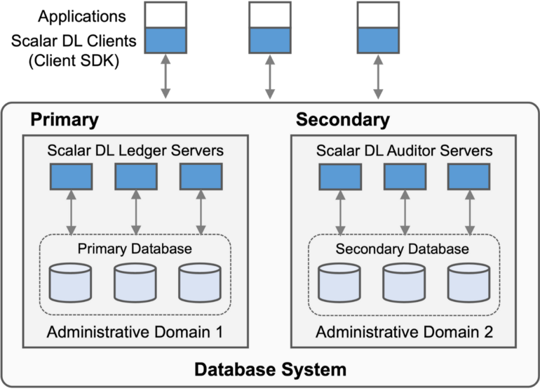

# ScalarDL の実装

ScalarDL は、正確性、スケーラビリティ、およびデータベース不可知性を実現する、トランザクション データベース システム用のスケーラブルで実用的なビザンチン障害検出ミドルウェアです。
このドキュメントでは、ScalarDL の実装について簡単に紹介します。
ScalarDL のアーキテクチャ、新規性、およびビザンチン障害検出プロトコルについては、[設計ドキュメント](design.md) を参照してください。

## ScalarDL コンポーネント

ScalarDL はデータベース上で動作するミドルウェアで、主に Java で書かれています。 ScalarDL は、Ledger、Auditor、および Client SDK で構成されます。 各コンポーネントを見てみましょう。

### Ledger

Ledger は、ビザンチン障害検出プロトコルのコミット フェーズを実装します。 Ledger は、ユーザーがワンショット トランザクションを作成するためのコントラクトと呼ばれるプログラム可能な決定論的関数も管理します。 コントラクトでは、ユーザーは任意のビジネス ロジックを記述し、コントラクトで定義されたインターフェイスを通じてデータベース操作を呼び出すことができます。 ネストされた呼び出し、つまりコントラクトが別のコントラクトを呼び出すことがサポートされているため、ユーザーは複数のコントラクトを使用してアプリケーションのビジネス ロジックをモジュール形式で実装できます。 Ledger は、基盤となるデータベース トランザクションを利用して、ACID 方式で複数の契約を実行します。 各契約は、後で検証できるようにデジタル署名を付けて Java バイトコード形式でデータベースに保存されます。

Ledger は、Bigtable のデータ モデルに似た Key-Value データ モデルに基づいて、基盤となるデータベースを多次元マップとして抽象化します。 さまざまなデータベースやデータ モデルへの幅広い適用性を実現するために、抽象化を選択しました。 レコードは、レコード キー (アプリケーション レベルの主キー)、バージョン、およびレコードの導出に使用される Contract 引数とすべてのレコード値の暗号化ハッシュを含む値のセットで構成されます。 レコード キーとバージョンは主キーを形成し、主キーは値のセットを一意にマップします。 Ledgerは、トレーサビリティを実現するために記録のバージョンを管理します。 また、Ledger は、同じレコード キーを持つレコードのハッシュ チェーンを構築して、レコードの部分的な悪意のある変更を困難にしますが、ScalarDL はビザンチン障害検出機能を提供するためにハッシュ チェーン構造を必要としません。

Ledger は、データベースに依存しないプロパティを実現するためにデータベース抽象化を使用して検出プロトコルを実装します。 データベースの抽象化を効率的に実装するために、ユニバーサル トランザクション マネージャーである ScalarDB を使用します。 データベース抽象化は現在、PostgreSQL、MySQL、Oracle Database、Microsoft SQL Server、Apache Cassandra、Amazon DynamoDB、Amazon Aurora、Azure Cosmos DB、およびそれらの互換データベースをサポートしています。 Cassandra、HBase、DynamoDB、Cosmos DB などの非 ACID データベースの場合、ScalarDB は、スナップショットの分離と厳密なシリアル化機能をサポートするデータベースに依存しない ACID トランザクション機能を使用してトランザクションを処理します。 これらの ACID データベースに対して、ScalarDB には、トランザクション管理を基盤となるデータベースに委任するか、トランザクション管理を単独で実行するという 2 つのオプションが用意されています。

Ledger はそれ自体だけでユーザーにサービスを提供できます。 このような場合、ScalarDL は、データベースに依存しないトランザクション機能を除いて、Oracle Blockchain Table や Amazon QLDB と同様に機能します。つまり、ScalarDL は単一の管理ドメイン (AD) でデータベースを管理するため、一部の限られたクラスのビザンチン障害のみを検出します。

### Auditor 

Auditor は、Byzantine 障害検出プロトコルの順序付けフェーズと検証フェーズを実装します。 また、 Auditor は Ledger と同じ契約を管理し、Ledger と同じデータベース抽象化を使用するため、 Auditor は基盤となるデータベースとしてさまざまなデータベースを使用できます。
正確性を保証するには、 Auditor を Ledger が配置されている管理ドメインとは別の管理ドメインに配置する必要があります。

### クライアント SDK

クライアント SDK は、プロトコルに基づいて Ledger および Auditor と対話します。 Client SDKと統合されたアプリケーションプログラムは、デジタル署名用のキーペア（秘密鍵と証明書）を管理し、契約の実行を認証するためのデジタル署名付き実行リクエストを作成します。 デジタル署名されたリクエストはデータベースにも保存されるため、誰がリクエストを実行したかを特定できるため、システムのセキュリティと追跡可能性がさらに高まります。 クライアント SDK は、クライアントとサーバー間でシークレットを共有することで HMAC 認証を使用することもできます。 ただし、HMAC 署名を追加したリクエストでは、そのような否認防止を提供できません。
クライアント SDK は、Java、Node.js、ブラウザ内 JavaScript、Go などの複数の言語で作成されています。

## 参考文献

* [ScalarDL設計ドキュメント](design.md)
