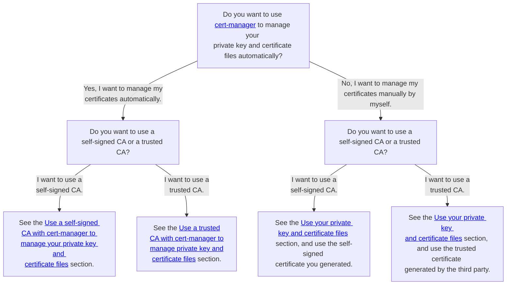

You have several options for certificate management:

1. Management of private key and certificate files
   1. Manage your private key and certificate files automatically by using [cert-manager](https://cert-manager.io/docs/).
      - This method can reduce maintenance or operation costs. For example, cert-manager automatically renews certificates before they expire and Scalar Helm Chart automatically mounts private key and certificate files on the Scalar product pods.
      - You cannot use a CA that cert-manager does not support. You can see the supported issuers in the [cert-manager documentation](https://cert-manager.io/docs/configuration/issuers/).
   1. Manage your private key and certificate files manually.
      - You can issue and manage your private key and certificate files on your own by using your preferred method.
      - You can use any certificate even if cert-manager does not support it.
      - You must update secret resources when certificates expire.
1. Kinds of certificates
   1. Use a trusted CA (signed certificate by third party).
      - You can use trusted certificates from a third-party certificate issuer.
      - You can encrypt packets.
      - You must pay costs to issue trusted certificates.
   1. Use self-signed certificates.
      - You can reduce costs to issue certificates.
      - Reliability of certificates is lower than a trusted CA, but you can encrypt packets.

In other words, you have the following four options:

1. Use a self-signed CA with automatic management.
1. Use a trusted CA with automatic management.
1. Use a self-signed CA with manual management.
1. Use a trusted CA with manual management.

You should consider which method to use based on your security requirements. For guidance and related documentation for each method, refer to the following decision tree:  

