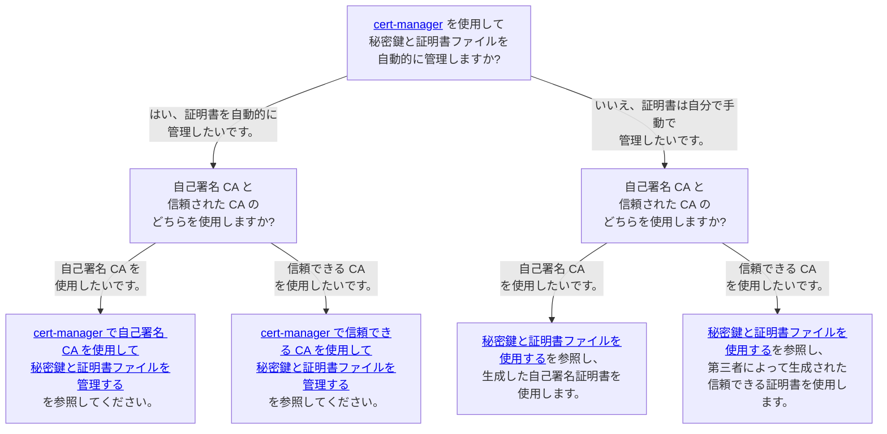

証明書管理にはいくつかのオプションがあります。

1. 秘密鍵と証明書ファイルの管理
   1. [cert-manager](https://cert-manager.io/docs/) を使用して秘密鍵と証明書ファイルを自動的に管理します。
      - メンテナンスや運用のコストを削減できます。たとえば、cert-manager は証明書の有効期限が切れる前に自動的に更新し、Scalar Helm Chart は秘密鍵と証明書ファイルを Scalar 製品ポッドに自動的にマウントします。
      - cert-manager がサポートしていない CA は使用できません。サポートされている発行元は [cert-manager ドキュメント](https://cert-manager.io/docs/configuration/issuers/)で確認できます。
   1. 秘密鍵と証明書ファイルを手動で管理します。
      - ご自身のお好みの方法で、秘密鍵と証明書ファイルを発行・管理することができます。
      - cert-manager がサポートしていない場合でも、任意の証明書を使用できます。
      - 証明書の有効期限が切れた場合は、シークレットリソースを更新する必要があります。
1. 証明書の種類
   1. 信頼できる CA (サードパーティによる署名付き証明書) を使用します。
      - サードパーティの証明書発行者からの信頼できる証明書を使用できます。
      - パケットを暗号化できます。
      - 信頼できる証明書を発行するには費用を支払う必要があります。
   1. 自己署名証明書を使用します。
      - 証明書発行にかかるコストを削減できます。
      - 証明書の信頼性は信頼できる CA よりも低くなりますが、パケットを暗号化できます。

つまり、次の4つのオプションがあります。

1. 自動管理で自己署名 CA を使用します。
1. 自動管理で信頼できる CA を使用します。
1. 手動管理で自己署名 CA を使用します。
1. 手動管理で信頼できる CA を使用します。

セキュリティ要件に基づいて、どの方法を使用するかを検討する必要があります。各方法のガイダンスと関連ドキュメントについては、次の意思決定ツリーを参照してください。

