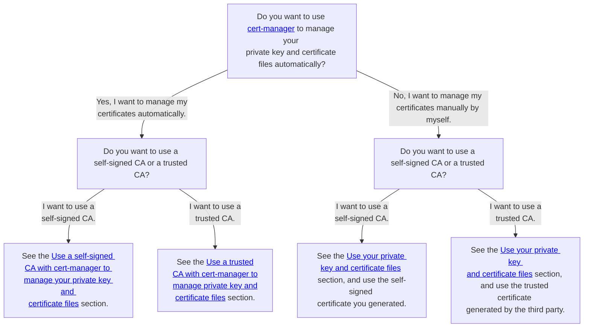

# Configure a custom values file for ScalarDB Cluster

This document explains how to create your custom values file for the ScalarDB Cluster chart. For details on the parameters, see the [README](https://github.com/scalar-labs/helm-charts/blob/main/charts/scalardb-cluster/README.md) of the ScalarDB Cluster chart.

## Required configurations

### Image configurations

You must set `scalardbCluster.image.repository`. Be sure to specify the ScalarDB Cluster container image so that you can pull the image from the container repository.

```yaml
scalardbCluster:
  image:
    repository: <SCALARDB_CLUSTER_CONTAINER_IMAGE>
```

### Database configurations

You must set `scalardbCluster.scalardbClusterNodeProperties`. Please set `scalardb-cluster-node.properties` to this parameter. For more details on the configurations of ScalarDB Cluster, see [ScalarDB Cluster Configurations](https://scalardb.scalar-labs.com/docs/latest/scalardb-cluster/scalardb-cluster-configurations/).

```yaml
scalardbCluster:
  scalardbClusterNodeProperties: |
    scalar.db.cluster.membership.type=KUBERNETES
    scalar.db.cluster.membership.kubernetes.endpoint.namespace_name=${env:SCALAR_DB_CLUSTER_MEMBERSHIP_KUBERNETES_ENDPOINT_NAMESPACE_NAME}
    scalar.db.cluster.membership.kubernetes.endpoint.name=${env:SCALAR_DB_CLUSTER_MEMBERSHIP_KUBERNETES_ENDPOINT_NAME}
    scalar.db.contact_points=localhost
    scalar.db.username=${env:SCALAR_DB_USERNAME}
    scalar.db.password=${env:SCALAR_DB_PASSWORD}
    scalar.db.storage=cassandra
```

Note that you must always set the following three properties if you deploy ScalarDB Cluster in a Kubernetes environment by using Scalar Helm Chart. These properties are fixed values. Since the properties don't depend on individual environments, you can set the same values by copying the following values and pasting them in `scalardbCluster.scalardbClusterNodeProperties`.

```yaml
scalardbCluster:
  scalardbClusterNodeProperties: |
    scalar.db.cluster.membership.type=KUBERNETES
    scalar.db.cluster.membership.kubernetes.endpoint.namespace_name=${env:SCALAR_DB_CLUSTER_MEMBERSHIP_KUBERNETES_ENDPOINT_NAMESPACE_NAME}
    scalar.db.cluster.membership.kubernetes.endpoint.name=${env:SCALAR_DB_CLUSTER_MEMBERSHIP_KUBERNETES_ENDPOINT_NAME}
```

## Optional configurations

### Resource configurations (recommended in production environments)

To control pod resources by using requests and limits in Kubernetes, you can use `scalardbCluster.resources`.

Note that, for commercial licenses, the resources for each pod of Scalar products are limited to 2vCPU / 4GB memory. Also, if you use the pay-as-you-go containers that the AWS Marketplace provides, you will not be able to run any containers that exceed the 2vCPU / 4GB memory configuration in `resources.limits`. If you exceed this resource limitation, the pods will automatically stop.

You can configure requests and limits by using the same syntax as requests and limits in Kubernetes. For more details on requests and limits in Kubernetes, see [Resource Management for Pods and Containers](https://kubernetes.io/docs/concepts/configuration/manage-resources-containers/).

```yaml
scalardbCluster:
  resources:
    requests:
      cpu: 2000m
      memory: 4Gi
    limits:
      cpu: 2000m
      memory: 4Gi
```

### Secret configurations (recommended in production environments)

To use environment variables to set some properties (e.g., credentials) in `scalardbCluster.scalardbClusterNodeProperties`, you can use `scalardbCluster.secretName` to specify the Secret resource that includes some credentials.

For example, you can set credentials for a backend database (`scalar.db.username` and `scalar.db.password`) by using environment variables, which makes your pods more secure.

For more details on how to use a Secret resource, see [How to use Secret resources to pass the credentials as the environment variables into the properties file](use-secret-for-credentials.mdx).

```yaml
scalardbCluster:
  secretName: "scalardb-cluster-credentials-secret"
```

### Affinity configurations (recommended in production environments)

To control pod deployment by using affinity and anti-affinity in Kubernetes, you can use `scalardbCluster.affinity`.

You can configure affinity and anti-affinity by using the same syntax for affinity and anti-affinity in Kubernetes. For more details on configuring affinity in Kubernetes, see [Assigning Pods to Nodes](https://kubernetes.io/docs/concepts/scheduling-eviction/assign-pod-node/).

```yaml
scalardbCluster:
  affinity:
    podAntiAffinity:
      preferredDuringSchedulingIgnoredDuringExecution:
        - podAffinityTerm:
            labelSelector:
              matchExpressions:
                - key: app.kubernetes.io/name
                  operator: In
                  values:
                    - scalardb-cluster
                - key: app.kubernetes.io/app
                  operator: In
                  values:
                    - scalardb-cluster
            topologyKey: kubernetes.io/hostname
          weight: 50
```

### Prometheus and Grafana configurations  (recommended in production environments)

To monitor ScalarDB Cluster pods by using [kube-prometheus-stack](https://github.com/prometheus-community/helm-charts/tree/main/charts/kube-prometheus-stack), you can set `scalardbCluster.grafanaDashboard.enabled`, `scalardbCluster.serviceMonitor.enabled`, and `scalardbCluster.prometheusRule.enabled` to `true`. When you set these configurations to `true`, the chart deploys the necessary resources and kube-prometheus-stack starts monitoring automatically.

```yaml
scalardbCluster:
  grafanaDashboard:
    enabled: true
    namespace: monitoring
  serviceMonitor:
    enabled: true
    namespace: monitoring
    interval: 15s
  prometheusRule:
    enabled: true
    namespace: monitoring
```

### SecurityContext configurations (default value is recommended)

To set SecurityContext and PodSecurityContext for ScalarDB Cluster pods, you can use `scalardbCluster.securityContext` and `scalardbCluster.podSecurityContext`.

You can configure SecurityContext and PodSecurityContext by using the same syntax as SecurityContext and PodSecurityContext in Kubernetes. For more details on the SecurityContext and PodSecurityContext configurations in Kubernetes, see [Configure a Security Context for a Pod or Container](https://kubernetes.io/docs/tasks/configure-pod-container/security-context/).

```yaml
scalardbCluster:
  podSecurityContext:
    seccompProfile:
      type: RuntimeDefault
  securityContext:
    capabilities:
      drop:
        - ALL
    runAsNonRoot: true
    allowPrivilegeEscalation: false
```

### TLS configurations (optional based on your environment)

You can enable TLS in:

- The communications between the ScalarDB Cluster node and clients.
- The communications between all ScalarDB Cluster nodes (the cluster's internal communications).

In addition, you have several options for certificate management. For more details, see [TLS configurations for Envoy](./configure-custom-values-envoy.mdx#tls-configurations-optional-based-on-your-environment).

You should consider which method you use based on your security requirements. For guidance and related documentation for each method, refer to the following decision tree:  



#### Enable TLS

You can enable TLS in all ScalarDB Cluster connections by using the following configurations:

```yaml
scalardbCluster:
  scalardbClusterNodeProperties: |
    ...(omit)...
    scalar.db.cluster.tls.enabled=true
    scalar.db.cluster.tls.ca_root_cert_path=/tls/scalardb-cluster/certs/ca.crt
    scalar.db.cluster.node.tls.cert_chain_path=/tls/scalardb-cluster/certs/tls.crt
    scalar.db.cluster.node.tls.private_key_path=/tls/scalardb-cluster/certs/tls.key
    scalar.db.cluster.tls.override_authority=<HOSTNAME_OF_YOUR_CERTIFICATE>
  tls:
    enabled: true
```

##### Use your private key and certificate files

You can set your private key and certificate files by using the following configurations:

```yaml
scalardbCluster:
  tls:
    enabled: true
    caRootCertSecret: "scalardb-cluster-tls-ca"
    certChainSecret: "scalardb-cluster-tls-cert"
    privateKeySecret: "scalardb-cluster-tls-key"
```

In this case, you have to create secret resources that include private key and certificate files for ScalarDB Cluster as follows, replacing the contents in the angle brackets as described:

```console
kubectl create secret generic scalardb-cluster-tls-ca --from-file=ca.crt=/<PATH_TO_YOUR_CA_CERTIFICATE_FILE_FOR_SCALARDB_CLUSTER> -n <NAMESPACE>
kubectl create secret generic scalardb-cluster-tls-cert --from-file=tls.crt=/<PATH_TO_YOUR_CERTIFICATE_FILE_FOR_SCALARDB_CLUSTER> -n <NAMESPACE>
kubectl create secret generic scalardb-cluster-tls-key --from-file=tls.key=/<PATH_TO_YOUR_PRIVATE_KEY_FILE_FOR_SCALARDB_CLUSTER> -n <NAMESPACE>
```

For more details on how to prepare private key and certificate files, see [How to create private key and certificate files for Scalar products](../scalar-kubernetes/HowToCreateKeyAndCertificateFiles.mdx).

##### Use a trusted CA with cert-manager to manage your private key and certificate files

You can manage your private key and certificate files with cert-manager by using the following configurations, replacing the content in the angle brackets as described:

:::note

* If you want to use cert-manager, you must deploy cert-manager and prepare the `Issuers` resource. For details, see the cert-manager documentation, [Installation](https://cert-manager.io/docs/installation/) and [Issuer Configuration](https://cert-manager.io/docs/configuration/).
* By default, Scalar Helm Chart creates a `Certificate` resource that satisfies the certificate requirements of Scalar products. The default certificate configuration is recommended, but if you use a custom certificate configuration, you must satisfy the certificate requirements of Scalar products. For details, see [How to create private key and certificate files for Scalar products](../scalar-kubernetes/HowToCreateKeyAndCertificateFiles.mdx#certificate-requirements).

:::

```yaml
scalardbCluster:
  tls:
    enabled: true
    certManager:
      enabled: true
      issuerRef:
        name: <YOUR_TRUSTED_CA>
      dnsNames:
        - cluster.scalardb.example.com
```

In this case, cert-manager issues your private key and certificate files by using your trusted issuer. You don't need to mount your private key and certificate files manually.

##### Use a self-signed CA with cert-manager to manage your private key and certificate files

You can manage your private key and self-signed certificate files with cert-manager by using the following configurations:

:::note

* If you want to use cert-manager, you must deploy cert-manager. For more details on how to deploy cert-manager, see the [Installation](https://cert-manager.io/docs/installation/) in the cert-manager official document.
* By default, Scalar Helm Chart creates a `Certificate` resource that satisfies the certificate requirements of Scalar products. We recommend the default certificate configuration, but if you custom certificate configuration, you must satisfy the certificate requirements of Scalar products. See [How to create private key and certificate files for Scalar products](../scalar-kubernetes/HowToCreateKeyAndCertificateFiles.mdx#certificate-requirements).

:::

```yaml
scalardbCluster:
  tls:
    enabled: true
    certManager:
      enabled: true
      selfSigned:
        enabled: true
      dnsNames:
        - cluster.scalardb.example.com
```

In this case, Scalar Helm Charts and cert-manager issue your private key and self-signed certificate files. You don't need to mount your private key and certificate files manually.

##### Set custom authority for TLS communications

You can set the custom authority for TLS communications by using `scalardbCluster.tls.overrideAuthority`. This value doesn't change what host is actually connected. This value is intended for testing but may safely be used outside of tests as an alternative to DNS overrides. For example, you can specify the hostname presented in the certificate chain file that you set by using `scalardbCluster.tls.certChainSecret`. This chart uses this value for `startupProbe` and `livenessProbe`.

```yaml
scalardbCluster:
  tls:
    enabled: true
    overrideAuthority: "cluster.scalardb.example.com"
```

##### Set a root CA certificate for Prometheus Operator

If you set `scalardbCluster.serviceMonitor.enabled=true` and `scalardbCluster.tls.enabled=true` (in other words, if you monitor ScalarDB Cluster with TLS configuration by using Prometheus Operator), you must set the secret name to `scalardbCluster.tls.caRootCertSecretForServiceMonitor`.

```yaml
scalardbCluster:
  tls:
    enabled: true
    caRootCertSecretForServiceMonitor: "scalardb-cluster-tls-ca-for-prometheus"
```

In this case, you have to create secret resources that include a root CA certificate for ScalarDB Cluster in the same namespace as Prometheus as follows:

```console
kubectl create secret generic scalardb-cluster-tls-ca-for-prometheus --from-file=ca.crt=/path/to/your/ca/certificate/file -n <NAMESPACE_SAME_AS_PROMETHEUS>
```

### Replica configurations (optional based on your environment)

You can specify the number of ScalarDB Cluster replicas (pods) by using `scalardbCluster.replicaCount`.

```yaml
scalardbCluster:
  replicaCount: 3
```

### Logging configurations (optional based on your environment)

To change the ScalarDB Cluster log level, you can use `scalardbCluster.logLevel`.

```yaml
scalardbCluster:
  logLevel: INFO
```

### GraphQL configurations (optional based on your environment)

To use the GraphQL feature in ScalarDB Cluster, you can set `scalardbCluster.graphql.enabled` to `true` to deploy some resources for the GraphQL feature. Note that you also need to set `scalar.db.graphql.enabled=true` in `scalardbCluster.scalardbClusterNodeProperties` when using the GraphQL feature.

```yaml
scalardbCluster:
  graphql:
    enabled: true
```

Also, you can configure the `Service` resource that accepts GraphQL requests from clients.

```yaml
scalardbCluster:
  graphql:
    service:
      type: ClusterIP
      annotations: {}
      ports:
        graphql:
          port: 8080
          targetPort: 8080
          protocol: TCP
```

### SQL configurations (optional based on your environment)

To use the SQL feature in ScalarDB Cluster, there is no configuration necessary for custom values files. You can use the feature by setting `scalar.db.sql.enabled=true` in `scalardbCluster.scalardbClusterNodeProperties`.

### Scalar Envoy configurations (optional based on your environment)

To use ScalarDB Cluster with `indirect` mode, you must enable Envoy as follows.

```yaml
envoy:
  enabled: true
```

Also, you must set the Scalar Envoy configurations in the custom values file for ScalarDB Cluster. This is because clients need to send requests to ScalarDB Cluster via Scalar Envoy as the load balancer of gRPC requests if you deploy ScalarDB Cluster in a Kubernetes environment with `indirect` mode.

For more details on Scalar Envoy configurations, see [Configure a custom values file for Scalar Envoy](configure-custom-values-envoy.mdx).

```yaml
envoy:
  configurationsForScalarEnvoy: 
    ...

scalardbCluster:
  configurationsForScalarDbCluster: 
    ...
```

### Taint and toleration configurations (optional based on your environment)

If you want to control pod deployment by using the taints and tolerations in Kubernetes, you can use `scalardbCluster.tolerations`.

You can configure taints and tolerations by using the same syntax as the tolerations in Kubernetes. For details on configuring tolerations in Kubernetes, see the official Kubernetes documentation [Taints and Tolerations](https://kubernetes.io/docs/concepts/scheduling-eviction/taint-and-toleration/).

```yaml
scalardbCluster:
  tolerations:
    - effect: NoSchedule
      key: scalar-labs.com/dedicated-node
      operator: Equal
      value: scalardb-cluster
```
