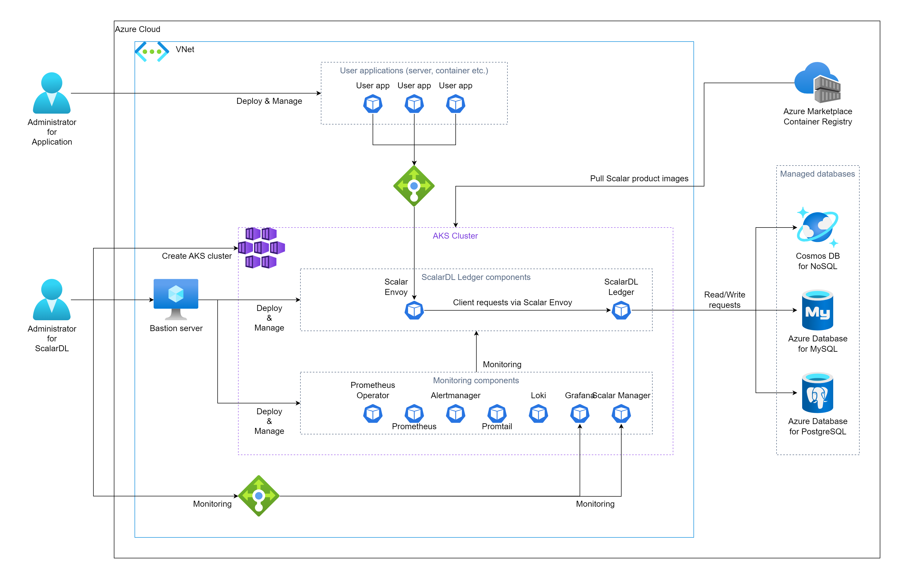

# Deploy ScalarDL Ledger on Azure Kubernetes Service (AKS)

This document explains how to deploy **ScalarDL Ledger** on Azure Kubernetes Service (AKS).

In this guide, you will create the following environment in your Azure environment.

## Step 1. Subscribe to ScalarDL Ledger in Azure Marketplace

You must get the ScalarDL Ledger container image from [Azure Marketplace](https://azuremarketplace.microsoft.com/en/marketplace/apps/scalarinc.scalardl) and subscribe to ScalarDL. For details on how to subscribe to ScalarDL Ledger in Azure Marketplace, see [Get Scalar products from Microsoft Azure Marketplace](AzureMarketplaceGuide.md#get-scalar-products-from-microsoft-azure-marketplace).

## Step 2. Create an AKS cluster

You must create an AKS cluster for the ScalarDL Ledger deployment. For details, see [Guidelines for creating an AKS cluster for Scalar products](CreateAKSClusterForScalarProducts.md).

## Step 3. Set up a database for ScalarDL Ledger

You must prepare a database before deploying ScalarDL Ledger. Because ScalarDL Ledger uses ScalarDB internally to access databases, refer to [ScalarDB Supported Databases](https://github.com/scalar-labs/scalardb/blob/master/docs/scalardb-supported-databases.md) to see which types of databases ScalarDB supports.

For details on setting up a database, see [Set up a database for ScalarDB/ScalarDL deployment in Azure](SetupDatabaseForAzure.md).

## Step 4. Create a bastion server

To execute some tools for deploying and managing ScalarDL Ledger on AKS, you must prepare a bastion server in the same Azure Virtual Network (VNet) of the AKS cluster that you created in **Step 2**. For details, see [Create a Bastion Server](CreateBastionServer.md).

## Step 5. Prepare custom values files for the Scalar Helm Charts for both ScalarDL Ledger and ScalarDL Schema Loader

To perform tasks, like accessing information in the database that you created in **Step 3**, you must configure custom values files for the Scalar Helm Charts for both ScalarDL Ledger and ScalarDL Schema Loader (for Ledger) based on your environment. For details, see [Configure a custom values file for Scalar Helm Charts](https://github.com/scalar-labs/helm-charts/blob/main/docs/configure-custom-values-file.md).

## Step 6. Deploy ScalarDL Ledger by using the Scalar Helm Chart

Deploy ScalarDL Ledger in your AKS cluster by using the Helm Chart for ScalarDL Ledger. For details, see [Deploy Scalar products using Scalar Helm Charts](https://github.com/scalar-labs/helm-charts/blob/main/docs/how-to-deploy-scalar-products.md).

**Note:** We recommend creating a dedicated namespace by using the `kubectl create ns scalardl-ledger` command and deploying ScalarDL Ledger in the namespace by using the `-n scalardl-ledger` option with the `helm install` command.

## Step 7. Check the status your ScalarDL Ledger deployment

After deploying ScalarDL Ledger in your AKS cluster, you must check the status of each component. For details, see [Components to Regularly Check When Running in a Kubernetes Environment](RegularCheck.md).

## Step 8. Monitor your ScalarDL Ledger deployment

After deploying ScalarDL Ledger in your AKS cluster, we recommend monitoring the deployed components and collecting their logs, especially in production. For details, see [Monitoring Scalar products on a Kubernetes cluster](K8sMonitorGuide.md) and [Collecting logs from Scalar products on a Kubernetes cluster](K8sLogCollectionGuide.md).

## Remove ScalarDL Ledger from AKS

If you want to remove the environment that you created, please remove all the resources in reverse order from which you created them in.
