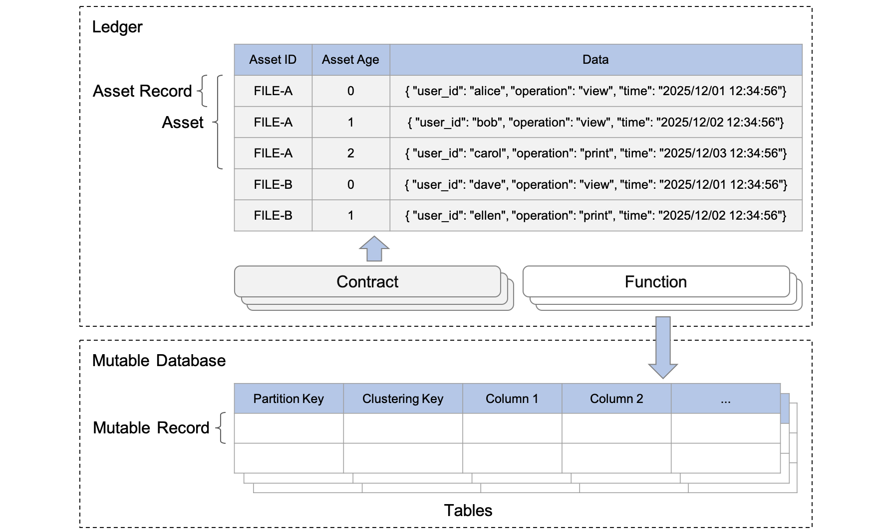

---
tags:
  - Community
  - Enterprise
---

# Model Your Data

import JavadocLink from '/src/theme/JavadocLink.js';

Data modeling (or in other words, organizing your data) is the process of conceptualizing and visualizing how data will be stored and used by identifying the patterns used to access data and the types of queries to be performed within business operations.

This page first explains the ScalarDL data model and then describes how to organize your data based on the data model.

## ScalarDL data model

The data model of ScalarDL is a kind of key-value model that abstracts a ledger as a set of assets, where each key acts as a unique identifier for an asset, and the value represents the data of the asset. The following diagram shows the objects in ScalarDL with some examples of the assets. This section first explains what objects ScalarDL defines and then describes how to locate the objects.

### Objects in ScalarDL

The ScalarDL data model has several objects.

#### Ledger

The ledger in ScalarDL is abstracted as a set of assets.

#### Asset

An asset can be arbitrary data but is more compatible to being viewed as a historical series of data. For example, assets can range from the tangible (real estate and hardware) to the intangible (contracts, intellectual property, and even audit trail logs as shown in the above diagram).

#### Asset record

An asset is composed of one or more asset records where each asset record is identified by an asset ID and an age. An asset record has data in any string format (typically JSON format) and several internal metadata to validate the authenticity of the record, such as a cryptographic hash. Asset records are read and written by a contract.

:::note

A contract is a Java program written for implementing single business logic and must be registered with the ledger in advance to be called. You can create, update, or get an asset by using a contract. When creating or updating the asset, a new age (that is, a new version) of the asset record is added in a tamper-evident manner.

:::

#### Mutable database

Assets managed by contracts are tamper evident and append only, so their data structure is limited in modeling various applications. Moreover, assets cannot be deleted to guarantee tamper evidence. To compensate for these limitations, you can use a mutable database abstraction for more powerful and easy-to-use modeling capabilities.

A mutable database corresponds to a ScalarDB namespace, which is a collection of tables. A table is a collection of partitions, and a partition is a collection of mutable records. For details on the ScalarDB data model, see [ScalarDB data model](https://scalardb.scalar-labs.com/docs/latest/data-modeling#scalardb-data-model).

#### Mutable record

A mutable record is a set of columns, which are fundamental data elements. Mutable records are read, written, or deleted by using a function.

:::note

A function is also a Java program written for implementing single business logic and must be registered with the ledger in advance to be called. You can create, update, get, or delete mutable records by using a subset of ScalarDB APIs through the function, which is atomically executed with a contract.

:::

### How to locate asset records

This section discusses how to locate asset records in the ledger.

#### Get the latest asset record

You can get the latest asset record by specifying an asset ID.

#### Scan asset records of an asset

You can scan multiple records of an asset (in other words, histories of an asset) by specifying an asset ID and age. Specifically, the asset ID and age can be specified in the `AssetFilter` class. For details about the specification, see the <JavadocLink packageName="scalardl-common" path="com/scalar/dl/ledger/database" className="AssetFilter" /> page in the Javadoc.

### How to locate mutable records

You can locate mutable records in ScalarDB tables by using keys like the partition key and clustering key. For details, see [How to locate records](https://scalardb.scalar-labs.com/docs/latest/data-modeling#how-to-locate-records) in the ScalarDB data model.

## How to organize your data

Since ScalarDL has a different data model compared to the relational data model, there is a basic principle and a few best practices for data modeling.

### Query-driven data modeling

In relational databases, data is organized in normalized tables, with foreign keys used to reference related data in other tables. The queries that the application will make are structured by the tables, and the related data is queried as table joins.

Since ScalarDL does not provide the join feature, data modeling should be more query driven, like NoSQL databases. The data access patterns and application queries should determine the structure and organization of assets.

### Best practices

This section describes a few best practices for modeling your data.

#### Add prefixes to asset IDs to deal with multiple entities

Since ScalarDL only provides a single asset ID space, you might need to manage several asset types by yourself, by adding prefixes to asset IDs if you want to deal with multiple entities.

For example, if you manage audit trail log files and users who can verify the authenticity of the files, you can deal with those two entities separately by adding prefixes into asset IDs like `log_` and `user_`.

#### Create indexes to query assets flexibly

You might often want to search for assets based on their various attributes. In those cases, you have two options to achieve such flexibility when searching:

- **Option 1:** Prepare a kind of index table as an asset so that each index asset has corresponding asset IDs as pointers. Although this approach introduces performance overheads to manage the index on the ledger, you can achieve strictly secure data management since the index information is also preserved in a tamper-evident manner.
- **Option 2:** Use a ScalarDB table as an index of assets. When putting an asset record in the ledger, you can atomically update a ScalarDB table with secondary indexes by using a function so that a record in the ScalarDB table points to the asset or asset record. Although this approach is more flexible and efficient than the first approach, you should note that the index information could be tampered with and consider whether this is acceptable in your use cases.

#### Determine the scope of tamper-evident assets

As described above, you can organize your data, both tamper evident and non-tamper evident, by using contracts and functions. How you choose to manage certain data depends on your use case and requirements. Thus, you should clarify what data you want to guarantee authenticity for.

For example, if you manage a list or index of assets in non-tamper-evident ScalarDB tables, you must understand the risks when those assets are tampered with. More specifically, suppose you have a list of IDs of audit trail log files whose contents are managed in ScalarDL in a tamper-evident manner. If losing the list due to malicious behavior is not acceptable, it should also be managed in ScalarDL.

#### Manage asset records efficiently

Depending on the characteristics of your data and its access patterns, there are a few options for how you store the data in asset records.

A simple way to store data in an asset is to always store the latest state of the data in its entirety. However, this approach is sometimes inefficient from a storage cost perspective because, if a small part of the data is updated frequently, almost all the parts of the data are stored as duplicates in the asset records.

In such a case, you can choose to put only the differential data when updating the asset and merge all the asset records when you want to get the whole image of the latest data. Although this approach is efficient from a storage cost perspective, it affects query performance since it requires scanning all asset records. To limit the affects of this trade-off, creating a snapshot at some point in time is also an option so that you do not have to scan all asset records every time.
