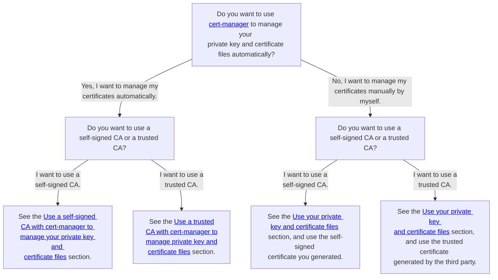
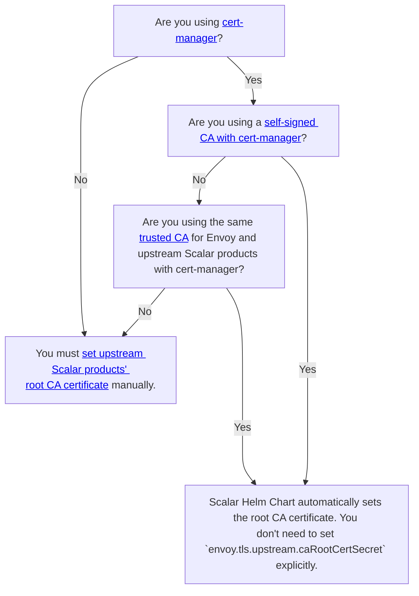

---
tags:
  - Enterprise Standard
  - Enterprise Premium
---

import Tabs from '@theme/Tabs';
import TabItem from '@theme/TabItem';

# Configure a custom values file for Scalar Envoy

This document explains how to create your custom values file for the Scalar Envoy chart. If you want to know the details of the parameters, please refer to the [README](https://github.com/scalar-labs/helm-charts/blob/main/charts/envoy/README.md) of the Scalar Envoy chart.

## Configure custom values for Scalar Envoy chart

The Scalar Envoy chart is used via other charts (scalardb, scalardb-cluster, scalardl, and scalardl-audit), so you don't need to create a custom values file for the Scalar Envoy chart. If you want to configure Scalar Envoy, you need to add the `envoy.*` configuration to the other charts.

For example, if you want to configure the Scalar Envoy for ScalarDB Server, you can configure some Scalar Envoy configurations in the custom values file of ScalarDB as follows.

* Example (scalardb-custom-values.yaml)
  ```yaml
  envoy:
    configurationsForScalarEnvoy: 
      ...
  
  scalardb:
    configurationsForScalarDB: 
       ...
  ```

## Required configurations

### Service configurations

You must set `envoy.service.type` to specify the Service resource type of Kubernetes.

If you accept client requests from inside of the Kubernetes cluster only (for example, if you deploy your client applications on the same Kubernetes cluster as Scalar products), you can set `envoy.service.type` to `ClusterIP`. This configuration doesn't create any load balancers provided by cloud service providers.

```yaml
envoy:
  service:
    type: ClusterIP
```

If you want to use a load balancer provided by a cloud service provider to accept client requests from outside of the Kubernetes cluster, you need to set `envoy.service.type` to `LoadBalancer`.

```yaml
envoy:
  service:
    type: LoadBalancer
```

If you want to configure the load balancer via annotations, you can also set annotations to `envoy.service.annotations`.

```yaml
envoy:
  service:
    type: LoadBalancer
    annotations:
      service.beta.kubernetes.io/aws-load-balancer-internal: "true"
      service.beta.kubernetes.io/aws-load-balancer-type: "nlb"
```

## Optional configurations

### Resource configurations (Recommended in the production environment)

If you want to control pod resources using the requests and limits of Kubernetes, you can use `envoy.resources`.

You can configure them using the same syntax as the requests and limits of Kubernetes. So, please refer to the official document [Resource Management for Pods and Containers](https://kubernetes.io/docs/concepts/configuration/manage-resources-containers/) for more details on the requests and limits of Kubernetes.

```yaml
envoy:
  resources:
    requests:
      cpu: 1000m
      memory: 2Gi
    limits:
      cpu: 2000m
      memory: 4Gi
```

### Affinity configurations (Recommended in the production environment)

If you want to control pod deployment using the affinity and anti-affinity of Kubernetes, you can use `envoy.affinity`.

You can configure them using the same syntax as the affinity of Kubernetes. So, please refer to the official document [Assigning Pods to Nodes](https://kubernetes.io/docs/concepts/scheduling-eviction/assign-pod-node/) for more details on the affinity configuration of Kubernetes.

```yaml
envoy:
  affinity:
    podAntiAffinity:
      preferredDuringSchedulingIgnoredDuringExecution:
        - podAffinityTerm:
            labelSelector:
              matchExpressions:
                - key: app.kubernetes.io/name
                  operator: In
                  values:
                    - scalardb-cluster
                - key: app.kubernetes.io/app
                  operator: In
                  values:
                    - envoy
            topologyKey: kubernetes.io/hostname
          weight: 50
```

### Prometheus and Grafana configurations (Recommended in production environments)

If you want to monitor Scalar Envoy pods using [kube-prometheus-stack](https://github.com/prometheus-community/helm-charts/tree/main/charts/kube-prometheus-stack), you can deploy a ConfigMap, a ServiceMonitor, and a PrometheusRule resource for kube-prometheus-stack using `envoy.grafanaDashboard.enabled`, `envoy.serviceMonitor.enabled`, and `envoy.prometheusRule.enabled`.

```yaml
envoy:
  grafanaDashboard:
    enabled: true
    namespace: monitoring
  serviceMonitor:
    enabled: true
    namespace: monitoring
    interval: 15s
  prometheusRule:
    enabled: true
    namespace: monitoring
```

### SecurityContext configurations (Default value is recommended)

If you want to set SecurityContext and PodSecurityContext for Scalar Envoy pods, you can use `envoy.securityContext` and `envoy.podSecurityContext`.

You can configure them using the same syntax as SecurityContext and PodSecurityContext of Kubernetes. So, please refer to the official document [Configure a Security Context for a Pod or Container](https://kubernetes.io/docs/tasks/configure-pod-container/security-context/) for more details on the SecurityContext and PodSecurityContext configurations of Kubernetes.

```yaml
envoy:
  podSecurityContext:
    seccompProfile:
      type: RuntimeDefault
  securityContext:
    capabilities:
      drop:
        - ALL
    runAsNonRoot: true
    allowPrivilegeEscalation: false
```

### Image configurations (Default value is recommended)

If you want to change the image repository and version, you can use `envoy.image.repository` to specify the container repository information of the Scalar Envoy container image that you want to pull.

```yaml
envoy:
  image:
    repository: <SCALAR_ENVOY_CONTAINER_IMAGE>
```

If you're using AWS or Azure, please refer to the following documents for more details:

* [How to install Scalar products through AWS Marketplace](../scalar-kubernetes/AwsMarketplaceGuide.mdx)
* [How to install Scalar products through Azure Marketplace](../scalar-kubernetes/AzureMarketplaceGuide.mdx)

### TLS configurations (optional based on your environment)

You can enable TLS in:

- Downstream connections between the client and Scalar Envoy.
- Upstream connections between Scalar Envoy and Scalar products.

In addition, you have several options from the following two perspectives:

1. Management of private key and certificate files
   1. Manage your private key and certificate files automatically by using [cert-manager](https://cert-manager.io/docs/).
      - You can reduce maintenance or operation costs. For example, cert-manager automatically renews certificates before they expire and Scalar Helm Chart automatically mounts private key and certificate files on the Scalar product pods.
      - You cannot use a CA that cert-manager does not support. You can see the supported issuer in the [cert-manager documentation](https://cert-manager.io/docs/configuration/issuers/).
   1. Manage your private key and certificate files manually.
      - You can issue and manage your private key and certificate files by using your preferred method on your own.
      - You can use any certificate even if cert-manager does not support it.
      - You must update secret resources when certificates expire.
1. Kinds of certificates
   1. Use a trusted CA (signed certificate by third party).
      - You can use trusted certificates from a third-party certificate issuer.
      - You can encrypt packets.
      - You must pay costs to issue trusted certificates.
   1. Use self-signed certificates.
      - You can reduce costs to issue certificates.
      - Reliability of certificates is lower than a trusted CA, but you can encrypt packets.

In other words, you have the following four options:

1. Use a self-signed CA with automatic management.
1. Use a trusted CA with automatic management.
1. Use a self-signed CA with manual management.
1. Use a trusted CA with manual management.

You should consider which method you use based on your security requirements. For guidance and related documentation for each method, refer to the following decision tree:



#### Enable TLS in downstream connections

You can enable TLS in downstream connections by using the following configurations:

```yaml
envoy:
  tls:
    downstream:
      enabled: true
```

##### Use your private key and certificate files

You can set your private key and certificate files by using the following configurations:

```yaml
envoy:
  tls:
    downstream:
      enabled: true
      certChainSecret: "envoy-tls-cert"
      privateKeySecret: "envoy-tls-key"
```

In this case, you have to create secret resources that include private key and certificate files for Scalar Envoy as follows, replacing the contents in the angle brackets as described:

```console
kubectl create secret generic envoy-tls-cert --from-file=tls.crt=/<PATH_TO_YOUR_CERTIFICATE_FILE_FOR_SCALAR_ENVOY> -n <NAMESPACE>
kubectl create secret generic envoy-tls-key --from-file=tls.key=/<PATH_TO_YOUR_PRIVATE_KEY_FILE_FOR_SCALAR_ENVOY> -n <NAMESPACE>
```

For more details on how to prepare private key and certificate files, see [How to create private key and certificate files for Scalar products](../scalar-kubernetes/HowToCreateKeyAndCertificateFiles.mdx).

##### Use a trusted CA with cert-manager to manage your private key and certificate files

You can manage your private key and certificate files with cert-manager by using the following configurations, replacing the content in the angle brackets as described:

:::note

* If you want to use cert-manager, you must deploy cert-manager and prepare the `Issuers` resource. For details, see the cert-manager documentation, [Installation](https://cert-manager.io/docs/installation/) and [Issuer Configuration](https://cert-manager.io/docs/configuration/).
* By default, Scalar Helm Chart creates a `Certificate` resource that satisfies the certificate requirements of Scalar products. The default certificate configuration is recommended, but if you use a custom certificate configuration, you must satisfy the certificate requirements of Scalar products. For details, see [How to create private key and certificate files for Scalar products](../scalar-kubernetes/HowToCreateKeyAndCertificateFiles.mdx#certificate-requirements).

:::

```yaml
envoy:
  tls:
    downstream:
      enabled: true
      certManager:
        enabled: true
        issuerRef:
          name: <YOUR_TRUSTED_CA>
        dnsNames:
          - envoy.scalar.example.com
```

In this case, cert-manager issues your private key and certificate files by using your trusted issuer. By using cert-manager, you don't need to mount your private key and certificate files manually.

##### Use a self-signed CA with cert-manager to manage your private key and certificate files

You can manage your private key and self-signed certificate files with cert-manager by using the following configurations:

:::note

* If you want to use cert-manager, you must deploy cert-manager. For details, see the cert-manager documentation, [Installation](https://cert-manager.io/docs/installation/).
* By default, Scalar Helm Chart creates a `Certificate` resource that satisfies the certificate requirements of Scalar products. The default certificate configuration is recommended, but if you use a custom certificate configuration, you must satisfy the certificate requirements of Scalar products. For details, see [How to create private key and certificate files for Scalar products](../scalar-kubernetes/HowToCreateKeyAndCertificateFiles.mdx#certificate-requirements).

:::

```yaml
envoy:
  tls:
    downstream:
      enabled: true
      certManager:
        enabled: true
        selfSigned:
          enabled: true
        dnsNames:
          - envoy.scalar.example.com
```

In this case, Scalar Helm Charts and cert-manager issue your private key and self-signed certificate files. You don't need to mount your private key and certificate files manually.

#### Enable TLS in upstream connections

You can enable TLS in upstream connections by using the following configurations:

```yaml
envoy:
  tls:
    upstream:
      enabled: true
```

Also, you must set root CA certificate file of upstream Scalar products. To determine which approach you should take, refer to the following decision tree:



##### Set your root CA certificate file of upstream Scalar products

You can set your root CA certificate file by using the following configurations:

```yaml
envoy:
  tls:
    upstream:
      enabled: true
      caRootCertSecret: "envoy-upstream-scalardb-cluster-root-ca"
```

In this case, you have to create secret resources that include CA certificate files as follows. You must set the root CA certificate file based on the upstream that you use (ScalarDB Cluster, ScalarDL Ledger, or ScalarDL Auditor). Be sure to replace the contents in the angle brackets as described.

<Tabs>
  <TabItem value="ScalarDB_Cluster" label="ScalarDB Cluster" default>
    ```console
    kubectl create secret generic envoy-upstream-scalardb-cluster-root-ca --from-file=ca.crt=/<PATH_TO_ROOT_CA_CERTIFICATE_FILE_FOR_SCALARDB_CLUSTER> -n <NAMESPACE>
    ```
  </TabItem>
  <TabItem value="ScalarDL_Ledger" label="ScalarDL Ledger">
    ```console
    kubectl create secret generic envoy-upstream-scalardl-ledger-root-ca --from-file=ca.crt=/<PATH_TO_ROOT_CA_CERTIFICATE_FILE_FOR_SCALARDL_LEDGER> -n <NAMESPACE>
    ```
  </TabItem>
  <TabItem value="ScalarDB_Auditor" label="ScalarDL Auditor">
    ```console
    kubectl create secret generic envoy-upstream-scalardl-auditor-root-ca --from-file=ca.crt=/<PATH_TO_ROOT_CA_CERTIFICATE_FILE_FOR_SCALARDL_AUDITOR> -n <NAMESPACE>
    ```
  </TabItem>
</Tabs>

For more details on how to prepare private key and certificate files, see [How to create key and certificate files for Scalar products](../scalar-kubernetes/HowToCreateKeyAndCertificateFiles.mdx).

##### Set custom authority for TLS communications

You can set the custom authority for TLS communications by using `envoy.tls.upstream.overrideAuthority`. This value doesn't change what host is actually connected. This value is intended for testing but may safely be used outside of tests as an alternative to DNS overrides. For example, you can specify the hostname presented in the certificate chain file that you set by using `scalardbCluster.tls.certChainSecret`, `ledger.tls.certChainSecret`, or `auditor.tls.certChainSecret`, depending on which product you're using. Envoy uses this value for verifying the certificate of the TLS connection with ScalarDB Cluster or ScalarDL.

```yaml
envoy:
  tls:
    upstream:
      enabled: true
      overrideAuthority: "cluster.scalardb.example.com"
```

### Replica configurations (Optional based on your environment)

You can specify the number of replicas (pods) of Scalar Envoy using `envoy.replicaCount`.

```yaml
envoy:
  replicaCount: 3
```

### Taint and toleration configurations (Optional based on your environment)

If you want to control pod deployment by using the taints and tolerations in Kubernetes, you can use `envoy.tolerations`.

You can configure taints and tolerations by using the same syntax as the tolerations in Kubernetes. For details on configuring tolerations in Kubernetes, see the official Kubernetes documentation [Taints and Tolerations](https://kubernetes.io/docs/concepts/scheduling-eviction/taint-and-toleration/).

```yaml
envoy:
  tolerations:
    - effect: NoSchedule
      key: scalar-labs.com/dedicated-node
      operator: Equal
      value: scalardb
```
