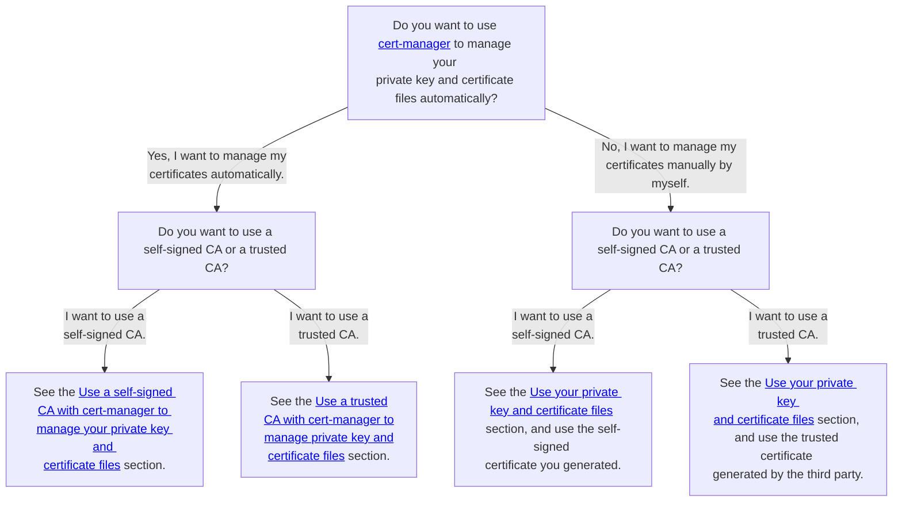

# Configure a custom values file for ScalarDL Ledger

This document explains how to create your custom values file for the ScalarDL Ledger chart. If you want to know the details of the parameters, please refer to the [README](https://github.com/scalar-labs/helm-charts/blob/main/charts/scalardl/README.md) of the ScalarDL Ledger chart.

## Required configurations

### Scalar Envoy configurations

You must set the Scalar Envoy configurations in the custom values file for ScalarDL Ledger. This is because client requests are sent to ScalarDL Ledger via Scalar Envoy as the load balancer of gRPC requests if you deploy ScalarDL Ledger on a Kubernetes environment.

Please refer to the document [Configure a custom values file for Scalar Envoy](configure-custom-values-envoy.mdx) for more details on the Scalar Envoy configurations.

```yaml
envoy:
  configurationsForScalarEnvoy: 
    ...

ledger:
  configurationsForScalarDLLedger: 
    ...
```

### Image configurations

You must set `ledger.image.repository`. Be sure to specify the ScalarDL Ledger container image so that you can pull the image from the container repository.

```yaml
ledger:
  image:
    repository: <SCALARDL_LEDGER_CONTAINER_IMAGE>
```

For more details on the container repository for Scalar products, see [How to get the container images of Scalar products](../scalar-kubernetes/HowToGetContainerImages.mdx).

### Ledger/Database configurations

You must set `ledger.ledgerProperties`. Please set your `ledger.properties` to this parameter. Please refer to the [ledger.properties](https://github.com/scalar-labs/scalar/blob/master/ledger/conf/ledger.properties) for more details on the configuration of ScalarDL Ledger.

```yaml
ledger:
  ledgerProperties: |
    scalar.db.contact_points=localhost
    scalar.db.username=cassandra
    scalar.db.password=cassandra
    scalar.db.storage=cassandra
    scalar.dl.ledger.proof.enabled=true
    scalar.dl.ledger.auditor.enabled=true
    scalar.dl.ledger.proof.private_key_path=/keys/ledger-key-file
```

### Key/Certificate configurations

If you set `scalar.dl.ledger.proof.enabled` to `true` (this configuration is required if you use ScalarDL Auditor), you must set a private key file to `scalar.dl.ledger.proof.private_key_path`.

In this case, you must mount the private key file on the ScalarDL Ledger pod.

For more details on how to mount the private key file, refer to [Mount key and certificate files on a pod in ScalarDL Helm Charts](mount-files-or-volumes-on-scalar-pods.mdx#mount-key-and-certificate-files-on-a-pod-in-scalardl-helm-charts).

## Optional configurations

### Resource configurations (Recommended in the production environment)

If you want to control pod resources using the requests and limits of Kubernetes, you can use `ledger.resources`.

Note that the resources for one pod of Scalar products are limited to 2vCPU / 4GB memory from the perspective of the commercial license. Also, when you get the pay-as-you-go containers provided from AWS Marketplace, you cannot run those containers with more than 2vCPU / 4GB memory configuration in the `resources.limits`. When you exceed this limitation, pods are automatically stopped.

You can configure them using the same syntax as the requests and limits of Kubernetes. So, please refer to the official document [Resource Management for Pods and Containers](https://kubernetes.io/docs/concepts/configuration/manage-resources-containers/) for more details on the requests and limits of Kubernetes.

```yaml
ledger:
  resources:
    requests:
      cpu: 2000m
      memory: 4Gi
    limits:
      cpu: 2000m
      memory: 4Gi
```

### Secret configurations (Recommended in the production environment)

If you want to use environment variables to set some properties (e.g., credentials) in the `ledger.ledgerProperties`, you can use `ledger.secretName` to specify the Secret resource that includes some credentials.

For example, you can set credentials for a backend database (`scalar.db.username` and `scalar.db.password`) using environment variables, which makes your pods more secure.

Please refer to the document [How to use Secret resources to pass the credentials as the environment variables into the properties file](use-secret-for-credentials.mdx) for more details on how to use a Secret resource.

```yaml
ledger:
  secretName: "ledger-credentials-secret"
```

### Affinity configurations (Recommended in the production environment)

If you want to control pod deployment using the affinity and anti-affinity of Kubernetes, you can use `ledger.affinity`.

You can configure them using the same syntax as the affinity of Kubernetes. So, please refer to the official document [Assigning Pods to Nodes](https://kubernetes.io/docs/concepts/scheduling-eviction/assign-pod-node/) for more details on the affinity configuration of Kubernetes.

```yaml
ledger:
  affinity:
    podAntiAffinity:
      preferredDuringSchedulingIgnoredDuringExecution:
        - podAffinityTerm:
            labelSelector:
              matchExpressions:
                - key: app.kubernetes.io/name
                  operator: In
                  values:
                    - scalardl
                - key: app.kubernetes.io/app
                  operator: In
                  values:
                    - ledger
            topologyKey: kubernetes.io/hostname
          weight: 50
```

### Prometheus/Grafana configurations (Recommended in the production environment)

If you want to monitor ScalarDL Ledger pods using [kube-prometheus-stack](https://github.com/prometheus-community/helm-charts/tree/main/charts/kube-prometheus-stack), you can deploy a ConfigMap, a ServiceMonitor, and a PrometheusRule resource for kube-prometheus-stack using `ledger.grafanaDashboard.enabled`, `ledger.serviceMonitor.enabled`, and `ledger.prometheusRule.enabled`.

```yaml
ledger:
  grafanaDashboard:
    enabled: true
    namespace: monitoring
  serviceMonitor:
    enabled: true
    namespace: monitoring
    interval: 15s
  prometheusRule:
    enabled: true
    namespace: monitoring
```

### SecurityContext configurations (Default value is recommended)

If you want to set SecurityContext and PodSecurityContext for ScalarDL Ledger pods, you can use `ledger.securityContext` and `ledger.podSecurityContext`.

You can configure them using the same syntax as SecurityContext and PodSecurityContext of Kubernetes. So, please refer to the official document [Configure a Security Context for a Pod or Container](https://kubernetes.io/docs/tasks/configure-pod-container/security-context/) for more details on the SecurityContext and PodSecurityContext configurations of Kubernetes.

```yaml
ledger:
  podSecurityContext:
    seccompProfile:
      type: RuntimeDefault
  securityContext:
    capabilities:
      drop:
        - ALL
    runAsNonRoot: true
    allowPrivilegeEscalation: false
```

### TLS configurations (optional based on your environment)

You can enable TLS in:

- The communications between the ScalarDL Ledger and clients.
- The communications between the ScalarDL Ledger and ScalarDL Auditor.

Also, you have several options from the certificate management. See [TLS configurations on the Envoy document side](./configure-custom-values-envoy.mdx#tls-configurations-optional-based-on-your-environment) for more details.

Please consider which you use based on your security requirements. According to your decision, you can see the related document as follows:



#### Enable TLS

You can enable TLS in all ScalarDL Ledger connections by using the following configurations:

```yaml
ledger:
  ledgerProperties: |
    ...(omit)...
    scalar.dl.ledger.server.tls.enabled=true
    scalar.dl.ledger.server.tls.cert_chain_path=/tls/scalardl-ledger/certs/tls.crt
    scalar.dl.ledger.server.tls.private_key_path=/tls/scalardl-ledger/certs/tls.key
  tls:
    enabled: true
```

##### Use your private key and certificate files

You can set your private key and certificate files by using the following configurations:

```yaml
ledger:
  tls:
    enabled: true
    caRootCertSecret: "scalardl-ledger-tls-ca"
    certChainSecret: "scalardl-ledger-tls-cert"
    privateKeySecret: "scalardl-ledger-tls-key"
```

In this case, you have to create secret resources that include private key and certificate files for ScalarDL Ledger as follows, replacing the contents in the angle brackets as described:

```console
kubectl create secret generic scalardl-ledger-tls-ca --from-file=ca.crt=/<PATH_TO_YOUR_CA_CERTIFICATE_FILE_FOR_SCALARDL_LEDGER> -n <NAMESPACE>
kubectl create secret generic scalardl-ledger-tls-cert --from-file=tls.crt=/<PATH_TO_YOUR_CERTIFICATE_FILE_FOR_SCALARDL_LEDGER> -n <NAMESPACE>
kubectl create secret generic scalardl-ledger-tls-key --from-file=tls.key=/<PATH_TO_YOUR_PRIVATE_KEY_FILE_FOR_SCALARDL_LEDGER> -n <NAMESPACE>
```

For more details on how to prepare private key and certificate files, see [How to create private key and certificate files for Scalar products](../scalar-kubernetes/HowToCreateKeyAndCertificateFiles.mdx).

##### Use a trusted CA with cert-manager to manage your private key and certificate files

You can manage private key and certificate with cert-manager by using the following configurations:

:::note

* If you want to use cert-manager, you must deploy cert-manager and prepare the `Issuers` resource. For more details on cert-manager, see the [Installation](https://cert-manager.io/docs/installation/) and [Issuer Configuration](https://cert-manager.io/docs/configuration/) in the cert-manager official document.
* By default, Scalar Helm Chart creates a `Certificate` resource that satisfies the certificate requirements of Scalar products. We recommend the default certificate configuration, but if you custom certificate configuration, you must satisfy the certificate requirements of Scalar products. See [How to create private key and certificate files for Scalar products](../scalar-kubernetes/HowToCreateKeyAndCertificateFiles.mdx#certificate-requirements).

:::

```yaml
ledger:
  tls:
    enabled: true
    certManager:
      enabled: true
      issuerRef:
        name: your-trusted-ca
      dnsNames:
        - ledger.scalardl.example.com
```

In this case, cert-manager issues private key and certificate by using your trusted issuer. You don't need to mount private key and certificate files manually.

##### Use a self-signed CA with cert-manager to manage your private key and certificate files

You can manage private key and self-signed certificate with cert-manager by using the following configurations:

:::note

* If you want to use cert-manager, you must deploy cert-manager. For more details on how to deploy cert-manager, see the [Installation](https://cert-manager.io/docs/installation/) in the cert-manager official document.
* By default, Scalar Helm Chart creates a `Certificate` resource that satisfies the certificate requirements of Scalar products. We recommend the default certificate configuration, but if you custom certificate configuration, you must satisfy the certificate requirements of Scalar products. See [How to create private key and certificate files for Scalar products](../scalar-kubernetes/HowToCreateKeyAndCertificateFiles.mdx#certificate-requirements).

:::

```yaml
ledger:
  tls:
    enabled: true
    certManager:
      enabled: true
      selfSigned:
        enabled: true
      dnsNames:
        - ledger.scalardl.example.com
```

In this case, Scalar Helm Charts and cert-manager issue private key and self-signed certificate. You don't need to mount private key and certificate files manually.

##### Set custom authority for TLS communications

You can set the custom authority for TLS communications by using `ledger.tls.overrideAuthority`. This value doesn't change what host is actually connected. This value is intended for testing but may safely be used outside of tests as an alternative to DNS overrides. For example, you can specify the hostname presented in the certificate chain file that you set by using `ledger.tls.certChainSecret`. This chart uses this value for `startupProbe` and `livenessProbe`.

```yaml
ledger:
  tls:
    enabled: true
    overrideAuthority: "ledger.scalardl.example.com"
```

### Replica configurations (optional based on your environment)

You can specify the number of replicas (pods) of ScalarDL Ledger using `ledger.replicaCount`.

```yaml
ledger:
  replicaCount: 3
```

### Logging configurations (Optional based on your environment)

If you want to change the log level of ScalarDL Ledger, you can use `ledger.scalarLedgerConfiguration.ledgerLogLevel`.

```yaml
ledger:
  scalarLedgerConfiguration:
    ledgerLogLevel: INFO
```

### Taint and toleration configurations (Optional based on your environment)

If you want to control pod deployment by using the taints and tolerations in Kubernetes, you can use `ledger.tolerations`.

You can configure taints and tolerations by using the same syntax as the tolerations in Kubernetes. For details on configuring tolerations in Kubernetes, see the official Kubernetes documentation [Taints and Tolerations](https://kubernetes.io/docs/concepts/scheduling-eviction/taint-and-toleration/).

```yaml
ledger:
  tolerations:
    - effect: NoSchedule
      key: scalar-labs.com/dedicated-node
      operator: Equal
      value: scalardl-ledger
```
