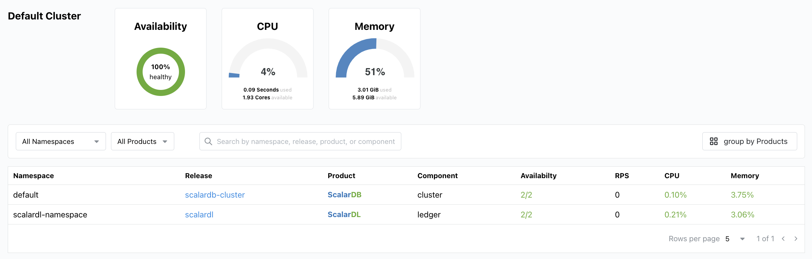
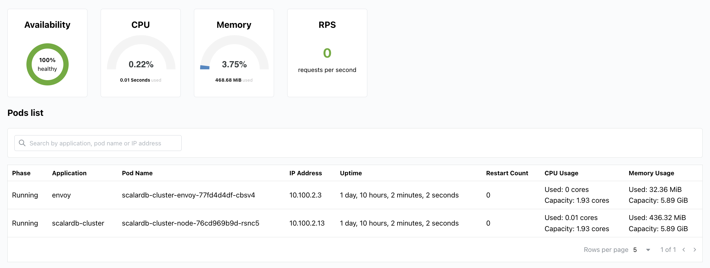
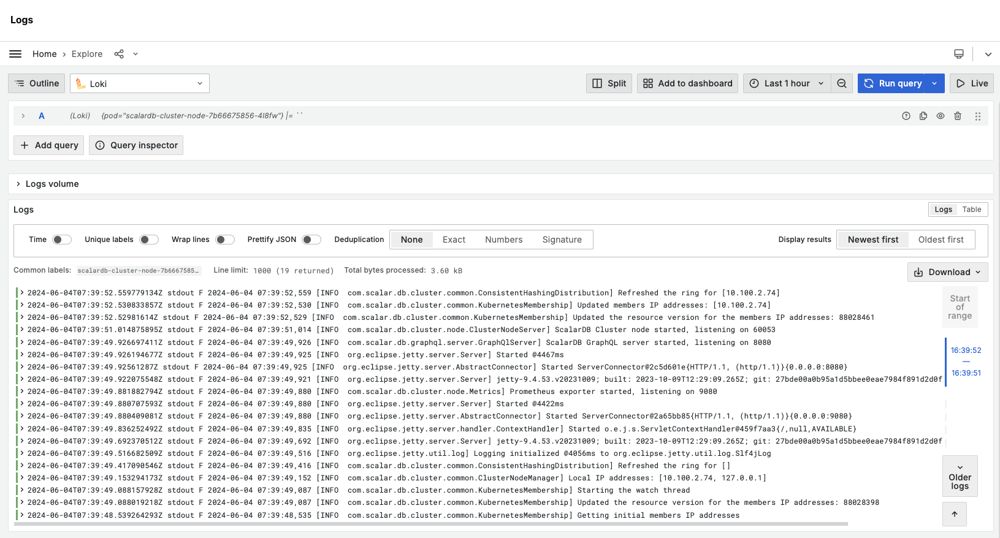
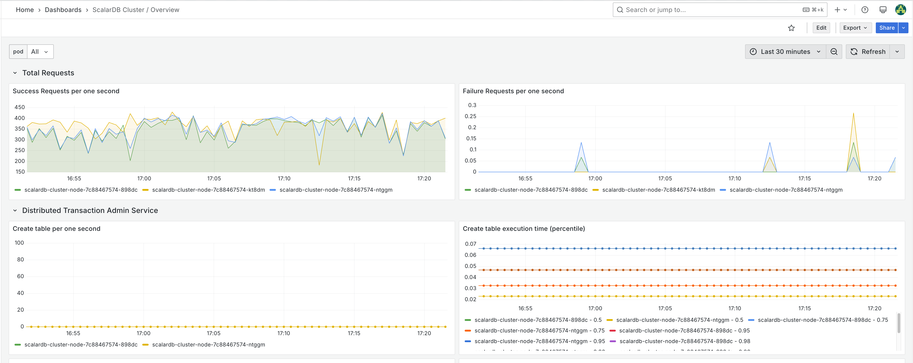
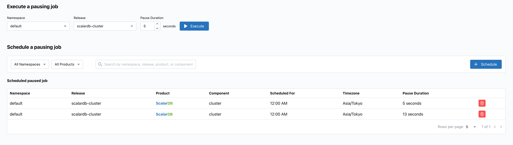
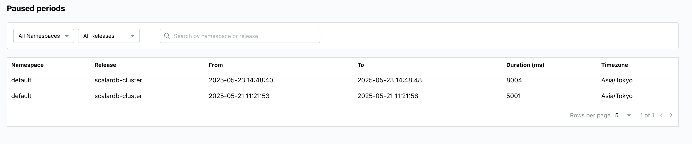

---
tags:
  - Enterprise Option
displayed_sidebar: docsEnglish
---

# Scalar Manager Overview

Scalar Manager is a centralized management and monitoring solution for ScalarDB and ScalarDL within Kubernetes cluster environments.
It simplifies the operational tasks associated with these products by aggregating essential functionalities into a graphical user interface (GUI).

## Why Scalar Manager?

Before Scalar Manager was released, you would need to use various command-line tools and third-party solutions individually to manage and monitor ScalarDB and ScalarDL deployments.
For example, `kubectl` is often used to check deployment status, the Prometheus stack for monitoring metrics, the Loki stack for log analysis, and Scalar's proprietary CLI tool for pausing Scalar products to ensure transactional consistency between multiple databases.
This constellation of tools presented a steep learning curve and lacked a unified interface, resulting in inefficient workflows for performing routine management tasks or troubleshooting issues.

Scalar Manager mitigates these pain points by aggregating essential functionalities into a single, user-friendly GUI.
With Scalar Manager, you can reduce the time and effort needed for management and monitoring, allowing you to focus on business development and operations.

## Key features

At its core, Scalar Manager provides the following features.

### Centralized cluster visualization

You can quickly gain real-time metrics about cluster health, pod logs, hardware usage, performance metrics like requests per second, and deep visibility into time-series data via the Grafana dashboards.

With the Grafana dashboards, you can also view pod logs and metrics in real-time or in time series.

### Streamlined pausing job management

You can execute or schedule pausing jobs to ensure transactional consistency, review and manage scheduled jobs, and monitor paused states within an intuitive GUI.

### User management

Scalar Manager includes authentication capabilities, allowing for secure access control to your deployment. The system provides user management functionalities that enable administrators to create, modify, and remove user accounts through an intuitive interface.

### Authentication and authorization

By using the authorization feature, administrators can define and assign specific roles to users, controlling their access permissions within the Scalar Manager environment. This control ensures that users only have access to the functionalities relevant to their responsibilities.

### Integrated authentication with Grafana

Scalar Manager now offers seamless authentication integration between your Grafana instance and other components of the system. This single-sign-on capability eliminates the need for multiple authentication processes, streamlining the user experience and enhancing security by reducing credential management overhead.
